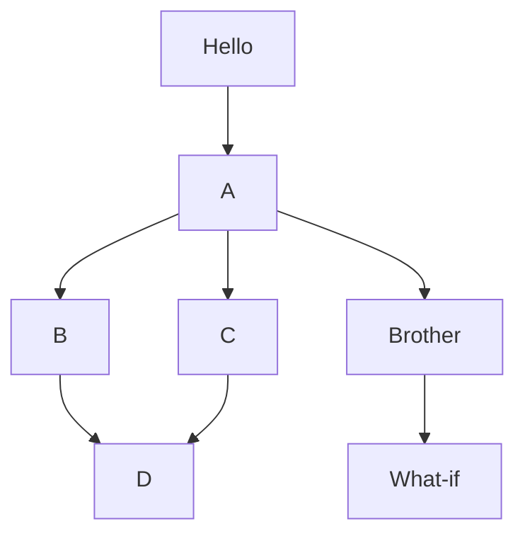

# Kubernetes Einführung


## Agenda
  1. Docker-Grundlagen 
     * [Übersicht Architektur](#übersicht-architektur)
     * [Was ist ein Container ?](#was-ist-ein-container-)
     * [Was sind container images](#was-sind-container-images)
     * [Container vs. Virtuelle Maschine](#container-vs-virtuelle-maschine)
     * [Was ist ein Dockerfile](#was-ist-ein-dockerfile)

  1. Kubernetes - Überblick
     * [Allgemeine Einführung in Container (Dev/Ops)](#allgemeine-einführung-in-container-devops)
     * [Warum Kubernetes, was macht Kubernetes](#warum-kubernetes-was-macht-kubernetes)
     * [Microservices (Warum ? Wie ?) (Devs/Ops)](#microservices-warum--wie--devsops)
     * [Wann macht Kubernetes Sinn, wann nicht?](#wann-macht-kubernetes-sinn-wann-nicht)
     * [Aufbau Allgemein](#aufbau-allgemein)
     * [Aufbau mit helm,OpenShift,Rancher(RKE),microk8s](#aufbau-mit-helmopenshiftrancherrkemicrok8s)
     * [Welches System ? (minikube, micro8ks etc.)](#welches-system--minikube-micro8ks-etc)
     * [Installation - Welche Komponenten from scratch](#installation---welche-komponenten-from-scratch)

  1. kubectl 
     * [kubectl einrichten mit namespace](#kubectl-einrichten-mit-namespace)

  1. Kubernetes Praxis API-Objekte 
     * [Das Tool kubectl (Devs/Ops) - Spickzettel](#das-tool-kubectl-devsops---spickzettel)
     * [kubectl example with run](#kubectl-example-with-run)
     * Arbeiten mit manifests (Devs/Ops)
     * Pods (Devs/Ops)
     * [kubectl/manifest/pod](#kubectlmanifestpod)
     * ReplicaSets (Theorie) - (Devs/Ops)
     * [kubectl/manifest/replicaset](#kubectlmanifestreplicaset)
     * Deployments (Devs/Ops)
     * [kubectl/manifest/deployments](#kubectlmanifestdeployments)
     * Services (Devs/Ops)
     * [kubectl/manifest/service](#kubectlmanifestservice)
     * DaemonSets (Devs/Ops)
     * IngressController (Devs/Ops)
     * [Hintergrund Ingress](#hintergrund-ingress)
     * [Ingress Controller auf Digitalocean (doks) mit helm installieren](#ingress-controller-auf-digitalocean-doks-mit-helm-installieren)
     * [Documentation for default ingress nginx](https://kubernetes.github.io/ingress-nginx/user-guide/nginx-configuration/configmap/)
     * [Beispiel Ingress](#beispiel-ingress)
     * [Beispiel mit Hostnamen](#beispiel-mit-hostnamen)
     * [Achtung: Ingress mit Helm - annotations](#achtung:-ingress-mit-helm---annotations)
     * [Permanente Weiterleitung mit Ingress](#permanente-weiterleitung-mit-ingress)
     * [ConfigMap Example](#configmap-example)

  1. Helm (Kubernetes Paketmanager) 
     * [Helm Grundlagen](#helm-grundlagen)
     * [Helm Warum ?](#helm-warum-)
     * [Helm Example](#helm-example)

  1. Kubernetes Storage 
     * [Praxis. Beispiel (Dev/Ops)](#praxis-beispiel-devops)

  1. Kubernetes Netzwerk 
     * [Kubernetes Netzwerke Übersicht](#kubernetes-netzwerke-übersicht)
     * [DNS - Resolution - Services](#dns---resolution---services)
     * [Kubernetes Firewall / Cilium Calico](#kubernetes-firewall--cilium-calico)
     * [Sammlung istio](#sammlung-istio)

  1. Kubernetes Autoscaling 
     * [Kubernetes Autoscaling](#kubernetes-autoscaling)

  1. Kubernetes Secrets / ConfigMap 
     * [Configmap Example 1](#configmap-example-1)
     * [Secrets Example 1](#secrets-example-1)
     * [Änderung in ConfigMap erkennen und anwenden](https://github.com/stakater/Reloader)

  1. Kubernetes Operator Konzept 
     * [Ueberblick](#ueberblick)
    
  1. Kubernetes Deployment Strategies
     * [Overview](#overview)
    
  1. Kubernetes QoS / HealthChecks
     * [Quality of Service - evict pods](#quality-of-service---evict-pods)
     * [LiveNess/Readiness - Probe / HealthChecks](#livenessreadiness---probe--healthchecks)
     
  1. Kubernetes Monitoring 
     * [Prometheus Monitoring Server (Overview)](#prometheus-monitoring-server-overview)

  1. Tipps & Tricks 
     * [Ubuntu client aufsetzen](#ubuntu-client-aufsetzen)
     * [Netzwerkverbindung zum Pod testen](#netzwerkverbindung-zum-pod-testen)
     
  1. Kubernetes Administration /Upgrades 
     * [Kubernetes Administration / Upgrades](#kubernetes-administration--upgrades)
     * [Terminierung von Container vermeiden](#terminierung-von-container-vermeiden)
     * [Praktische Umsetzung RBAC anhand eines Beispiels (Ops)](#praktische-umsetzung-rbac-anhand-eines-beispiels-ops)

  1. Weiter lernen 
     * [Lernumgebung](https://killercoda.com/)
     * [Bestimmte Tasks lernen](https://kubernetes.io/docs/tasks/configure-pod-container/assign-memory-resource/)
     * [Udemy Online Training](https://www.udemy.com/course/certified-kubernetes-security-specialist/)
     * [Kubernetes Videos mit Hands On](https://www.youtube.com/watch?v=16fgzklcF7Y)

  1. Documentation (Use Cases) 
     * [Case Studies Kubernetes](https://kubernetes.io/case-studies/)
     * [Use Cases](https://codilime.com/blog/harnessing-the-power-of-kubernetes-7-use-cases/)
     
  1. Interna von Kubernetes 
     * [OCI,Container,Images Standards](#ocicontainerimages-standards)
   
  1. Andere Systeme / Verschiedenes  
     * [Kubernetes vs. Cloudfoundry](#kubernetes-vs-cloudfoundry)
     * [Kubernetes Alternativen](#kubernetes-alternativen)
     * [Hyperscaler vs. Kubernetes on Premise](#hyperscaler-vs-kubernetes-on-premise)
     

## Backlog 

  1. Kubernetes - Überblick
     * [Allgemeine Einführung in Container (Dev/Ops)](#allgemeine-einführung-in-container-devops)
     * [Warum Kubernetes, was macht Kubernetes](#warum-kubernetes-was-macht-kubernetes)
     * [Microservices (Warum ? Wie ?) (Devs/Ops)](#microservices-warum--wie--devsops)
     * [Wann macht Kubernetes Sinn, wann nicht?](#wann-macht-kubernetes-sinn-wann-nicht)
     * [Aufbau Allgemein](#aufbau-allgemein)
     * [Aufbau mit helm,OpenShift,Rancher(RKE),microk8s](#aufbau-mit-helmopenshiftrancherrkemicrok8s)
     * [Welches System ? (minikube, micro8ks etc.)](#welches-system--minikube-micro8ks-etc)
     * [Installation - Welche Komponenten from scratch](#installation---welche-komponenten-from-scratch)
  
  1. Kubernetes - microk8s (Installation und Management) 
     * [Installation Ubuntu - snap](#installation-ubuntu---snap)
     * [Remote-Verbindung zu Kubernetes (microk8s) einrichten](#remote-verbindung-zu-kubernetes-microk8s-einrichten)
     * [Create a cluster with microk8s](#create-a-cluster-with-microk8s)
     * [Ingress controller in microk8s aktivieren](#ingress-controller-in-microk8s-aktivieren)
     * [Arbeiten mit der Registry](#arbeiten-mit-der-registry)
     * [Installation Kuberenetes Dashboard](#installation-kuberenetes-dashboard)

  1. Kubernetes Praxis API-Objekte 
     * [Das Tool kubectl (Devs/Ops) - Spickzettel](#das-tool-kubectl-devsops---spickzettel)
     * [kubectl example with run](#kubectl-example-with-run)
     * Arbeiten mit manifests (Devs/Ops)
     * Pods (Devs/Ops)
     * [kubectl/manifest/pod](#kubectlmanifestpod)
     * ReplicaSets (Theorie) - (Devs/Ops)
     * [kubectl/manifest/replicaset](#kubectlmanifestreplicaset)
     * Deployments (Devs/Ops)
     * [kubectl/manifest/deployments](#kubectlmanifestdeployments)
     * Services (Devs/Ops)
     * [kubectl/manifest/service](#kubectlmanifestservice)
     * DaemonSets (Devs/Ops)
     * IngressController (Devs/Ops)
     * [Hintergrund Ingress](#hintergrund-ingress)
     * [Documentation for default ingress nginx](https://kubernetes.github.io/ingress-nginx/user-guide/nginx-configuration/configmap/)
     * [Beispiel Ingress](#beispiel-ingress)
     * [Beispiel mit Hostnamen](#beispiel-mit-hostnamen)
     * [Achtung: Ingress mit Helm - annotations](#achtung:-ingress-mit-helm---annotations)
     * [Permanente Weiterleitung mit Ingress](#permanente-weiterleitung-mit-ingress)
     * [ConfigMap Example](#configmap-example)

  1. Kubernetes - ENV - Variablen für den Container setzen
     * [ENV - Variablen - Übung](#env---variablen---übung)

  1. Kubernetes Secrets und Encrypting von z.B. Credentials 
     * [Kubernetes secrets Typen](#kubernetes-secrets-typen)
     * [Sealed Secrets - bitnami](#sealed-secrets---bitnami)

  1. Kubernetes - Arbeiten mit einer lokalen Registry (microk8s) 
     * [microk8s lokale Registry](#microk8s-lokale-registry)

  1. Kubernetes Praxis Scaling/Rolling Updates/Wartung 
     * Rolling Updates (Devs/Ops) 
     * Scaling von Deployments (Devs/Ops) 
     * [Wartung mit drain / uncordon (Ops)](#wartung-mit-drain--uncordon-ops)
     * [Ausblick AutoScaling (Ops)](#ausblick-autoscaling-ops)

  1. Kubernetes Storage 
     * Grundlagen (Dev/Ops)
     * Objekte PersistantVolume / PersistantVolumeClaim (Dev/Ops) 
     * [Praxis. Beispiel (Dev/Ops)](#praxis-beispiel-devops)

  1. Kubernetes Networking 
     * [Überblick](#überblick)
     * Pod to Pod
     * Webbasierte Dienste (Ingress) 
     * IP per Pod
     * Inter Pod Communication ClusterDNS 
     * [Beispiel NetworkPolicies](#beispiel-networkpolicies)

  1. Kubernetes Paketmanagement (Helm) 
     * [Warum ? (Dev/Ops)](#warum--devops)
     * [Grundlagen / Aufbau / Verwendung (Dev/Ops)](#grundlagen--aufbau--verwendung-devops)
     * [Praktisches Beispiel bitnami/mysql (Dev/Ops)](#praktisches-beispiel-bitnamimysql-devops)

  1. Kustomize
     * [Beispiel ConfigMap - Generator](#beispiel-configmap---generator)
     * [Beispiel Overlay und Patching](#beispiel-overlay-und-patching)
     * [Resources](#resources)

  1. Kubernetes Rechteverwaltung (RBAC) 
     * Warum ? (Ops)
     * [Wie aktivieren?](#wie-aktivieren)
     * Rollen und Rollenzuordnung (Ops)
     * Service Accounts (Ops)
     * [Praktische Umsetzung anhand eines Beispiels (Ops)](#praktische-umsetzung-anhand-eines-beispiels-ops)

  1. Kubernetes Backups 
     * [Kubernetes Backup](#kubernetes-backup)

  1. Kubernetes Monitoring 
     * [Debugging von Ingress](#debugging-von-ingress)
     * [Ebenen des Loggings](#ebenen-des-loggings)
     * [Working with kubectl logs](#working-with-kubectl-logs)
     * [Built-In Monitoring tools - kubectl top pods/nodes](#built-in-monitoring-tools---kubectl-top-podsnodes)
     * [Protokollieren mit Elasticsearch und Fluentd (Devs/Ops)](#protokollieren-mit-elasticsearch-und-fluentd-devsops)
     * [Long Installation step-by-step - Digitalocean](https://www.digitalocean.com/community/tutorials/how-to-set-up-an-elasticsearch-fluentd-and-kibana-efk-logging-stack-on-kubernetes)
     * Container Level Monitoring (Devs/Ops)
     * [Setting up metrics-server - microk8s](#setting-up-metrics-server---microk8s)
  
  1. Kubernetes Security 
     * [Grundlagen und Beispiel (Praktisch)](#grundlagen-und-beispiel-praktisch)

  1. Kubernetes GUI 
     * [Rancher](#rancher)
     * [Kubernetes Dashboard](#kubernetes-dashboard)

  1. Kubernetes CI/CD (Optional) 
     * Canary Deployment (Devs/Ops) 
     * Blue Green Deployment (Devs/Ops) 

  1. Tipps & Tricks 
     * [bash-completion](#bash-completion)
     * [Alias in Linux kubectl get -o wide](#alias-in-linux-kubectl-get--o-wide)
     * [vim einrückung für yaml-dateien](#vim-einrückung-für-yaml-dateien)
     * [kubectl spickzettel](#kubectl-spickzettel)
     * [Alte manifests migrieren](#alte-manifests-migrieren)
     * [X-Forward-Header-For setzen in Ingress](#x-forward-header-for-setzen-in-ingress)
  
  1. Übungen 
     * [übung Tag 3](#übung-tag-3)
     * [übung Tag 4](#übung-tag-4)
  
  1. Fragen 
     * [Q and A](#q-and-a)
     * [Kuberenetes und Ansible](#kuberenetes-und-ansible)

  1. Documentation
     * [Kubernetes mit VisualStudio Code](https://code.visualstudio.com/docs/azure/kubernetes)
     * [Kube Api Ressources - Versionierungsschema](#kube-api-ressources---versionierungsschema)
     * [Kubernetes Labels and Selector](https://kubernetes.io/docs/concepts/overview/working-with-objects/labels/)

  1. Misc 
     * [Mermaid Test](#mermaid-test)
     
  


<div class="page-break"></div>

## Docker-Grundlagen 

### Übersicht Architektur


### Was ist ein Container ?


```
- vereint in sich Software
- Bibliotheken 
- Tools 
- Konfigurationsdateien 
- keinen eigenen Kernel 
- gut zum Ausführen von Anwendungen auf verschiedenen Umgebungen 

- Container sind entkoppelt
- Container sind voneinander unabhängig 
- Können über wohldefinierte Kommunikationskanäle untereinander Informationen austauschen

- Durch Entkopplung von Containern:
  o Unverträglichkeiten von Bibliotheken, Tools oder Datenbank können umgangen werden, wenn diese von den Applikationen in unterschiedlichen Versionen benötigt werden.
```

### Was sind container images


  * Container Image benötigt, um zur Laufzeit Container-Instanzen zu erzeugen 
  * Bei Docker werden Docker Images zu Docker Containern, wenn Sie auf einer Docker Engine als Prozess ausgeführt
  * Man kann sich ein Docker Image als Kopiervorlage vorstellen.
    * Diese wird genutzt, um damit einen Docker Container als Kopie zu erstellen   

### Container vs. Virtuelle Maschine


```
VM's virtualisieren Hardware
Container virtualisieren Betriebssystem 


```

### Was ist ein Dockerfile


### Grundlagen
 * Textdatei, die Linux - Kommandos enthält
   * die man auch auf der Kommandozeile ausführen könnte 
   * Diese erledigen alle Aufgaben, die nötig sind, um ein Image zusammenzustellen
   * mit docker build wird dieses image erstellt 
   
### Beispiel 

```
FROM node:12-alpine
RUN apk add --no-cache python2 g++ make
WORKDIR /app
COPY . .
RUN yarn install --production
## übersetzt: node src/index.js 
CMD ["node", "src/index.js"]
EXPOSE 3000
```

## Kubernetes - Überblick

### Allgemeine Einführung in Container (Dev/Ops)


### Architektur 


### Was sind Docker Images 

  * Docker Image benötigt, um zur Laufzeit Container-Instanzen zu erzeugen 
  * Bei Docker werden Docker Images zu Docker Containern, wenn Sie auf einer Docker Engine als Prozess ausgeführt
  * Man kann sich ein Docker Image als Kopiervorlage vorstellen.
    * Diese wird genutzt, um damit einen Docker Container als Kopie zu erstellen   

### Was sind Docker Container ? 

```
- vereint in sich Software
- Bibliotheken 
- Tools 
- Konfigurationsdateien 
- keinen eigenen Kernel 
- gut zum Ausführen von Anwendungen auf verschiedenen Umgebungen 

### Weil :
- Container sind entkoppelt
- Container sind voneinander unabhängig 
- Können über wohldefinierte Kommunikationskanäle untereinander Informationen austauschen

- Durch Entkopplung von Containern:
  o Unverträglichkeiten von Bibliotheken, Tools oder Datenbank können umgangen werden, wenn diese von den Applikationen in unterschiedlichen Versionen benötigt werden.
```

### Container vs. VM 

```
VM's virtualisieren Hardware
Container virtualisieren Betriebssystem 
```

### Dockerfile 

 * Textdatei, die Linux - Kommandos enthält
   * die man auch auf der Kommandozeile ausführen könnte 
   * Diese erledigen alle Aufgaben, die nötig sind, um ein Image zusammenzustellen
   * mit docker build wird dieses image erstellt 

### Einfaches Beispiel eines Dockerfiles

```
FROM nginx:latest
COPY html /usr/share/nginx/html
```

```
## beispiel 
## cd beispiel
## ls 
## Dockerfile 
docker build . 
docker push 
```
### Komplexeres Beispiel eines Dockerfiles 

  * https://github.com/StefanScherer/whoami/blob/main/Dockerfile

### Warum Kubernetes, was macht Kubernetes


### Ausgangslage

  * Ich habe jetzt einen Haufen Container, aber:
    * Wie bekomme ich die auf die Systeme.
    * Und wie halte ich den Verwaltungsaufwand in Grenzen.
  * Lösung: Kubernetes -> ein Orchestrierungstool

### Hintergründe

  * Gegenüber Virtualisierung von Hardware - 5fache bessere Auslastung
  * Google als Ausgangspunkt (Borg) 
  * Software 2014 als OpenSource zur Verfügung gestellt 
  * Optimale Ausnutzung der Hardware, hunderte bis tausende Dienste können auf einigen Maschinen laufen (Cluster)  
  * Immutable - System
  * Selbstheilend
  
### Wozu dient Kubernetes 

  * Orchestrierung von Containern
  * am gebräuchlisten aktuell Docker

### Microservices (Warum ? Wie ?) (Devs/Ops)


### Was soll das ? 

```
Ein mini-dienst, soll das minimale leisten, d.h. nur das wofür er da ist.

-> z.B. Webserver 
oder Datenbank-Server
oder Dienst, der nur reports erstellt 
```

### Wie erfolgt die Zusammenarbeit 

```
Orchestrierung (im Rahmen der Orchestierung über vorgefertigte Schnittstellen, d.h. auch feststehende Benamung) 
- Label 

```

### Vorteile 

```
## 
Leichtere Updates von Microservices, weil sie nur einen kleinere Funktionalität 


```

### Nachteile 

```
* Komplexität 
  * z.B. in Bezug auf Debugging 
  * Logging / Backups 
```

### Wann macht Kubernetes Sinn, wann nicht?


### Wann nicht sinnvoll ? 

  * Anwendung, die ich nicht in Container "verpackt" habe  
  * Spielt der Dienstleister mit (Wartungsvertrag) 
  * Kosten / Nutzenverhältnis (Umstellen von Container zu teuer) 
  * Anwendung läßt sich nicht skalieren 
    * z.B. Bottleneck Datenbank  
    * Mehr Container bringen nicht mehr (des gleichen Typs) 
  
### Wo spielt Kubernetes seine Stärken aus ? 

  * Skalieren von Anwendungen. 
  * Heilen von Systemen (neu starten von Pods) 
  * Automatische Überwachung mit deklarativem Management) - ich beschreibe, was ich will
  * Neue Versionen zu auszurollen (Canary Deployment, Blue/Green Deployment) 

### Mögliche Nachteile 

  * Steigert die Komplexität.
  * Debugging wird u.U. schwieriger
  * Mit Kubernetes erkaufe ich mir auch, die Notwendigkeit.
    * Über adequate Backup-Lösungen nachzudenken (Moving Target, Kubernetes Aware Backups) 
    * Bereitsstellung von Monitoring Daten Log-Aggregierungslösung 

### Klassische Anwendungsfällen 

  * Webbasierte Anwendungen (z.B. auch API's bzw. Web)
 


### Aufbau Allgemein


### Schaubild 


### Komponenten / Grundbegriffe

#### Master (Control Plane)

##### Aufgaben 

  * Der Master koordiniert den Cluster
  * Der Master koordiniert alle Aktivitäten in Ihrem Cluster
    * Planen von Anwendungen
    * Verwalten des gewünschten Status der Anwendungen
    * Skalieren von Anwendungen
    * Rollout neuer Updates.

##### Komponenten des Masters 

###### etcd

  * Verwalten der Konfiguration des Clusters (key/value - pairs) 
  
###### kube-controller-manager  
  
  * Zuständig für die Überwachung der Stati im Cluster mit Hilfe von endlos loops. 
  * kommuniziert mit dem Cluster über die kubernetes-api (bereitgestellt vom kube-api-server)

###### kube-api-server 

  * provides api-frontend for administration (no gui)
  * Exposes an HTTP API (users, parts of the cluster and external components communicate with it)
  * REST API
 
###### kube-scheduler 

  * assigns Pods to Nodes. 
  * scheduler determines which Nodes are valid placements for each Pod in the scheduling queue 
    ( according to constraints and available resources )
  * The scheduler then ranks each valid Node and binds the Pod to a suitable Node. 
  * Reference implementation (other schedulers can be used)
 
#### Nodes  

  * Nodes (Knoten) sind die Arbeiter (Maschinen), die Anwendungen ausführen
  * Ref: https://kubernetes.io/de/docs/concepts/architecture/nodes/

#### Pod/Pods 

  * Pods sind die kleinsten einsetzbaren Einheiten, die in Kubernetes erstellt und verwaltet werden können.
  * Ein Pod (übersetzt Gruppe) ist eine Gruppe von einem oder mehreren Containern
    * gemeinsam genutzter Speicher- und Netzwerkressourcen   
    * Befinden sich immer auf dem gleich virtuellen Server 
   

### Node (Minion) - components 

#### General 

  * On the nodes we will rollout the applications

#### kubelet

```
Node Agent that runs on every node (worker) 
Er stellt sicher, dass Container in einem Pod ausgeführt werden.
```

#### Kube-proxy 

  * Läuft auf jedem Node 
  * = Netzwerk-Proxy für die Kubernetes-Netzwerk-Services.
  * Kube-proxy verwaltet die Netzwerkkommunikation innerhalb oder außerhalb Ihres Clusters.
  
### Referenzen 

  * https://www.redhat.com/de/topics/containers/kubernetes-architecture


### Aufbau mit helm,OpenShift,Rancher(RKE),microk8s


### Welches System ? (minikube, micro8ks etc.)


## Überblick der Systeme 

### General 

```
kubernetes itself has not convenient way of doing specific stuff like 
creating the kubernetes cluster.

So there are other tools/distri around helping you with that.

```

### Kubeadm

#### General 

  * The official CNCF (https://www.cncf.io/) tool for provisioning Kubernetes clusters
    (variety of shapes and forms (e.g. single-node, multi-node, HA, self-hosted))
  * Most manual way to create and manage a cluster 

#### Disadvantages 

  * Plugins sind oftmals etwas schwierig zu aktivieren

### microk8s 

#### General

  * Created by Canonical (Ubuntu)
  * Runs on Linux
  * Runs only as snap
  * In the meantime it is also available for Windows/Mac
  * HA-Cluster 

#### Production-Ready ? 

  * Short answer: YES 

```
Quote canonical (2020):

MicroK8s is a powerful, lightweight, reliable production-ready Kubernetes distribution. It is an enterprise-grade Kubernetes distribution that has a small disk and memory footprint while offering carefully selected add-ons out-the-box, such as Istio, Knative, Grafana, Cilium and more. Whether you are running a production environment or interested in exploring K8s, MicroK8s serves your needs.

Ref: https://ubuntu.com/blog/introduction-to-microk8s-part-1-2

```

#### Advantages

  * Easy to setup HA-Cluster (multi-node control plane)
  * Easy to manage 

### minikube 

#### Disadvantages
  
  * Not usable / intended for production 

#### Advantages 

  * Easy to set up on local systems for testing/development (Laptop, PC) 
  * Multi-Node cluster is possible 
  * Runs und Linux/Windows/Mac
  * Supports plugin (Different name ?)


### k3s


### kind (Kubernetes-In-Docker)

#### General 

  * Runs in docker container 


#### For Production ?

```
Having a footprint, where kubernetes runs within docker 
and the applikations run within docker as docker containers
it is not suitable for production.
```


### Installation - Welche Komponenten from scratch


### Step 1: Server 1 (manuell installiert -> microk8s)

```
## Installation Ubuntu - Server 

## cloud-init script 
## s.u. BASIS (keine Voraussetzung - nur zum Einrichten des Nutzers 11trainingdo per ssh) 

## Server 1 - manuell 
## Ubuntu 20.04 LTS - Grundinstallation 

## minimal Netzwerk - öffentlichen IP 
## nichts besonderes eingerichtet - Standard Digitalocean 

## Standard vo Installation microk8s 
lo               UNKNOWN        127.0.0.1/8 ::1/128
## public ip / interne 
eth0             UP             164.92.255.234/20 10.19.0.6/16 fe80::c:66ff:fec4:cbce/64
## private ip 
eth1             UP             10.135.0.3/16 fe80::8081:aaff:feaa:780/64

snap install microk8s --classic 
## namensaufloesung fuer pods 
microk8s enable dns 

```

```
## Funktioniert microk8s 
microk8s status
```

### Steps 2: Server 2+3 (automatische Installation -> microk8s ) 

```
## Was macht das ? 
## 1. Basisnutzer (11trainingdo) - keine Voraussetzung für microk8s
## 2. Installation von microk8s 
##.>>>>>>> microk8s installiert <<<<<<<<
## - snap install --classic microk8s 
## >>>>>>> Zuordnung zur Gruppe microk8s - notwendig für bestimmte plugins (z.B. helm)  
## usermod -a -G microk8s root 
## >>>>>>> Setzen des .kube - Verzeichnisses auf den Nutzer microk8s -> nicht zwingend erforderlich 
## chown -r -R microk8s ~/.kube 
## >>>>>>> REQUIRED .. DNS aktivieren, wichtig für Namensauflösungen innerhalb der PODS
## >>>>>>> sonst funktioniert das nicht !!! 
## microk8s enable dns 
## >>>>>>> kubectl alias gesetzt, damit man nicht immer microk8s kubectl eingeben muss
## - echo "alias kubectl='microk8s kubectl'" >> /root/.bashrc

## cloud-init script 
## s.u. MITMICROK8S (keine Voraussetzung - nur zum Einrichten des Nutzers 11trainingdo per ssh) 
##cloud-config
users:
  - name: 11trainingdo
    shell: /bin/bash

runcmd:
  - sed -i "s/PasswordAuthentication no/PasswordAuthentication yes/g" /etc/ssh/sshd_config
  - echo " " >> /etc/ssh/sshd_config 
  - echo "AllowUsers 11trainingdo" >> /etc/ssh/sshd_config 
  - echo "AllowUsers root" >> /etc/ssh/sshd_config 
  - systemctl reload sshd 
  - sed -i '/11trainingdo/c 11trainingdo:$6$HeLUJW3a$4xSfDFQjKWfAoGkZF3LFAxM4hgl3d6ATbr2kEu9zMOFwLxkYMO.AJF526mZONwdmsm9sg0tCBKl.SYbhS52u70:17476:0:99999:7:::' /etc/shadow
  - echo "11trainingdo ALL=(ALL) ALL" > /etc/sudoers.d/11trainingdo
  - chmod 0440 /etc/sudoers.d/11trainingdo
  
  - echo "Installing microk8s"
  - snap install --classic microk8s
  - usermod -a -G microk8s root
  - chown -f -R microk8s ~/.kube
  - microk8s enable dns 
  - echo "alias kubectl='microk8s kubectl'" >> /root/.bashrc
```
```
## Prüfen ob microk8s - wird automatisch nach Installation gestartet
## kann eine Weile dauern
microk8s status

```

### Step 3: Client - Maschine (wir sollten nicht auf control-plane oder cluster - node arbeiten

```
Weiteren Server hochgezogen. 
Vanilla + BASIS 

## Installation Ubuntu - Server 

## cloud-init script 
## s.u. BASIS (keine Voraussetzung - nur zum Einrichten des Nutzers 11trainingdo per ssh) 

## Server 1 - manuell 
## Ubuntu 20.04 LTS - Grundinstallation 

## minimal Netzwerk - öffentlichen IP 
## nichts besonderes eingerichtet - Standard Digitalocean 

## Standard vo Installation microk8s 
lo               UNKNOWN        127.0.0.1/8 ::1/128
## public ip / interne 
eth0             UP             164.92.255.232/20 10.19.0.6/16 fe80::c:66ff:fec4:cbce/64
## private ip 
eth1             UP             10.135.0.5/16 fe80::8081:aaff:feaa:780/64

```

```
##### Installation von kubectl aus dem snap
## NICHT .. keine microk8s - keine control-plane / worker-node 
## NUR Client zum Arbeiten 
snap install kubectl --classic 

##### .kube/config 
## Damit ein Zugriff auf die kube-server-api möglich
## d.h. REST-API Interface, um das Cluster verwalten.
## Hier haben uns für den ersten Control-Node entschieden
## Alternativ wäre round-robin per dns möglich 

## Mini-Schritt 1:
## Auf dem Server 1: kubeconfig ausspielen 
microk8s config > /root/kube-config 
## auf das Zielsystem gebracht (client 1) 
scp /root/kubeconfig 11trainingdo@10.135.0.5:/home/11trainingdo

## Mini-Schritt 2:
## Auf dem Client 1 (diese Maschine) kubeconfig an die richtige Stelle bringen 
## Standardmäßig der Client nach eine Konfigurationsdatei sucht in ~/.kube/config 
sudo su -
cd 
mkdir .kube 
cd .kube 
mv /home/11trainingdo/kube-config config 

## Verbindungstest gemacht
## Damit feststellen ob das funktioniert. 
kubectl cluster-info 

```

### Schritt 4: Auf allen Servern IP's hinterlegen und richtigen Hostnamen überprüfen 

```
## Auf jedem Server 
hostnamectl 
## evtl. hostname setzen 
## z.B. - auf jedem Server eindeutig 
hostnamectl set-hostname n1.training.local 

## Gleiche hosts auf allen server einrichten.
## Wichtig, um Traffic zu minimieren verwenden, die interne (private) IP

/etc/hosts 
10.135.0.3 n1.training.local n1
10.135.0.4 n2.training.local n2
10.135.0.5 n3.training.local n3 

```

### Schritt 5: Cluster aufbauen 

```
## Mini-Schritt 1:
## Server 1: connection - string (token) 
microk8s add-node 
## Zeigt Liste und wir nehmen den Eintrag mit der lokalen / öffentlichen ip
## Dieser Token kann nur 1x verwendet werden und wir auf dem ANDEREN node ausgeführt
## microk8s join 10.135.0.3:25000/e9cdaa11b5d6d24461c8643cdf107837/bcad1949221a

## Mini-Schritt 2:
## Dauert eine Weile, bis das durch ist. 
## Server 2: Den Node hinzufügen durch den JOIN - Befehl 
microk8s join 10.135.0.3:25000/e9cdaa11b5d6d24461c8643cdf107837/bcad1949221a

## Mini-Schritt 3:
## Server 1: token besorgen für node 3
microk8s add-node 

## Mini-Schritt 4:
## Server 3: Den Node hinzufügen durch den JOIN-Befehl 
microk8s join 10.135.0.3:25000/09c96e57ec12af45b2752fb45450530c/bcad1949221a

## Mini-Schritt 5: Überprüfen ob HA-Cluster läuft 
Server 1: (es kann auf jedem der 3 Server überprüft werden, auf einem reicht 
microk8s status | grep high-availability 
high-availability: yes 
```

### Ergänzend nicht notwendige Scripte 

```
## cloud-init script 
## s.u. BASIS (keine Voraussetzung - nur zum Einrichten des Nutzers 11trainingdo per ssh) 

## Digitalocean - unter user_data reingepastet beim Einrichten 

##cloud-config
users:
  - name: 11trainingdo
    shell: /bin/bash

runcmd:
  - sed -i "s/PasswordAuthentication no/PasswordAuthentication yes/g" /etc/ssh/sshd_config
  - echo " " >> /etc/ssh/sshd_config 
  - echo "AllowUsers 11trainingdo" >> /etc/ssh/sshd_config 
  - echo "AllowUsers root" >> /etc/ssh/sshd_config 
  - systemctl reload sshd 
  - sed -i '/11trainingdo/c 11trainingdo:$6$HeLUJW3a$4xSfDFQjKWfAoGkZF3LFAxM4hgl3d6ATbr2kEu9zMOFwLxkYMO.AJF526mZONwdmsm9sg0tCBKl.SYbhS52u70:17476:0:99999:7:::' /etc/shadow
  - echo "11trainingdo ALL=(ALL) ALL" > /etc/sudoers.d/11trainingdo
  - chmod 0440 /etc/sudoers.d/11trainingdo
```

## kubectl 

### kubectl einrichten mit namespace


### config einrichten 

```
cd
mkdir .kube
cd .kube
cp -a /tmp/config config
ls -la
## nano config befüllen 
## das bekommt ihr aus Eurem Cluster Management Tool 
kubectl cluster-info
```

### Arbeitsbereich konfigurieren 

```
kubectl create ns jochen
kubectl get ns
kubectl config set-context --current --namespace jochen
```

## Kubernetes Praxis API-Objekte 

### Das Tool kubectl (Devs/Ops) - Spickzettel


### Allgemein 

```
## Zeige Informationen über das Cluster 
kubectl cluster-info 

## Welche api-resources gibt es ?
kubectl api-resources 
kubectl api-resources | grep namespaces 

## Hilfe zu object und eigenschaften bekommen
kubectl explain pod 
kubectl explain pod.metadata
kubectl explain pod.metadata.name 

```

### namespaces 

```
kubectl get ns
kubectl get namespaces 

## namespace wechseln, z.B. nach Ingress
kubectl config set-context --current --namespace=ingress 
## jetzt werden alle Objekte im Namespace Ingress angezeigt 
kubectl get all,configmaps 

## wieder zurückwechseln. 
## der standardmäßige Namespace ist 'default' 
kubectl config set-context --current --namespace=default 

```

### Arbeiten mit manifesten 

```
kubectl apply -f nginx-replicaset.yml 
## Wie ist aktuell die hinterlegte config im system
kubectl get -o yaml -f nginx-replicaset.yml 

## Änderung in nginx-replicaset.yml z.B. replicas: 4 
## dry-run - was wird geändert 
kubectl diff -f nginx-replicaset.yml 

## anwenden 
kubectl apply -f nginx-replicaset.yml 

## Alle Objekte aus manifest löschen
kubectl delete -f nginx-replicaset.yml 

## Recursive Löschen
cd ~/manifests 
## multiple subfolders subfolders present 
kubectl delete -f . -R 


```

### Ausgabeformate / Spezielle Informationen

```
## Ausgabe kann in verschiedenen Formaten erfolgen 
kubectl get pods -o wide # weitere informationen 
## im json format
kubectl get pods -o json 

## gilt natürluch auch für andere kommandos
kubectl get deploy -o json 
kubectl get deploy -o yaml 

## Label anzeigen 
kubectl get deploy --show-labels 

```


### Zu den Pods 

```
## Start einen pod // BESSER: direkt manifest verwenden
## kubectl run podname image=imagename 
kubectl run nginx image=nginx 

## Pods anzeigen 
kubectl get pods 
kubectl get pod

## Pods in allen namespaces anzeigen 
kubectl get pods -A 

## Format weitere Information 
kubectl get pod -o wide 
## Zeige labels der Pods
kubectl get pods --show-labels 

## Zeige pods mit einem bestimmten label 
kubectl get pods -l app=nginx 

## Status eines Pods anzeigen 
kubectl describe pod nginx 

## Pod löschen 
kubectl delete pod nginx 

## Kommando in pod ausführen 
kubectl exec -it nginx -- bash 

```


### Alle Objekte anzeigen 

```
## Manchen Objekte werden mit all angezeigt 
kubectl get all 
kubectl get all,configmaps 

## Über alle Namespaces hinweg 
kubectl get all -A 


```

### Logs

```
kubectl logs <container>
kubectl logs <deployment>
## e.g. 
## kubectl logs -n namespace8 deploy/nginx
## with timestamp 
kubectl logs --timestamps -n namespace8 deploy/nginx
## continously show output 
kubectl logs -f <pod>
## letzten x Zeilen anschauen aus log anschauen
kubectl logs --tail=5 <your pod>
```

### Referenz

  * https://kubernetes.io/de/docs/reference/kubectl/cheatsheet/

### kubectl example with run


### Example (that does work)

```
## Synopsis (most simplistic example 
## kubectl run NAME --image=IMAGE_EG_FROM_DOCKER
## example
kubectl run nginx --image=nginx 

kubectl get pods 
## on which node does it run ? 
kubectl get pods -o wide 
```

### Example (that does not work) 

```
kubectl run foo2 --image=foo2
## ImageErrPull - Image konnte nicht geladen werden 
kubectl get pods 
## Weitere status - info 
kubectl describe pods foo2 
```

### Ref:

  * https://kubernetes.io/docs/reference/generated/kubectl/kubectl-commands#run

### kubectl/manifest/pod


### Walkthrough 

```
cd
mkdir -p manifests
cd manifests/
mkdir -p 01-web
cd 01-web
nano nginx-static.yml 
```

```
## vi nginx-static.yml 

apiVersion: v1
kind: Pod
metadata:
  name: nginx-static-web
  labels:
    webserver: nginx
spec:
  containers:
  - name: web
    image: nginx

```

```
kubectl apply -f nginx-static.yml 
```

```
kubectl describe pod nginx-static-web 
## show config 
kubectl get pod/nginx-static-web -o yaml
kubectl get pod/nginx-static-web -o wide 
```

### kubectl/manifest/replicaset


```
cd 
cd manifests 
mkdir 02-rs
cd 02-rs 
nano rs.yml 
```

```
apiVersion: apps/v1
kind: ReplicaSet
metadata:
  name: nginx-replica-set
spec:
  replicas: 2
  selector:
    matchLabels:
      tier: frontend
  template:
    metadata:
      name: template-nginx-replica-set
      labels:
        tier: frontend
    spec:
      containers:
        - name: nginx
          image: "nginx:latest"
          ports:
             - containerPort: 80
             

```

```
kubectl apply -f .
```

### kubectl/manifest/deployments


### Prepare 

```
cd 
cd manifests 
mkdir 03-deploy 
cd 03-deploy 
nano nginx-deployment.yml 
```

```
## vi nginx-deployment.yml 
apiVersion: apps/v1
kind: Deployment
metadata:
  name: nginx-deployment
spec:
  selector:
    matchLabels:
      app: nginx
  replicas: 8 # tells deployment to run 2 pods matching the template
  template:
    metadata:
      labels:
        app: nginx
    spec:
      containers:
      - name: nginx
        image: nginx:latest
        ports:
        - containerPort: 80
        
```

```
kubectl apply -f . 
```

### New Version 

```
nano nginx-deployment.yml 
```

```
## Ändern des images von nginx:latest in nginx:1.21 
## danach 
kubectl apply -f .
kubectl get all 
```


### kubectl/manifest/service


### Example I : Service with ClusterIP 

```
cd 
cd manifests
mkdir 04-service 
cd 04-service 
nano svc.yml 
```

```
apiVersion: apps/v1
kind: Deployment
metadata:
  name: web-nginx
spec:
  selector:
    matchLabels:
      run: my-nginx
  replicas: 2
  template:
    metadata:
      labels:
        run: my-nginx
    spec:
      containers:
      - name: cont-nginx
        image: nginx
        ports:
        - containerPort: 80
---
apiVersion: v1
kind: Service
metadata:
  name: svc-nginx
  labels:
    run: svc-my-nginx
spec:
  type: ClusterIP
  ports:
  - port: 80
    protocol: TCP
  selector:
    run: my-nginx      
        
```        

```
kubectl apply -f . 
```

### Example II : Short version 

```
nano svc.yml
## in Zeile type: 
## ClusterIP ersetzt durch NodePort 

kubectl apply -f .
kubectl get svc
kubectl get nodes -o wide
## im client 
curl http://164.92.193.245:30280
```

### Example II : Service with NodePort (long version)

```
## you will get port opened on every node in the range 30000+
apiVersion: apps/v1
kind: Deployment
metadata:
  name: web-nginx
spec:
  selector:
    matchLabels:
      run: my-nginx
  replicas: 2
  template:
    metadata:
      labels:
        run: my-nginx
    spec:
      containers:
      - name: cont-nginx
        image: nginx
        ports:
        - containerPort: 80
---
apiVersion: v1
kind: Service
metadata:
  name: svc-nginx
  labels:
    run: svc-my-nginx
spec:
  type: NodePort
  ports:
  - port: 80
    protocol: TCP
  selector:
    run: my-nginx
       
```        


### Ref.

  * https://kubernetes.io/docs/concepts/services-networking/connect-applications-service/

### Hintergrund Ingress


### Ref. / Dokumentation 

  * https://matthewpalmer.net/kubernetes-app-developer/articles/kubernetes-ingress-guide-nginx-example.html

### Ingress Controller auf Digitalocean (doks) mit helm installieren


### Basics 

  * Das Verfahren funktioniert auch so auf anderen Plattformen, wenn helm verwendet wird und noch kein IngressController vorhanden
  * Ist kein IngressController vorhanden, werden die Ingress-Objekte zwar angelegt, es funktioniert aber nicht. 

### Prerequisites 

  * kubectl muss eingerichtet sein 

### Walkthrough (Setup Ingress Controller) 

```
helm repo add ingress-nginx https://kubernetes.github.io/ingress-nginx
helm repo update
helm show values ingress-nginx/ingress-nginx

## It will be setup with type loadbalancer - so waiting to retrieve an ip from the external loadbalancer
## This will take a little. 
helm install nginx-ingress ingress-nginx/ingress-nginx --namespace ingress --create-namespace --set controller.publishService.enabled=true 

## See when the external ip comes available
kubectl -n ingress get all
kubectl --namespace ingress get services -o wide -w nginx-ingress-ingress-nginx-controller

## Output  
NAME                                     TYPE           CLUSTER-IP     EXTERNAL-IP      PORT(S)                      AGE     SELECTOR
nginx-ingress-ingress-nginx-controller   LoadBalancer   10.245.78.34   157.245.20.222   80:31588/TCP,443:30704/TCP   4m39s   app.kubernetes.io/component=controller,app.kubernetes.io/instance=nginx-ingress,app.kubernetes.io/name=ingress-nginx

## Now setup wildcard - domain for training purpose 
*.lab1.t3isp.de A 157.245.20.222 


```

### Documentation for default ingress nginx

  * https://kubernetes.github.io/ingress-nginx/user-guide/nginx-configuration/configmap/

### Beispiel Ingress


### Prerequisits

```
## Ingress Controller muss aktiviert sein 
microk8s enable ingress
```

### Walkthrough 

```
mkdir apple-banana-ingress

## apple.yml 
## vi apple.yml 
kind: Pod
apiVersion: v1
metadata:
  name: apple-app
  labels:
    app: apple
spec:
  containers:
    - name: apple-app
      image: hashicorp/http-echo
      args:
        - "-text=apple"
---

kind: Service
apiVersion: v1
metadata:
  name: apple-service
spec:
  selector:
    app: apple
  ports:
    - protocol: TCP
      port: 80
      targetPort: 5678 # Default port for image
```

```
kubectl apply -f apple.yml 
```

```
## banana
## vi banana.yml
kind: Pod
apiVersion: v1
metadata:
  name: banana-app
  labels:
    app: banana
spec:
  containers:
    - name: banana-app
      image: hashicorp/http-echo
      args:
        - "-text=banana"

---

kind: Service
apiVersion: v1
metadata:
  name: banana-service
spec:
  selector:
    app: banana
  ports:
    - port: 80
      targetPort: 5678 # Default port for image
```

```
kubectl apply -f banana.yml
```

```
## Ingress
apiVersion: extensions/v1beta1
kind: Ingress
metadata:
  name: example-ingress
  annotations:
    ingress.kubernetes.io/rewrite-target: /
spec:
  ingressClassName: nginx
  rules:
  - http:
      paths:
        - path: /apple
          backend:
            serviceName: apple-service
            servicePort: 80
        - path: /banana
          backend:
            serviceName: banana-service
            servicePort: 80
```

```
## ingress 
kubectl apply -f ingress.yml
kubectl get ing 
```

### Reference 

  * https://matthewpalmer.net/kubernetes-app-developer/articles/kubernetes-ingress-guide-nginx-example.html

### Find the problem 

```
## Hints 

## 1. Which resources does our version of kubectl support 
## Can we find Ingress as "Kind" here.
kubectl api-ressources 

## 2. Let's see, how the configuration works 
kubectl explain --api-version=networking.k8s.io/v1 ingress.spec.rules.http.paths.backend.service

## now we can adjust our config 
```

### Solution

```
## in kubernetes 1.22.2 - ingress.yml needs to be modified like so.
apiVersion: networking.k8s.io/v1
kind: Ingress
metadata:
  name: example-ingress
  annotations:
    ingress.kubernetes.io/rewrite-target: /
spec:
  ingressClassName: nginx
  rules:
  - http:
      paths:
        - path: /apple
          pathType: Prefix
          backend:
            service:
              name: apple-service
              port:
                number: 80
        - path: /banana
          pathType: Prefix
          backend:
            service:
              name: banana-service
              port:
                number: 80                
```

### Beispiel mit Hostnamen


### Prerequisits

```
## Ingress Controller muss aktiviert sein (Trainer sagt Bescheid, wenn nötig)
microk8s enable ingress
```

### Step 1: Walkthrough 

```
cd 
cd manifests
mkdir abi 
cd abi
nano apple.yml 
```

```
## mkdir apple-banana-ingress
## cd apple-banana-ingress

## apple.yml 
## vi apple.yml 
kind: Pod
apiVersion: v1
metadata:
  name: apple-app
  labels:
    app: apple
spec:
  containers:
    - name: apple-app
      image: hashicorp/http-echo
      args:
        - "-text=apple-tln<x>"
---

kind: Service
apiVersion: v1
metadata:
  name: apple-service
spec:
  selector:
    app: apple
  ports:
    - protocol: TCP
      port: 80
      targetPort: 5678 # Default port for image
```

```
kubectl apply -f apple.yml 
```

```
nano banana.yml
```


```
## banana
## vi banana.yml
kind: Pod
apiVersion: v1
metadata:
  name: banana-app
  labels:
    app: banana
spec:
  containers:
    - name: banana-app
      image: hashicorp/http-echo
      args:
        - "-text=banana-tln<x>"

---

kind: Service
apiVersion: v1
metadata:
  name: banana-service
spec:
  selector:
    app: banana
  ports:
    - port: 80
      targetPort: 5678 # Default port for image
```

```
kubectl apply -f banana.yml
```

### Step 2: Testing connection by podIP and Service 

```
kubectl get svc
kubectl get pods -o wide
kubectl run podtest --rm -ti --image busybox -- /bin/sh
```

```
/ # wget -O - http://<pod-ip>:5678 
/ # wget -O - http://<cluster-ip>
```

### Step 3: Walkthrough 

```
nano ingress.yml
```

```
## Ingress
apiVersion: extensions/v1beta1
kind: Ingress
metadata:
  name: example-ingress
  annotations:
    ingress.kubernetes.io/rewrite-target: /
spec:
  ingressClassName: nginx
  rules:
  - host: "<euername>.lab1.t3isp.de"
    http:
      paths:
        - path: /apple
          backend:
            serviceName: apple-service
            servicePort: 80
        - path: /banana
          backend:
            serviceName: banana-service
            servicePort: 80
```

```
## ingress 
kubectl apply -f ingress.yml
```

### Reference 

  * https://matthewpalmer.net/kubernetes-app-developer/articles/kubernetes-ingress-guide-nginx-example.html

### Find the problem 

```
## Hints 

## 1. Which resources does our version of kubectl support 
## Can we find Ingress as "Kind" here.
kubectl api-ressources 

## 2. Let's see, how the configuration works 
kubectl explain --api-version=networking.k8s.io/v1 ingress.spec.rules.http.paths.backend.service

## now we can adjust our config 
```

### Solution

```
## in kubernetes 1.22.2 - ingress.yml needs to be modified like so.
apiVersion: networking.k8s.io/v1
kind: Ingress
metadata:
  name: example-ingress
  annotations:
    ingress.kubernetes.io/rewrite-target: /
spec:
  ingressClassName: nginx
  rules:
  - host: "app12.lab1.t3isp.de"
    http:
      paths:
        - path: /apple
          pathType: Prefix
          backend:
            service:
              name: apple-service
              port:
                number: 80
        - path: /banana
          pathType: Prefix
          backend:
            service:
              name: banana-service
              port:
                number: 80                
```

### Achtung: Ingress mit Helm - annotations


### Welcher wird verwendet, angeben:

```
Damit das Ingress Objekt welcher Controller verwendet werden soll, muss dieser angegeben werden:

kubernetes.io/ingress.class: nginx


Als ganzes Object:
## Ingress
apiVersion: extensions/v1beta1
kind: Ingress
metadata:
  name: example-ingress
  annotations:
    ingress.kubernetes.io/rewrite-target: /
    kubernetes.io/ingress.class: nginx
spec:
  rules:
  - http:
      paths:
        - path: /apple
          backend:
            serviceName: apple-service
            servicePort: 80
        - path: /banana
          backend:
            serviceName: banana-service
            servicePort: 80

```

### Ref: 

  * https://www.digitalocean.com/community/tutorials/how-to-set-up-an-nginx-ingress-on-digitalocean-kubernetes-using-helm

### Permanente Weiterleitung mit Ingress


### Example

```
## redirect.yml 
apiVersion: v1
kind: Namespace
metadata:
  name: my-namespace

---

apiVersion: networking.k8s.io/v1
kind: Ingress
metadata:
  annotations:
    nginx.ingress.kubernetes.io/permanent-redirect: https://www.google.de
    nginx.ingress.kubernetes.io/permanent-redirect-code: "308"
  name: destination-home
  namespace: my-namespace
spec:
  rules:
  - http:
      paths:
      - backend:
          service:
            name: http-svc
            port:
              number: 80
        path: /source
        pathType: ImplementationSpecific
```


```
## eine node mit ip-adresse aufrufen 
curl -I  http:/41.12.45.21/source
HTTP/1.1 308 
Permanent Redirect 

```

### Umbauen zu google ;o) 

```
This annotation allows to return a permanent redirect instead of sending data to the upstream. For example nginx.ingress.kubernetes.io/permanent-redirect: https://www.google.com would redirect everything to Google.

```

### Refs:

  * https://github.com/kubernetes/ingress-nginx/blob/main/docs/user-guide/nginx-configuration/annotations.md#permanent-redirect
  * 

### ConfigMap Example


### Schritt 1: configmap vorbereiten 
```
cd 
mkdir -p manifests 
cd manifests
mkdir configmaptests 
cd configmaptests
nano 01-configmap.yml
```

```
### 01-configmap.yml
kind: ConfigMap 
apiVersion: v1 
metadata:
  name: example-configmap 
data:
  # als Wertepaare
  database: mongodb
  database_uri: mongodb://localhost:27017
```

```
kubectl apply -f 01-configmap.yml 
kubectl get cm
kubectl get cm -o yaml
```

### Schrit 2: Beispiel als Datei 


```
nano 02-pod.yml
```

```
kind: Pod 
apiVersion: v1 
metadata:
  name: pod-mit-configmap 

spec:
  # Add the ConfigMap as a volume to the Pod
  volumes:
    # `name` here must match the name
    # specified in the volume mount
    - name: example-configmap-volume
      # Populate the volume with config map data
      configMap:
        # `name` here must match the name 
        # specified in the ConfigMap's YAML 
        name: example-configmap

  containers:
    - name: container-configmap
      image: nginx:latest
      # Mount the volume that contains the configuration data 
      # into your container filesystem
      volumeMounts:
        # `name` here must match the name
        # from the volumes section of this pod
        - name: example-configmap-volume
          mountPath: /etc/config


```

```
kubectl apply -f 02-pod.yml 
```

```
##Jetzt schauen wir uns den Container/Pod mal an
kubectl exec pod-mit-configmap -- ls -la /etc/config
kubectl exec -it pod-mit-configmap --  bash
## ls -la /etc/config 
```

### Schritt 3: Beispiel. ConfigMap als env-variablen 

```
nano 03-pod-mit-env.yml
```

```
## 03-pod-mit-env.yml 
kind: Pod 
apiVersion: v1 
metadata:
  name: pod-env-var 
spec:
  containers:
    - name: env-var-configmap
      image: nginx:latest 
      envFrom:
        - configMapRef:
            name: example-configmap

```

```
kubectl apply -f 03-pod-mit-env.yml
```

```
## und wir schauen uns das an 
##Jetzt schauen wir uns den Container/Pod mal an
kubectl exec pod-env-var -- env
kubectl exec -it pod-env-var --  bash
## env

```


### Reference: 

 * https://matthewpalmer.net/kubernetes-app-developer/articles/ultimate-configmap-guide-kubernetes.html

## Helm (Kubernetes Paketmanager) 

### Helm Grundlagen


### Wo ? 

```
artifacts helm 

```

 * https://artifacthub.io/

### Komponenten 

```
Chart - beeinhaltet Beschreibung und Komponenten 
tar.gz - Format 
oder Verzeichnis 

Wenn wir ein Chart ausführen wird eine Release erstellen 
(parallel: image -> container, analog: chart -> release)
```

### Installation 

```
## Beispiel ubuntu 
## snap install --classic helm

## Cluster muss vorhanden, aber nicht notwendig wo helm installiert 

## Voraussetzung auf dem Client-Rechner (helm ist nichts als anderes als ein Client-Programm) 
Ein lauffähiges kubectl auf dem lokalen System (welches sich mit dem Cluster verbinden.
-> saubere -> .kube/config 

## Test
kubectl cluster-info 

```


### Helm Warum ?


```
Ein Paket für alle Komponenten
Einfaches Installieren, Updaten und deinstallieren 
Feststehende Struktur 
```

### Helm Example


### Prerequisites 

  * kubectl needs to be installed and configured to access cluster
  * Good: helm works as unprivileged user as well - Good for our setup 
  * install helm on ubuntu (client) as root: snap install --classic helm 
    * this installs helm3
  * Please only use: helm3. No server-side components needed (in cluster) 
    * Get away from examples using helm2 (hint: helm init) - uses tiller  

### Simple Walkthrough (Example 0)

```
## Repo hinzufpgen 
helm repo add bitnami https://charts.bitnami.com/bitnami 
## gecachte Informationen aktualieren 
helm repo update

helm search repo bitnami 
## helm install release-name bitnami/mysql
helm install my-mysql bitnami/mysql
## Chart runterziehen ohne installieren 
## helm pull bitnami/mysql

## Release anzeigen zu lassen
helm list 

## Status einer Release / Achtung, heisst nicht unbedingt nicht, dass pod läuft 
helm status my-mysql 

## weitere release installieren 
## helm install neuer-release-name  bitnami/mysql 


```

### Under the hood 

```
## Helm speichert Informationen über die Releases in den Secrets
kubectl get secrets | grep helm 


```


### Example 1: - To get know the structure 

```
helm repo add bitnami https://charts.bitnami.com/bitnami 
helm search repo bitnami 
helm repo update
helm pull bitnami/mysql 
tar xzvf mysql-9.0.0.tgz 

```


### Example 2: We will setup mysql without persistent storage (not helpful in production ;o() 

```
helm repo add bitnami https://charts.bitnami.com/bitnami 
helm search repo bitnami 
helm repo update

helm install my-mysql bitnami/mysql


```


### Example 2 - continue - fehlerbehebung 

```
helm uninstall my-mysql 
## Install with persistentStorage disabled - Setting a specific value 
helm install my-mysql --set primary.persistence.enabled=false bitnami/mysql

## just as notice 
## helm uninstall my-mysql 

```

### Example 2b: using a values file 

```
## mkdir helm-mysql
## cd helm-mysql
## vi values.yml 
primary:
  persistence:
    enabled: false 
```

```
helm uninstall my-mysql
helm install my-mysql bitnami/mysql -f values.yml 
```

### Example 3: Install wordpress 

```
helm repo add bitnami https://charts.bitnami.com/bitnami 
helm install my-wordpress \
  --set wordpressUsername=admin \
  --set wordpressPassword=password \
  --set mariadb.auth.rootPassword=secretpassword \
    bitnami/wordpress
```


### Referenced

  * https://github.com/bitnami/charts/tree/master/bitnami/mysql/#installing-the-chart
  * https://helm.sh/docs/intro/quickstart/

## Kubernetes Storage 

### Praxis. Beispiel (Dev/Ops)


### Create new server and install nfs-server

```
## on Ubuntu 20.04LTS
apt install nfs-kernel-server 
systemctl status nfs-server 

vi /etc/exports 
## adjust ip's of kubernetes master and nodes 
## kmaster
/var/nfs/ 192.168.56.101(rw,sync,no_root_squash,no_subtree_check)
## knode1
/var/nfs/ 192.168.56.103(rw,sync,no_root_squash,no_subtree_check)
## knode 2
/var/nfs/ 192.168.56.105(rw,sync,no_root_squash,no_subtree_check)

exportfs -av 
```

### On all nodes (needed for production) 

```
## 
apt install nfs-common 

```

### On all nodes (only for testing) (Version 1)

```
#### Please do this on all servers (if you have access by ssh)
### find out, if connection to nfs works ! 

## for testing 
mkdir /mnt/nfs 
## 192.168.56.106 is our nfs-server 
mount -t nfs 192.168.56.106:/var/nfs /mnt/nfs 
ls -la /mnt/nfs
umount /mnt/nfs
```

### Setup PersistentVolume and PersistentVolumeClaim in cluster

#### Schritt 1: 

```
cd
cd manifests 
mkdir -p nfs; cd nfs
nano 01-pv.yml 
```

```
apiVersion: v1
kind: PersistentVolume
metadata:
  # any PV name
  name: pv-nfs-tln<nr>
  labels:
    volume: nfs-data-volume-tln<nr>
spec:
  capacity:
    # storage size
    storage: 1Gi
  accessModes:
    # ReadWriteMany(RW from multi nodes), ReadWriteOnce(RW from a node), ReadOnlyMany(R from multi nodes)
    - ReadWriteMany
  persistentVolumeReclaimPolicy:
    # retain even if pods terminate
    Retain
  nfs:
    # NFS server's definition
    path: /var/nfs/tln<nr>/nginx
    server: 10.135.0.8
    readOnly: false
  storageClassName: ""

```

```
kubectl apply -f 01-pv.yml 
```

#### Schritt 2:

```
nano 02-pvc.yml
```

```
## vi 02-pvc.yml 
## now we want to claim space
apiVersion: v1
kind: PersistentVolumeClaim
metadata:
  name: pv-nfs-claim-tln<nr>
spec:
  storageClassName: ""
  volumeName: pv-nfs-tln<nr>
  accessModes:
  - ReadWriteMany
  resources:
     requests:
       storage: 1Gi
```


```
kubectl apply -f 02-pvc.yml
```


#### Schritt 3:

```
nano 03-deploy.yml
```

```
## deployment including mount 
## vi 03-deploy.yml 
apiVersion: apps/v1
kind: Deployment
metadata:
  name: nginx-deployment
spec:
  selector:
    matchLabels:
      app: nginx
  replicas: 4 # tells deployment to run 4 pods matching the template
  template:
    metadata:
      labels:
        app: nginx
    spec:
       
      containers:
      - name: nginx
        image: nginx:latest
        ports:
        - containerPort: 80
        
        volumeMounts:
          - name: nfsvol
            mountPath: "/usr/share/nginx/html"

      volumes:
      - name: nfsvol
        persistentVolumeClaim:
          claimName: pv-nfs-claim-tln<nr>


```

```
kubectl apply -f 03-deploy.yml 

```


```
## now testing it with a service 
## cat 04-service.yml 
apiVersion: v1
kind: Service
metadata:
  name: service-nginx
  labels:
    run: svc-my-nginx
spec:
  type: NodePort
  ports:
  - port: 80
    protocol: TCP
  selector:
    app: nginx
```        

```
kubectl apply -f 04-service.yml 
```

#### Schritt 4

```
## connect to the container and add index.html - data 
kubectl exec -it deploy/nginx-deployment -- bash 
## in container
echo "hello dear friend" > /usr/share/nginx/html/index.html 
exit 

## now try to connect 
kubectl get svc 

## connect with ip and port
kubectl run -it --rm curly --image=curlimages/curl -- /bin/sh 
## curl http://<cluster-ip>
## exit

### oder alternative von extern (Browser) auf Client 
http://<ext-ip>:30154 (Node Port) - ext-ip -> kubectl get nodes -o wide 

## now destroy deployment 
kubectl delete -f 03-deploy.yml 

## Try again - no connection 
kubectl run -it --rm curly --image=curlimages/curl -- /bin/sh 
## curl http://<cluster-ip>
## exit 
```

#### Schritt 5

```

## now start deployment again 
kubectl apply -f 03-deploy.yml 

## and try connection again  
kubectl run -it --rm curly --image=curlimages/curl -- /bin/sh 
## curl http://<cluster-ip>:<port> # port -> > 30000
## exit 
```


## Kubernetes Netzwerk 

### Kubernetes Netzwerke Übersicht


### CNI 

  * Common Network Interface
  * Feste Definition, wie Container mit Netzwerk-Bibliotheken kommunizieren

### Docker - Container oder andere 

  * Container wird hochgefahren -> über CNI -> zieht Netzwerk - IP  hoch. 
  * Container witd runtergahren -> uber CNI -> Netzwerk - IP wird released 

### Welche gibt es ? 

  * Flannel
  * Canal 
  * Calico 
  * Cilium
  
### Flannel

#### Overlay - Netzwerk 

  * virtuelles Netzwerk was sich oben drüber und eigentlich auf Netzwerkebene nicht existiert
  * VXLAN 

#### Vorteile 

  * Guter einfacher Einstieg 
  * reduziert auf eine Binary flanneld 

#### Nachteile 

  * keine Firewall - Policies möglich 
  * keine klassischen Netzwerk-Tools zum Debuggen möglich. 

### Canal 

#### General 

  * Auch ein Overlay - Netzwerk 
  * Unterstüzt auch policies 

### Calico

#### Generell 

  * klassische Netzwerk (BGP)

#### Vorteile gegenüber Flannel 

  * Policy über Kubernetes Object (NetworkPolicies)

#### Vorteile 

  * ISTIO integrierbar (Mesh - Netz) 
  * Performance etwas besser als Flannel (weil keine Encapsulation)

#### Referenz 
  * https://projectcalico.docs.tigera.io/security/calico-network-policy


### Cilium 

#### Generell 

### microk8s Vergleich 

  * https://microk8s.io/compare

```
snap.microk8s.daemon-flanneld
Flannel is a CNI which gives a subnet to each host for use with container runtimes.

Flanneld runs if ha-cluster is not enabled. If ha-cluster is enabled, calico is run instead.

The flannel daemon is started using the arguments in ${SNAP_DATA}/args/flanneld. For more information on the configuration, see the flannel documentation.
```

### DNS - Resolution - Services


```
kubectl run podtest --rm -ti --image busybox -- /bin/sh
If you don't see a command prompt, try pressing enter.
/ # wget -O - http://apple-service.jochen
Connecting to apple-service.jochen (10.245.39.214:80)
writing to stdout
apple-tln1
-                    100% |**************************************************************************************************************|    11  0:00:00 ETA
written to stdout
/ # wget -O - http://apple-service.jochen.svc.cluster.local
Connecting to apple-service.jochen.svc.cluster.local (10.245.39.214:80)
writing to stdout
apple-tln1
-                    100% |**************************************************************************************************************|    11  0:00:00 ETA
written to stdout
/ # wget -O - http://apple-service
Connecting to apple-service (10.245.39.214:80)
writing to stdout
apple-tln1
-                    100% |**************************************************************************************************************|    11  0:00:00 ETA
written to stdout
```

### Kubernetes Firewall / Cilium Calico


### Um was geht es ? 

  * Wir wollen Firewall-Regeln mit Kubernetes machen (NetworkPolicy) 
  * Firewall in Kubernetes -> Network Policies 


### Gruppe mit eigenem cluster 

```
<tln> = nix 
z.B. 
policy-demo<tln> => policy-demo
```


### Gruppe mit einem einzigen Cluster

```
<tln> = Teilnehmernummer  
z.B. 
policy-demo<tln> => policy-demo1
```


### Walkthrough 

```
## Schritt 1:
kubectl create ns policy-demo<tln>
kubectl create deployment --namespace=policy-demo<tln> nginx --image=nginx
kubectl expose --namespace=policy-demo<tln> deployment nginx --port=80
## lassen einen 2. pod laufen mit dem auf den nginx zugreifen 
kubectl run --namespace=policy-demo<tln> access --rm -ti --image busybox -- /bin/sh
```
```
## innerhalb der shell 
wget -q nginx -O -
```

### Schritt 2: Policy festlegen, dass kein Ingress Traffic erlaubt ist 

```
cd 
cd manifests 
mkdir network
cd network 
nano 01-policy.yml 
```

```
## Deny Regel 
kind: NetworkPolicy
apiVersion: networking.k8s.io/v1
metadata:
  name: default-deny
  namespace: policy-demo<tln>
spec:
  podSelector:
    matchLabels: {}
```


```
kubectl apply -f 01-policy.yml 
```

```
## lassen einen 2. pod laufen mit dem auf den nginx zugreifen 
kubectl run --namespace=policy-demo<tln> access --rm -ti --image busybox -- /bin/sh
```

```
## innerhalb der shell 
## kein Zugriff möglich
wget -O - nginx 
```


### Schritt 3: Zugriff erlauben von pods mit dem Label run=access 

```
cd 
cd manifests 
cd network
nano 02-allow.yml 
```

```
## Schritt 3: 
## 02-allow.yml
kind: NetworkPolicy
apiVersion: networking.k8s.io/v1
metadata:
  name: access-nginx
  namespace: policy-demo<tln>
spec:
  podSelector:
    matchLabels:
      app: nginx
  ingress:
    - from:
      - podSelector:
          matchLabels:
            run: access
```


```
kubectl apply -f 02-allow.yml 
```

```
## lassen einen 2. pod laufen mit dem auf den nginx zugreifen 
## pod hat durch run -> access automatisch das label run:access zugewiesen 
kubectl run --namespace=policy-demo<tln> access --rm -ti --image busybox -- /bin/sh
```

```
## innerhalb der shell 
wget -q nginx -O -
```

``` 
kubectl run --namespace=policy-demo<tln> no-access --rm -ti --image busybox -- /bin/sh
```

```
## in der shell  
wget -q nginx -O -
```

```

kubectl delete ns policy-demo<tln>

```


### Ref:

  * https://projectcalico.docs.tigera.io/security/tutorials/kubernetes-policy-basic
  * https://kubernetes.io/docs/concepts/services-networking/network-policies/
  * https://docs.cilium.io/en/latest/security/policy/language/#http

### Sammlung istio


### Schaubild 


### Istio 

```
## Visualization 
## with kiali (included in istio) 
https://istio.io/latest/docs/tasks/observability/kiali/kiali-graph.png

## Example 
## https://istio.io/latest/docs/examples/bookinfo/
The sidecars are injected in all pods within the namespace by labeling the namespace like so:
kubectl label namespace default istio-injection=enabled

## Gateway (like Ingress in vanilla Kubernetes) 
kubectl label namespace default istio-injection=enabled
```

### istio tls 

 * https://istio.io/latest/docs/ops/configuration/traffic-management/tls-configuration/


### istio - the next generation without sidecar 

  * https://istio.io/latest/blog/2022/introducing-ambient-mesh/

## Kubernetes Autoscaling 

### Kubernetes Autoscaling


### Example: 

```

apiVersion: autoscaling/v1
kind: HorizontalPodAutoscaler
metadata:
    name: busybox-1
spec:
    scaleTargetRef:
        kind: Deployment
        name: busybox-1
    minReplicas: 3
    maxReplicas: 4
    targetCPUUtilizationPercentage: 80


```


### Reference 

  * https://medium.com/expedia-group-tech/autoscaling-in-kubernetes-why-doesnt-the-horizontal-pod-autoscaler-work-for-me-5f0094694054

## Kubernetes Secrets / ConfigMap 

### Configmap Example 1


### Schritt 1: configmap vorbereiten 
```
cd 
mkdir -p manifests 
cd manifests
mkdir configmaptests 
cd configmaptests
nano 01-configmap.yml
```

```
### 01-configmap.yml
kind: ConfigMap 
apiVersion: v1 
metadata:
  name: example-configmap 
data:
  # als Wertepaare
  database: mongodb
  database_uri: mongodb://localhost:27017
```

```
kubectl apply -f 01-configmap.yml 
kubectl get cm
kubectl get cm -o yaml
```

### Schrit 2: Beispiel als Datei 


```
nano 02-pod.yml
```

```
kind: Pod 
apiVersion: v1 
metadata:
  name: pod-mit-configmap 

spec:
  # Add the ConfigMap as a volume to the Pod
  volumes:
    # `name` here must match the name
    # specified in the volume mount
    - name: example-configmap-volume
      # Populate the volume with config map data
      configMap:
        # `name` here must match the name 
        # specified in the ConfigMap's YAML 
        name: example-configmap

  containers:
    - name: container-configmap
      image: nginx:latest
      # Mount the volume that contains the configuration data 
      # into your container filesystem
      volumeMounts:
        # `name` here must match the name
        # from the volumes section of this pod
        - name: example-configmap-volume
          mountPath: /etc/config


```

```
kubectl apply -f 02-pod.yml 
```

```
##Jetzt schauen wir uns den Container/Pod mal an
kubectl exec pod-mit-configmap -- ls -la /etc/config
kubectl exec -it pod-mit-configmap --  bash
## ls -la /etc/config 
```

### Schritt 3: Beispiel. ConfigMap als env-variablen 

```
nano 03-pod-mit-env.yml
```

```
## 03-pod-mit-env.yml 
kind: Pod 
apiVersion: v1 
metadata:
  name: pod-env-var 
spec:
  containers:
    - name: env-var-configmap
      image: nginx:latest 
      envFrom:
        - configMapRef:
            name: example-configmap

```

```
kubectl apply -f 03-pod-mit-env.yml
```

```
## und wir schauen uns das an 
##Jetzt schauen wir uns den Container/Pod mal an
kubectl exec pod-env-var -- env
kubectl exec -it pod-env-var --  bash
## env

```


### Reference: 

 * https://matthewpalmer.net/kubernetes-app-developer/articles/ultimate-configmap-guide-kubernetes.html

### Secrets Example 1


### Übung 1 - ENV Variablen aus Secrets setzen 

```
## Schritt 1: Secret anlegen.
## Diesmal noch nicht encoded - base64 
## vi 06-secret-unencoded.yml 
apiVersion: v1
kind: Secret
metadata:
  name: mysecret
type: Opaque
stringData:
    APP_PASSWORD: "s3c3tp@ss"
    APP_EMAIL: "mail@domain.com"
```

```
## Schritt 2: Apply'en und anschauen 
kubectl apply -f 06-secret-unencoded.yml 
## ist zwar encoded, aber last_applied ist im Klartext 
## das könnte ich nur nur umgehen, in dem ich es encoded speichere 
kubectl get secret mysecret -o yaml 
```

```
## Schritt 3: 
## vi 07-print-envs-complete.yml 
apiVersion: v1                   
kind: Pod                        
metadata:                        
  name: print-envs-complete                
spec:                            
  containers:                    
  - name: env-ref-demo           
    image: nginx                 
    env:                         
    - name: APP_VERSION          
      value: 1.21.1              
    - name: APP_PASSWORD   
      valueFrom:           
        secretKeyRef:      
          name: mysecret   
          key: APP_PASSWORD
    - name: APP_EMAIL      
      valueFrom:           
        secretKeyRef:      
          name: mysecret   
          key: APP_EMAIL   
                          


```


```
## Schritt 4: 
kubectl apply -f 07-print-envs-complete.yml 
kubectl exec -it print-envs-complete -- bash 
##env | grep -e APP_ -e MYSQL 
```

### Änderung in ConfigMap erkennen und anwenden

  * https://github.com/stakater/Reloader

## Kubernetes Operator Konzept 

### Ueberblick


### Overview 

```
o Possibility to extend functionality (new resource/object)
o Mainly to add new controllers to automate things
o Operator will control states
o Makes it easier to configure things.
  e.g. a crd prometheus could create a prometheus server, which consists of 
  of different building blocks (Deployment, Service a.s.o)
```

### How to see CRD's (customresourcedefinitions)

```
kubectl get crd 
## Cilium, if present on the system 
kubectl api-resources | grep cil 
```


## Kubernetes Deployment Strategies

### Overview

  
```
10.1 Canary

Eine kleine Teilmenge der Nutzer bekommt die neue Anwendung zu sehen, 
der Rest immer noch die alte.
Es funktioniert als Testballon 


10.2. Blue / Green

aktuelle Version ist Blue
neue Green 

Neue wird getestet, und wenn sie funktioniert wird der Traffic von Blue auf Green umgeschwitzt.
Blue kann entweder gelöscht werden oder dient als Fallback

10.3. A/B 

Es sind zwei verschiedene Versionen online, um bspw. etwas zu testen.
(Neues Feature) 

Dabei kann man die Gewichtung entsprechend durch Anzahl der jeweiligen Pods
im jeweiligen Deployment konfigurieren.
z.B. Deployment1: 10 pods
Deployment2: 5 pods

Beide haben ein gemeinsames Label. 

Über dieses Label greift der Service darauf zu.

```

## Kubernetes QoS / HealthChecks

### Quality of Service - evict pods


### Die Class wird auf Basis der Limits und Requests der Container vergeben

```
Request: Definiert wieviel ein Container mindestens braucht (CPU,memory)
Limit: Definiert, was ein Container maximal braucht.

in spec.containers 
```

### Art der Typen: 

  * Guaranteed
  * Burstable
  * BestEffort 

### Guaranteed 

```
Type: Garanteed:
https://kubernetes.io/docs/tasks/configure-pod-container/quality-service-pod/#create-a-pod-that-gets-assigned-a-qos-class-of-guaranteed

set when limit equals request
(request: das braucht er,
limit: das braucht er maximal) 

Garantied ist die höchste Stufe und diese werden bei fehlenden Ressourcen 
als letztes "evicted"

apiVersion: v1

kind: Pod

metadata:

  name: qos-demo

  namespace: qos-example

spec:

  containers:

  - name: qos-demo-ctr

    image: nginx

    resources:

      limits:

        memory: "200Mi"

        cpu: "700m"

      requests:

        memory: "200Mi"

        cpu: "700m"
```


### LiveNess/Readiness - Probe / HealthChecks


### Übung 1: Liveness (command) 

```
What does it do ? 
 
* At the beginning pod is ready (first 30 seconds)
* Check will be done after 5 seconds of pod being startet
* Check will be done periodically every 5 minutes and will check
  * for /tmp/healthy
  * if file is there will return: 0 
  * if file is not there will return: 1 
* After 30 seconds container will be killed
* After 35 seconds container will be restarted
```

```
## cd
## mkdir -p manifests/probes
## cd manifests/probes 
## vi 01-pod-liveness-command.yml 

apiVersion: v1
kind: Pod
metadata:
  labels:
    test: liveness
  name: liveness-exec
spec:
  containers:
  - name: liveness
    image: k8s.gcr.io/busybox
    args:
    - /bin/sh
    - -c
    - touch /tmp/healthy; sleep 30; rm -f /tmp/healthy; sleep 600
    livenessProbe:
      exec:
        command:
        - cat
        - /tmp/healthy
      initialDelaySeconds: 5
      periodSeconds: 5
```

```
## apply and test 
kubectl apply -f 01-pod-liveness-command.yml 
kubectl describe -l test=liveness pods 
sleep 30
kubectl describe -l test=liveness pods 
sleep 5 
kubectl describe -l test=liveness pods 
```

```
## cleanup
kubectl delete -f 01-pod-liveness-command.yml
 
``` 

### Übung 2: Liveness Probe (HTTP)

```
## Step 0: Understanding Prerequisite:
This is how this image works:
## after 10 seconds it returns code 500 
http.HandleFunc("/healthz", func(w http.ResponseWriter, r *http.Request) {
    duration := time.Now().Sub(started)
    if duration.Seconds() > 10 {
        w.WriteHeader(500)
        w.Write([](fmt.Sprintf("error: %v", duration.Seconds())))
    } else {
        w.WriteHeader(200)
        w.Write([]("ok"))
    }
})
```

```
## Step 1: Pod  - manifest 
## vi 02-pod-liveness-http.yml
## status-code >=200 and < 400 o.k. 
## else failure 
apiVersion: v1
kind: Pod
metadata:
  labels:
    test: liveness
  name: liveness-http
spec:
  containers:
  - name: liveness
    image: k8s.gcr.io/liveness
    args:
    - /server
    livenessProbe:
      httpGet:
        path: /healthz
        port: 8080
        httpHeaders:
        - name: Custom-Header
          value: Awesome
      initialDelaySeconds: 3
      periodSeconds: 3
```

```
## Step 2: apply and test
kubectl apply -f 02-pod-liveness-http.yml
## after 10 seconds port should have been started 
sleep 10 
kubectl describe pod liveness-http

```


### Reference:
 
   * https://kubernetes.io/docs/tasks/configure-pod-container/configure-liveness-readiness-startup-probes/

## Kubernetes Monitoring 

### Prometheus Monitoring Server (Overview)


### What does it do ?

  * It monitors your system by collecting data
  * Data is pulled from your system by defined endpoints (http) from your cluster 
  * To provide data on your system, a lot of exporters are available, that
    * collect the data and provide it in Prometheus

### Technical 

  * Prometheus has a TDB (Time Series Database) and is good as storing time series with data
  * Prometheus includes a local on-disk time series database, but also optionally integrates with remote storage systems.
  * Prometheus's local time series database stores data in a custom, highly efficient format on local storage.
  * Ref: https://prometheus.io/docs/prometheus/latest/storage/

### What are time series ? 

  * A time series is a sequence of data points that occur in successive order over some period of time. 
  * Beispiel: 
    * Du willst die täglichen Schlusspreise für eine Aktie für ein Jahr dokumentieren
    * Damit willst Du weitere Analysen machen 
    * Du würdest das Paar Datum/Preis dann in der Datumsreihenfolge sortieren und so ausgeben
    * Dies wäre eine "time series" 

### Kompenenten von Prometheus 


Quelle: https://www.devopsschool.com/

#### Prometheus Server 

1. Retrieval (Sammeln) 
   * Data Retrieval Worker 
     * pull metrics data
1. Storage 
   * Time Series Database (TDB)
     * stores metrics data
1. HTTP Server 
   * Accepts PromQL - Queries (e.g. from Grafana)
     * accept queries 
  
### Grafana ? 

  * Grafana wird meist verwendet um die grafische Auswertung zu machen.
  * Mit Grafana kann ich einfach Dashboards verwenden 
  * Ich kann sehr leicht festlegen (Durch Data Sources), so meine Daten herkommen

## Tipps & Tricks 

### Ubuntu client aufsetzen


```
## Now let us do some generic setup 
echo "Installing kubectl"
snap install --classic kubectl

echo "Installing helm"
snap install --classic helm 

apt-get update 
apt-get install -y bash-completion
source /usr/share/bash-completion/bash_completion
## is it installed properly
type _init_completion

## activate for all users
kubectl completion bash | sudo tee /etc/bash_completion.d/kubectl > /dev/null

## Activate syntax - stuff for vim
## Tested on Ubuntu 
echo "hi CursorColumn cterm=NONE ctermbg=lightred ctermfg=white" >> /etc/vim/vimrc.local 
echo "autocmd FileType y?ml setlocal ts=2 sts=2 sw=2 ai number expandtab cursorline cursorcolumn" >> /etc/vim/vimrc.local 

## Activate Syntax highlightning for nano 
cd /usr/local/bin
git clone https://github.com/serialhex/nano-highlight.git 
## Now set it generically in /etc/nanorc to work for all 
echo 'include "/usr/local/bin/nano-highlight/yaml.nanorc"' >> /etc/nanorc 
```

### Netzwerkverbindung zum Pod testen


### Situation 

```
Managed Cluster und ich kann nicht auf einzelne Nodes per ssh zugreifen
```

### Behelf: Eigenen Pod starten mit busybox 

```
kubectl run podtest --rm -ti --image busybox -- /bin/sh
```

### Example test connection 

```
## wget befehl zum Kopieren
wget -O - http://10.244.0.99
```

```
## -O -> Output (grosses O (buchstabe)) 
kubectl run podtest --rm -ti --image busybox -- /bin/sh
/ # wget -O - http://10.244.0.99
/ # exit 
```

## Kubernetes Administration /Upgrades 

### Kubernetes Administration / Upgrades


```
I. Schritt 1 (Optional aber zu empfehlen): Testsystem mit neuer Version aufsetzen (z.B. mit kind oder direkt in der Cloud)

II. Schritt 2: Manifeste auf den Stand bringen, dass sie mit den 
neuen Api's funktionieren, sprich ApiVersion anheben.

III. Control Plane upgraden. 

Achtung: In dieser Zeit steht die API nicht zur Verfügung.
Die Workloads im Cluster funktionieren nach wievor.

IV. Nodes upgraden wie folgt in 2 Varianten:

Variante 1: Rolling update

Jede Node wird gedrained und die der Workload auf einer neuen Node 
hochgezogen.

Variante 2: Surge Update 

Es werden eine Reihe von weiteren Nodes bereitgestellt, die bereits mit der
neuen Version laufen.

Alle Workloads werden auf den neuen Nodes hochgezogen und wenn diese dort laufen, 
wird auf diese Nodes umgeswitcht. 


https://medium.com/google-cloud/zero-downtime-gke-cluster-node-version-upgrade-and-spec-update-dad917e25b53
```

 


### Terminierung von Container vermeiden


  * https://kubernetes.io/docs/concepts/containers/container-lifecycle-hooks/


```
preStop - Hook 

Prozess läuft wie folgt:

 

Timeout before runterskalierung erfolgt ?
Was ist, wenn er noch rechnet ? (task läuft, der nicht beendet werden soll) 

Timeout: 30 sec.
preStop 

This is the process.

a. State of pod is set to terminate 
b. preStop hook is executed, either exec or http
after success.
c. Terminate - Signal is sent to pod/container
d. Wait 30 secs.
e. Kill - Signal is set, if container did stop yet.
```


### Praktische Umsetzung RBAC anhand eines Beispiels (Ops)


### Enable RBAC in microk8s 

```
## This is important, if not enable every user on the system is allowed to do everything 
microk8s enable rbac 
```

### Wichtig:

```
Jeder verwendet seine eigene teilnehmer-nr z.B. 
training1
training2
usw. ;o)
```


### Schritt 1: Nutzer-Account auf Server anlegen / in Client 

```
cd 
mkdir -p manifests/rbac
cd manifests/rbac
```

####  Mini-Schritt 1: Definition für Nutzer 

```
## vi service-account.yml 
apiVersion: v1
kind: ServiceAccount
metadata:
  name: training<nr> # <nr> entsprechend eintragen
  namespace: default


kubectl apply -f service-account.yml 
```


#### Mini-Schritt 2: ClusterRolle festlegen - Dies gilt für alle namespaces, muss aber noch zugewiesen werden

```
### Bevor sie zugewiesen ist, funktioniert sie nicht - da sie keinem Nutzer zugewiesen ist 

## vi pods-clusterrole.yml 
apiVersion: rbac.authorization.k8s.io/v1
kind: ClusterRole
metadata:
  name: pods-clusterrole-<nr> # für <nr> teilnehmer - nr eintragen
rules:
- apiGroups: [""] # "" indicates the core API group
  resources: ["pods"]
  verbs: ["get", "watch", "list"]

kubectl apply -f pods-clusterrole.yml 
```

#### Mini-Schritt 3: Die ClusterRolle den entsprechenden Nutzern über RoleBinding zu ordnen 
```
## vi rb-training-ns-default-pods.yml
apiVersion: rbac.authorization.k8s.io/v1
kind: RoleBinding
metadata:
  name: rolebinding-ns-default-pods<nr>
  namespace: default
roleRef:
  apiGroup: rbac.authorization.k8s.io
  kind: ClusterRole
  name: pods-clusterrole-<nr> # <nr> durch teilnehmer nr ersetzen 
subjects:
- kind: ServiceAccount
  name: training<nr> # nr durch teilnehmer - nr ersetzen 
  namespace: default

kubectl apply -f rb-training-ns-default-pods.yml

```

#### Mini-Schritt 4: Testen (klappt der Zugang) 

```
kubectl auth can-i get pods -n default --as system:serviceaccount:default:training<nr> # nr durch teilnehmer - nr ersetzen 
```

### Schritt 2: Context anlegen / Credentials auslesen und in kubeconfig hinterlegen 

#### Mini-Schritt 1: kubeconfig setzen 
```
kubectl config set-context training-ctx --cluster microk8s-cluster --user training<nr> # <nr> durch teilnehmer - nr ersetzen 

## extract name of the token from here 
TOKEN_NAME=`kubectl -n default get serviceaccount training<nr> -o jsonpath='{.secrets[0].name}'` # nr durch teilnehmer <nr> ersetzen 

TOKEN=`kubectl -n default get secret $TOKEN_NAME -o jsonpath='{.data.token}' | base64 --decode`
echo $TOKEN
kubectl config set-credentials training<nr> --token=$TOKEN # <nr> druch teilnehmer - nr ersetzen 
kubectl config use-context training-ctx

## Hier reichen die Rechte nicht aus 
kubectl get deploy
## Error from server (Forbidden): pods is forbidden: User "system:serviceaccount:kube-system:training" cannot list # resource "pods" in API group "" in the namespace "default"
```

#### Mini-Schritt 2:
```
kubectl config use-context training-ctx
kubectl get pods 
```

### Refs:

  * https://docs.oracle.com/en-us/iaas/Content/ContEng/Tasks/contengaddingserviceaccttoken.htm
  * https://microk8s.io/docs/multi-user
  * https://faun.pub/kubernetes-rbac-use-one-role-in-multiple-namespaces-d1d08bb08286


## Weiter lernen 

### Lernumgebung

  * https://killercoda.com/

### Bestimmte Tasks lernen

  * https://kubernetes.io/docs/tasks/configure-pod-container/assign-memory-resource/

### Udemy Online Training

  * https://www.udemy.com/course/certified-kubernetes-security-specialist/

### Kubernetes Videos mit Hands On

  * https://www.youtube.com/watch?v=16fgzklcF7Y

## Documentation (Use Cases) 

### Case Studies Kubernetes

  * https://kubernetes.io/case-studies/

### Use Cases

  * https://codilime.com/blog/harnessing-the-power-of-kubernetes-7-use-cases/

## Interna von Kubernetes 

### OCI,Container,Images Standards


### Grundlagen 

  * Container und Images sind nicht docker-spezifisch, sondern folgen der OCI Spezifikation (Open Container Initiative) 
  * D.h. die "Bausteine" Image, Container, Registry sind standards
  * Ich brauche kein Docker, um Images zu bauen, es gibt Alternativen:
    * z.B. buildah 
  * kubelet -> redet mit CRI (Container Runtime Interface) -> Redet mit Container Runtime z.B. containerd (Docker), CRI-O (Redhat)
    * [CRI](https://kubernetes.io/docs/concepts/architecture/cri/)

### Hintergründe 

  * Container Runtime (CRI-O, containerd) 
  * [OCI image (Spezifikation)](https://github.com/opencontainers/image-spec)
  * OCI container (Spezifikation) 
  * [Sehr gute Lernreihe zu dem Thema Container (Artikel)](https://iximiuz.com/en/posts/not-every-container-has-an-operating-system-inside/)

## Andere Systeme / Verschiedenes  

### Kubernetes vs. Cloudfoundry


```

cloudfoundry hat als kleinsten Baustein, die application. 
Der Entwickler entwickelt diese und pushed diese dann.
Dadurch wird der gesamte Prozess angetriggert 
(Es wird IMHO ein build pack verwendet) und das image wird gebaut.

Meiner Meinung nach verwendet es auch OCI für die Images
(not sure)

Als Deployment platform für cloudfoundry kann auch kubernetes verwendet 
werden 

Kubernetes setzt beim image an, das ist der kleinste Baustein.
Kubernetes selbst ist nicht in der Lage images zu bauen.

Um diesen Prozess muss sich der Entwickler kümmern oder es wird eine Pipeline 
bereitgestellt, die das ermöglicht.

Kubernetes skaliert nicht out of the box, zumindest nicht so integriert wie 
das bei Cloudfoundry möglich ist.

Die Multi-Tenant möglichkeit geht nicht, wie ich das in Cloudfoundry verstehe
out of the box.

Datenbanken sind bei Kubernetes nicht ausserhalb, sondern Teil von Kubernetes 
(bei Cloudfoundry ausserhalb) 

Eine Verknüpfung der applikation mit der Datenbank erfolgt nicht automatisch

Quintessenz: Wenn ich Kubernetes verwende, muss ich mich um den Prozess 
"Von der Applikation zum Deployment/Image/Container)" selbst kümmern,
bspw. in dem ich eine Pipeline in gitlab baue 

```

### Kubernetes Alternativen


```
docker-compose 
==============

Vorteile:
>>>>>>>>>
Einfach zu lernen

Nachteile:
>>>>>>>>>>
Nur auf einem Host 
rudimentäre Features (kein loadbalancing)

Mittel der Wahl als Einstieg 


docker swarm 
============

Zitat Linux Magazin: Swarm ist das Gegenangebot zu Kubernetes für alle Admins, die gut mit den Docker-Konventionen leben können und den Umgang mit den Standard-Docker-APIs gewöhnt sind. Sie haben bei Swarm weniger zu lernen als bei Kubernetes.


Vorteile:
>>>>>>>>>
Bereits in Docker integriert (gleiche Komandos)
Einfacher zu lernen 


Nachteile:
>>>>>>>>>>
Kleinere Community
Kleineres Feature-Set als Kubernetes
(Opinion): Bei vielen Containern wird es unhandlich


openshift 4 (Redhat)
===========

- Verwendet als runtime: CRI-O (Redhat) 


Vorteile:
>>>>>>>>>

Container laufen nicht als root (by default) 
Viele Prozesse bereits mitgedacht als Tools 
?? Applikation deployen ??

In OpenShift 4 - Kubernetes als Unterbau 


Nachteile: 
>>>>>>>>>>
o Lizenzgebühren (Redhat) 
o kleinere Userbase 


mesos
=====

Mesos ist ein Apache-Projekt, in das Mesospheres Marathon und DC/OS eingeflossen sind. Letzteres ist ein Container-Betriebssystem. Mesos ist kein Orchestrator im eigentlichen Sinne. Vielmehr könnte man die Lösung als verteiltes Betriebssystem bezeichnen, das eine gemeinsame Abstraktionsschicht der Ressourcen, auf denen es läuft, bereitstellt.


Vorteile:

Nachteile:


Rancher
=======
Graphical frontend, build on containers to deploy multiple kubernetes clusters

```

### Hyperscaler vs. Kubernetes on Premise


```

Neutral:
========
o Erweiterungen spezifisch für die Cloud-Platform 
o Spezielle Kommandozeilen - Tools 

Vorteile:
=========
o Kostenabrechnung nach Bedarf (Up- / Downscaling) 
o Storage-Lösung (Clusterbasierte) beim CloudProvider. 
o Backup mitgedacht.
o Leichter Upgrades zu machen 
o wenig Operations-Aufwand durch feststehende Prozesse und Tools 

Nachteile:
==========
o Gefahr des Vendor Logins 
o Kosten-Explosion 
o Erst_iniitialisierung: Aneignen von Spezial-Wissen für den jeweiligen Cloud-Provider 
(Lernkurve und Invest) 

Gibt es eine Abstraktionsschicht, die für alle Cloud-Anbieter verwenden kann.


```


## Kubernetes - Überblick

### Allgemeine Einführung in Container (Dev/Ops)


### Architektur 


### Was sind Docker Images 

  * Docker Image benötigt, um zur Laufzeit Container-Instanzen zu erzeugen 
  * Bei Docker werden Docker Images zu Docker Containern, wenn Sie auf einer Docker Engine als Prozess ausgeführt
  * Man kann sich ein Docker Image als Kopiervorlage vorstellen.
    * Diese wird genutzt, um damit einen Docker Container als Kopie zu erstellen   

### Was sind Docker Container ? 

```
- vereint in sich Software
- Bibliotheken 
- Tools 
- Konfigurationsdateien 
- keinen eigenen Kernel 
- gut zum Ausführen von Anwendungen auf verschiedenen Umgebungen 

### Weil :
- Container sind entkoppelt
- Container sind voneinander unabhängig 
- Können über wohldefinierte Kommunikationskanäle untereinander Informationen austauschen

- Durch Entkopplung von Containern:
  o Unverträglichkeiten von Bibliotheken, Tools oder Datenbank können umgangen werden, wenn diese von den Applikationen in unterschiedlichen Versionen benötigt werden.
```

### Container vs. VM 

```
VM's virtualisieren Hardware
Container virtualisieren Betriebssystem 
```

### Dockerfile 

 * Textdatei, die Linux - Kommandos enthält
   * die man auch auf der Kommandozeile ausführen könnte 
   * Diese erledigen alle Aufgaben, die nötig sind, um ein Image zusammenzustellen
   * mit docker build wird dieses image erstellt 

### Einfaches Beispiel eines Dockerfiles

```
FROM nginx:latest
COPY html /usr/share/nginx/html
```

```
## beispiel 
## cd beispiel
## ls 
## Dockerfile 
docker build . 
docker push 
```
### Komplexeres Beispiel eines Dockerfiles 

  * https://github.com/StefanScherer/whoami/blob/main/Dockerfile

### Warum Kubernetes, was macht Kubernetes


### Ausgangslage

  * Ich habe jetzt einen Haufen Container, aber:
    * Wie bekomme ich die auf die Systeme.
    * Und wie halte ich den Verwaltungsaufwand in Grenzen.
  * Lösung: Kubernetes -> ein Orchestrierungstool

### Hintergründe

  * Gegenüber Virtualisierung von Hardware - 5fache bessere Auslastung
  * Google als Ausgangspunkt (Borg) 
  * Software 2014 als OpenSource zur Verfügung gestellt 
  * Optimale Ausnutzung der Hardware, hunderte bis tausende Dienste können auf einigen Maschinen laufen (Cluster)  
  * Immutable - System
  * Selbstheilend
  
### Wozu dient Kubernetes 

  * Orchestrierung von Containern
  * am gebräuchlisten aktuell Docker

### Microservices (Warum ? Wie ?) (Devs/Ops)


### Was soll das ? 

```
Ein mini-dienst, soll das minimale leisten, d.h. nur das wofür er da ist.

-> z.B. Webserver 
oder Datenbank-Server
oder Dienst, der nur reports erstellt 
```

### Wie erfolgt die Zusammenarbeit 

```
Orchestrierung (im Rahmen der Orchestierung über vorgefertigte Schnittstellen, d.h. auch feststehende Benamung) 
- Label 

```

### Vorteile 

```
## 
Leichtere Updates von Microservices, weil sie nur einen kleinere Funktionalität 


```

### Nachteile 

```
* Komplexität 
  * z.B. in Bezug auf Debugging 
  * Logging / Backups 
```

### Wann macht Kubernetes Sinn, wann nicht?


### Wann nicht sinnvoll ? 

  * Anwendung, die ich nicht in Container "verpackt" habe  
  * Spielt der Dienstleister mit (Wartungsvertrag) 
  * Kosten / Nutzenverhältnis (Umstellen von Container zu teuer) 
  * Anwendung läßt sich nicht skalieren 
    * z.B. Bottleneck Datenbank  
    * Mehr Container bringen nicht mehr (des gleichen Typs) 
  
### Wo spielt Kubernetes seine Stärken aus ? 

  * Skalieren von Anwendungen. 
  * Heilen von Systemen (neu starten von Pods) 
  * Automatische Überwachung mit deklarativem Management) - ich beschreibe, was ich will
  * Neue Versionen zu auszurollen (Canary Deployment, Blue/Green Deployment) 

### Mögliche Nachteile 

  * Steigert die Komplexität.
  * Debugging wird u.U. schwieriger
  * Mit Kubernetes erkaufe ich mir auch, die Notwendigkeit.
    * Über adequate Backup-Lösungen nachzudenken (Moving Target, Kubernetes Aware Backups) 
    * Bereitsstellung von Monitoring Daten Log-Aggregierungslösung 

### Klassische Anwendungsfällen 

  * Webbasierte Anwendungen (z.B. auch API's bzw. Web)
 


### Aufbau Allgemein


### Schaubild 


### Komponenten / Grundbegriffe

#### Master (Control Plane)

##### Aufgaben 

  * Der Master koordiniert den Cluster
  * Der Master koordiniert alle Aktivitäten in Ihrem Cluster
    * Planen von Anwendungen
    * Verwalten des gewünschten Status der Anwendungen
    * Skalieren von Anwendungen
    * Rollout neuer Updates.

##### Komponenten des Masters 

###### etcd

  * Verwalten der Konfiguration des Clusters (key/value - pairs) 
  
###### kube-controller-manager  
  
  * Zuständig für die Überwachung der Stati im Cluster mit Hilfe von endlos loops. 
  * kommuniziert mit dem Cluster über die kubernetes-api (bereitgestellt vom kube-api-server)

###### kube-api-server 

  * provides api-frontend for administration (no gui)
  * Exposes an HTTP API (users, parts of the cluster and external components communicate with it)
  * REST API
 
###### kube-scheduler 

  * assigns Pods to Nodes. 
  * scheduler determines which Nodes are valid placements for each Pod in the scheduling queue 
    ( according to constraints and available resources )
  * The scheduler then ranks each valid Node and binds the Pod to a suitable Node. 
  * Reference implementation (other schedulers can be used)
 
#### Nodes  

  * Nodes (Knoten) sind die Arbeiter (Maschinen), die Anwendungen ausführen
  * Ref: https://kubernetes.io/de/docs/concepts/architecture/nodes/

#### Pod/Pods 

  * Pods sind die kleinsten einsetzbaren Einheiten, die in Kubernetes erstellt und verwaltet werden können.
  * Ein Pod (übersetzt Gruppe) ist eine Gruppe von einem oder mehreren Containern
    * gemeinsam genutzter Speicher- und Netzwerkressourcen   
    * Befinden sich immer auf dem gleich virtuellen Server 
   

### Node (Minion) - components 

#### General 

  * On the nodes we will rollout the applications

#### kubelet

```
Node Agent that runs on every node (worker) 
Er stellt sicher, dass Container in einem Pod ausgeführt werden.
```

#### Kube-proxy 

  * Läuft auf jedem Node 
  * = Netzwerk-Proxy für die Kubernetes-Netzwerk-Services.
  * Kube-proxy verwaltet die Netzwerkkommunikation innerhalb oder außerhalb Ihres Clusters.
  
### Referenzen 

  * https://www.redhat.com/de/topics/containers/kubernetes-architecture


### Aufbau mit helm,OpenShift,Rancher(RKE),microk8s


### Welches System ? (minikube, micro8ks etc.)


## Überblick der Systeme 

### General 

```
kubernetes itself has not convenient way of doing specific stuff like 
creating the kubernetes cluster.

So there are other tools/distri around helping you with that.

```

### Kubeadm

#### General 

  * The official CNCF (https://www.cncf.io/) tool for provisioning Kubernetes clusters
    (variety of shapes and forms (e.g. single-node, multi-node, HA, self-hosted))
  * Most manual way to create and manage a cluster 

#### Disadvantages 

  * Plugins sind oftmals etwas schwierig zu aktivieren

### microk8s 

#### General

  * Created by Canonical (Ubuntu)
  * Runs on Linux
  * Runs only as snap
  * In the meantime it is also available for Windows/Mac
  * HA-Cluster 

#### Production-Ready ? 

  * Short answer: YES 

```
Quote canonical (2020):

MicroK8s is a powerful, lightweight, reliable production-ready Kubernetes distribution. It is an enterprise-grade Kubernetes distribution that has a small disk and memory footprint while offering carefully selected add-ons out-the-box, such as Istio, Knative, Grafana, Cilium and more. Whether you are running a production environment or interested in exploring K8s, MicroK8s serves your needs.

Ref: https://ubuntu.com/blog/introduction-to-microk8s-part-1-2

```

#### Advantages

  * Easy to setup HA-Cluster (multi-node control plane)
  * Easy to manage 

### minikube 

#### Disadvantages
  
  * Not usable / intended for production 

#### Advantages 

  * Easy to set up on local systems for testing/development (Laptop, PC) 
  * Multi-Node cluster is possible 
  * Runs und Linux/Windows/Mac
  * Supports plugin (Different name ?)


### k3s


### kind (Kubernetes-In-Docker)

#### General 

  * Runs in docker container 


#### For Production ?

```
Having a footprint, where kubernetes runs within docker 
and the applikations run within docker as docker containers
it is not suitable for production.
```


### Installation - Welche Komponenten from scratch


### Step 1: Server 1 (manuell installiert -> microk8s)

```
## Installation Ubuntu - Server 

## cloud-init script 
## s.u. BASIS (keine Voraussetzung - nur zum Einrichten des Nutzers 11trainingdo per ssh) 

## Server 1 - manuell 
## Ubuntu 20.04 LTS - Grundinstallation 

## minimal Netzwerk - öffentlichen IP 
## nichts besonderes eingerichtet - Standard Digitalocean 

## Standard vo Installation microk8s 
lo               UNKNOWN        127.0.0.1/8 ::1/128
## public ip / interne 
eth0             UP             164.92.255.234/20 10.19.0.6/16 fe80::c:66ff:fec4:cbce/64
## private ip 
eth1             UP             10.135.0.3/16 fe80::8081:aaff:feaa:780/64

snap install microk8s --classic 
## namensaufloesung fuer pods 
microk8s enable dns 

```

```
## Funktioniert microk8s 
microk8s status
```

### Steps 2: Server 2+3 (automatische Installation -> microk8s ) 

```
## Was macht das ? 
## 1. Basisnutzer (11trainingdo) - keine Voraussetzung für microk8s
## 2. Installation von microk8s 
##.>>>>>>> microk8s installiert <<<<<<<<
## - snap install --classic microk8s 
## >>>>>>> Zuordnung zur Gruppe microk8s - notwendig für bestimmte plugins (z.B. helm)  
## usermod -a -G microk8s root 
## >>>>>>> Setzen des .kube - Verzeichnisses auf den Nutzer microk8s -> nicht zwingend erforderlich 
## chown -r -R microk8s ~/.kube 
## >>>>>>> REQUIRED .. DNS aktivieren, wichtig für Namensauflösungen innerhalb der PODS
## >>>>>>> sonst funktioniert das nicht !!! 
## microk8s enable dns 
## >>>>>>> kubectl alias gesetzt, damit man nicht immer microk8s kubectl eingeben muss
## - echo "alias kubectl='microk8s kubectl'" >> /root/.bashrc

## cloud-init script 
## s.u. MITMICROK8S (keine Voraussetzung - nur zum Einrichten des Nutzers 11trainingdo per ssh) 
##cloud-config
users:
  - name: 11trainingdo
    shell: /bin/bash

runcmd:
  - sed -i "s/PasswordAuthentication no/PasswordAuthentication yes/g" /etc/ssh/sshd_config
  - echo " " >> /etc/ssh/sshd_config 
  - echo "AllowUsers 11trainingdo" >> /etc/ssh/sshd_config 
  - echo "AllowUsers root" >> /etc/ssh/sshd_config 
  - systemctl reload sshd 
  - sed -i '/11trainingdo/c 11trainingdo:$6$HeLUJW3a$4xSfDFQjKWfAoGkZF3LFAxM4hgl3d6ATbr2kEu9zMOFwLxkYMO.AJF526mZONwdmsm9sg0tCBKl.SYbhS52u70:17476:0:99999:7:::' /etc/shadow
  - echo "11trainingdo ALL=(ALL) ALL" > /etc/sudoers.d/11trainingdo
  - chmod 0440 /etc/sudoers.d/11trainingdo
  
  - echo "Installing microk8s"
  - snap install --classic microk8s
  - usermod -a -G microk8s root
  - chown -f -R microk8s ~/.kube
  - microk8s enable dns 
  - echo "alias kubectl='microk8s kubectl'" >> /root/.bashrc
```
```
## Prüfen ob microk8s - wird automatisch nach Installation gestartet
## kann eine Weile dauern
microk8s status

```

### Step 3: Client - Maschine (wir sollten nicht auf control-plane oder cluster - node arbeiten

```
Weiteren Server hochgezogen. 
Vanilla + BASIS 

## Installation Ubuntu - Server 

## cloud-init script 
## s.u. BASIS (keine Voraussetzung - nur zum Einrichten des Nutzers 11trainingdo per ssh) 

## Server 1 - manuell 
## Ubuntu 20.04 LTS - Grundinstallation 

## minimal Netzwerk - öffentlichen IP 
## nichts besonderes eingerichtet - Standard Digitalocean 

## Standard vo Installation microk8s 
lo               UNKNOWN        127.0.0.1/8 ::1/128
## public ip / interne 
eth0             UP             164.92.255.232/20 10.19.0.6/16 fe80::c:66ff:fec4:cbce/64
## private ip 
eth1             UP             10.135.0.5/16 fe80::8081:aaff:feaa:780/64

```

```
##### Installation von kubectl aus dem snap
## NICHT .. keine microk8s - keine control-plane / worker-node 
## NUR Client zum Arbeiten 
snap install kubectl --classic 

##### .kube/config 
## Damit ein Zugriff auf die kube-server-api möglich
## d.h. REST-API Interface, um das Cluster verwalten.
## Hier haben uns für den ersten Control-Node entschieden
## Alternativ wäre round-robin per dns möglich 

## Mini-Schritt 1:
## Auf dem Server 1: kubeconfig ausspielen 
microk8s config > /root/kube-config 
## auf das Zielsystem gebracht (client 1) 
scp /root/kubeconfig 11trainingdo@10.135.0.5:/home/11trainingdo

## Mini-Schritt 2:
## Auf dem Client 1 (diese Maschine) kubeconfig an die richtige Stelle bringen 
## Standardmäßig der Client nach eine Konfigurationsdatei sucht in ~/.kube/config 
sudo su -
cd 
mkdir .kube 
cd .kube 
mv /home/11trainingdo/kube-config config 

## Verbindungstest gemacht
## Damit feststellen ob das funktioniert. 
kubectl cluster-info 

```

### Schritt 4: Auf allen Servern IP's hinterlegen und richtigen Hostnamen überprüfen 

```
## Auf jedem Server 
hostnamectl 
## evtl. hostname setzen 
## z.B. - auf jedem Server eindeutig 
hostnamectl set-hostname n1.training.local 

## Gleiche hosts auf allen server einrichten.
## Wichtig, um Traffic zu minimieren verwenden, die interne (private) IP

/etc/hosts 
10.135.0.3 n1.training.local n1
10.135.0.4 n2.training.local n2
10.135.0.5 n3.training.local n3 

```

### Schritt 5: Cluster aufbauen 

```
## Mini-Schritt 1:
## Server 1: connection - string (token) 
microk8s add-node 
## Zeigt Liste und wir nehmen den Eintrag mit der lokalen / öffentlichen ip
## Dieser Token kann nur 1x verwendet werden und wir auf dem ANDEREN node ausgeführt
## microk8s join 10.135.0.3:25000/e9cdaa11b5d6d24461c8643cdf107837/bcad1949221a

## Mini-Schritt 2:
## Dauert eine Weile, bis das durch ist. 
## Server 2: Den Node hinzufügen durch den JOIN - Befehl 
microk8s join 10.135.0.3:25000/e9cdaa11b5d6d24461c8643cdf107837/bcad1949221a

## Mini-Schritt 3:
## Server 1: token besorgen für node 3
microk8s add-node 

## Mini-Schritt 4:
## Server 3: Den Node hinzufügen durch den JOIN-Befehl 
microk8s join 10.135.0.3:25000/09c96e57ec12af45b2752fb45450530c/bcad1949221a

## Mini-Schritt 5: Überprüfen ob HA-Cluster läuft 
Server 1: (es kann auf jedem der 3 Server überprüft werden, auf einem reicht 
microk8s status | grep high-availability 
high-availability: yes 
```

### Ergänzend nicht notwendige Scripte 

```
## cloud-init script 
## s.u. BASIS (keine Voraussetzung - nur zum Einrichten des Nutzers 11trainingdo per ssh) 

## Digitalocean - unter user_data reingepastet beim Einrichten 

##cloud-config
users:
  - name: 11trainingdo
    shell: /bin/bash

runcmd:
  - sed -i "s/PasswordAuthentication no/PasswordAuthentication yes/g" /etc/ssh/sshd_config
  - echo " " >> /etc/ssh/sshd_config 
  - echo "AllowUsers 11trainingdo" >> /etc/ssh/sshd_config 
  - echo "AllowUsers root" >> /etc/ssh/sshd_config 
  - systemctl reload sshd 
  - sed -i '/11trainingdo/c 11trainingdo:$6$HeLUJW3a$4xSfDFQjKWfAoGkZF3LFAxM4hgl3d6ATbr2kEu9zMOFwLxkYMO.AJF526mZONwdmsm9sg0tCBKl.SYbhS52u70:17476:0:99999:7:::' /etc/shadow
  - echo "11trainingdo ALL=(ALL) ALL" > /etc/sudoers.d/11trainingdo
  - chmod 0440 /etc/sudoers.d/11trainingdo
```

## Kubernetes - microk8s (Installation und Management) 

### Installation Ubuntu - snap


### Walkthrough

```
sudo snap install microk8s --classic
## Important enable dns // otherwice not dns lookup is possible 
microk8s enable dns 
microk8s status

## Execute kubectl commands like so 
microk8s kubectl
microk8s kubectl cluster-info

## Make it easier with an alias 
echo "alias kubectl='microk8s kubectl'" >> ~/.bashrc
source ~/.bashrc
kubectl

```
### Working with snaps 

```
snap info microk8s 

```

### Ref:

  * https://microk8s.io/docs/setting-snap-channel

### Remote-Verbindung zu Kubernetes (microk8s) einrichten


```
## on CLIENT install kubectl 
sudo snap install kubectl --classic 

## On MASTER -server get config 
## als root
cd
microk8s config > /home/kurs/remote_config 

## Download (scp config file) and store in .kube - folder  
cd ~
mkdir .kube
cd .kube  # Wichtig: config muss nachher im verzeichnis .kube liegen 
## scp kurs@master_server:/path/to/remote_config config 
## z.B. 
scp kurs@192.168.56.102:/home/kurs/remote_config config
## oder benutzer 11trainingdo
scp 11trainingdo@192.168.56.102:/home/11trainingdo/remote_config config 

##### Evtl. IP-Adresse in config zum Server aendern 

## Ultimative 1. Test auf CLIENT 
kubectl cluster-info 

## or if using kubectl or alias 
kubectl get pods 

## if you want to use a different kube config file, you can do like so 
kubectl --kubeconfig /home/myuser/.kube/myconfig

```

### Create a cluster with microk8s


### Walkthrough 

```
## auf master (jeweils für jedes node neu ausführen)
microk8s add-node

## dann auf jeweiligem node vorigen Befehl der ausgegeben wurde ausführen
## Kann mehr als 60 sekunden dauern ! Geduld...Geduld..Geduld 
##z.B. -> ACHTUNG evtl. IP ändern 
microk8s join 10.128.63.86:25000/567a21bdfc9a64738ef4b3286b2b8a69

```

### Auf einem Node addon aktivieren z.B. ingress

```
gucken, ob es auf dem anderen node auch aktiv ist. 
```

### Add Node only as Worker-Node 

```
microk8s join 10.135.0.15:25000/5857843e774c2ebe368e14e8b95bdf80/9bf3ceb70a58 --worker
Contacting cluster at 10.135.0.15

root@n41:~# microk8s status
This MicroK8s deployment is acting as a node in a cluster.
Please use the master node.
```


### Ref:

  * https://microk8s.io/docs/high-availability

### Ingress controller in microk8s aktivieren


### Aktivieren

```
microk8s enable ingress
```

### Referenz 

  * https://microk8s.io/docs/addon-ingress

### Arbeiten mit der Registry


### Installation 

```
## node 1 - aktivieren 
microk8s enable registry 


```

### Creating an image mit docker 

```
## node 1 / nicht client 
snap install docker 

mkdir myubuntu 
cd myubuntu 
## vi Dockerfile 
FROM ubuntu:latest
RUN apt-get update; apt-get install -y inetutils-ping
CMD ["/bin/bash"]


docker build -t localhost:32000/myubuntu .
docker images 
docker push localhost:32000/myubuntu 

```

### Installation Kuberenetes Dashboard


### Reference:

  * https://blog.tippybits.com/installing-kubernetes-in-virtualbox-3d49f666b4d6    

## Kubernetes Praxis API-Objekte 

### Das Tool kubectl (Devs/Ops) - Spickzettel


### Allgemein 

```
## Zeige Informationen über das Cluster 
kubectl cluster-info 

## Welche api-resources gibt es ?
kubectl api-resources 
kubectl api-resources | grep namespaces 

## Hilfe zu object und eigenschaften bekommen
kubectl explain pod 
kubectl explain pod.metadata
kubectl explain pod.metadata.name 

```

### namespaces 

```
kubectl get ns
kubectl get namespaces 

## namespace wechseln, z.B. nach Ingress
kubectl config set-context --current --namespace=ingress 
## jetzt werden alle Objekte im Namespace Ingress angezeigt 
kubectl get all,configmaps 

## wieder zurückwechseln. 
## der standardmäßige Namespace ist 'default' 
kubectl config set-context --current --namespace=default 

```

### Arbeiten mit manifesten 

```
kubectl apply -f nginx-replicaset.yml 
## Wie ist aktuell die hinterlegte config im system
kubectl get -o yaml -f nginx-replicaset.yml 

## Änderung in nginx-replicaset.yml z.B. replicas: 4 
## dry-run - was wird geändert 
kubectl diff -f nginx-replicaset.yml 

## anwenden 
kubectl apply -f nginx-replicaset.yml 

## Alle Objekte aus manifest löschen
kubectl delete -f nginx-replicaset.yml 

## Recursive Löschen
cd ~/manifests 
## multiple subfolders subfolders present 
kubectl delete -f . -R 


```

### Ausgabeformate / Spezielle Informationen

```
## Ausgabe kann in verschiedenen Formaten erfolgen 
kubectl get pods -o wide # weitere informationen 
## im json format
kubectl get pods -o json 

## gilt natürluch auch für andere kommandos
kubectl get deploy -o json 
kubectl get deploy -o yaml 

## Label anzeigen 
kubectl get deploy --show-labels 

```


### Zu den Pods 

```
## Start einen pod // BESSER: direkt manifest verwenden
## kubectl run podname image=imagename 
kubectl run nginx image=nginx 

## Pods anzeigen 
kubectl get pods 
kubectl get pod

## Pods in allen namespaces anzeigen 
kubectl get pods -A 

## Format weitere Information 
kubectl get pod -o wide 
## Zeige labels der Pods
kubectl get pods --show-labels 

## Zeige pods mit einem bestimmten label 
kubectl get pods -l app=nginx 

## Status eines Pods anzeigen 
kubectl describe pod nginx 

## Pod löschen 
kubectl delete pod nginx 

## Kommando in pod ausführen 
kubectl exec -it nginx -- bash 

```


### Alle Objekte anzeigen 

```
## Manchen Objekte werden mit all angezeigt 
kubectl get all 
kubectl get all,configmaps 

## Über alle Namespaces hinweg 
kubectl get all -A 


```

### Logs

```
kubectl logs <container>
kubectl logs <deployment>
## e.g. 
## kubectl logs -n namespace8 deploy/nginx
## with timestamp 
kubectl logs --timestamps -n namespace8 deploy/nginx
## continously show output 
kubectl logs -f <pod>
## letzten x Zeilen anschauen aus log anschauen
kubectl logs --tail=5 <your pod>
```

### Referenz

  * https://kubernetes.io/de/docs/reference/kubectl/cheatsheet/

### kubectl example with run


### Example (that does work)

```
## Synopsis (most simplistic example 
## kubectl run NAME --image=IMAGE_EG_FROM_DOCKER
## example
kubectl run nginx --image=nginx 

kubectl get pods 
## on which node does it run ? 
kubectl get pods -o wide 
```

### Example (that does not work) 

```
kubectl run foo2 --image=foo2
## ImageErrPull - Image konnte nicht geladen werden 
kubectl get pods 
## Weitere status - info 
kubectl describe pods foo2 
```

### Ref:

  * https://kubernetes.io/docs/reference/generated/kubectl/kubectl-commands#run

### kubectl/manifest/pod


### Walkthrough 

```
cd
mkdir -p manifests
cd manifests/
mkdir -p 01-web
cd 01-web
nano nginx-static.yml 
```

```
## vi nginx-static.yml 

apiVersion: v1
kind: Pod
metadata:
  name: nginx-static-web
  labels:
    webserver: nginx
spec:
  containers:
  - name: web
    image: nginx

```

```
kubectl apply -f nginx-static.yml 
```

```
kubectl describe pod nginx-static-web 
## show config 
kubectl get pod/nginx-static-web -o yaml
kubectl get pod/nginx-static-web -o wide 
```

### kubectl/manifest/replicaset


```
cd 
cd manifests 
mkdir 02-rs
cd 02-rs 
nano rs.yml 
```

```
apiVersion: apps/v1
kind: ReplicaSet
metadata:
  name: nginx-replica-set
spec:
  replicas: 2
  selector:
    matchLabels:
      tier: frontend
  template:
    metadata:
      name: template-nginx-replica-set
      labels:
        tier: frontend
    spec:
      containers:
        - name: nginx
          image: "nginx:latest"
          ports:
             - containerPort: 80
             

```

```
kubectl apply -f .
```

### kubectl/manifest/deployments


### Prepare 

```
cd 
cd manifests 
mkdir 03-deploy 
cd 03-deploy 
nano nginx-deployment.yml 
```

```
## vi nginx-deployment.yml 
apiVersion: apps/v1
kind: Deployment
metadata:
  name: nginx-deployment
spec:
  selector:
    matchLabels:
      app: nginx
  replicas: 8 # tells deployment to run 2 pods matching the template
  template:
    metadata:
      labels:
        app: nginx
    spec:
      containers:
      - name: nginx
        image: nginx:latest
        ports:
        - containerPort: 80
        
```

```
kubectl apply -f . 
```

### New Version 

```
nano nginx-deployment.yml 
```

```
## Ändern des images von nginx:latest in nginx:1.21 
## danach 
kubectl apply -f .
kubectl get all 
```


### kubectl/manifest/service


### Example I : Service with ClusterIP 

```
cd 
cd manifests
mkdir 04-service 
cd 04-service 
nano svc.yml 
```

```
apiVersion: apps/v1
kind: Deployment
metadata:
  name: web-nginx
spec:
  selector:
    matchLabels:
      run: my-nginx
  replicas: 2
  template:
    metadata:
      labels:
        run: my-nginx
    spec:
      containers:
      - name: cont-nginx
        image: nginx
        ports:
        - containerPort: 80
---
apiVersion: v1
kind: Service
metadata:
  name: svc-nginx
  labels:
    run: svc-my-nginx
spec:
  type: ClusterIP
  ports:
  - port: 80
    protocol: TCP
  selector:
    run: my-nginx      
        
```        

```
kubectl apply -f . 
```

### Example II : Short version 

```
nano svc.yml
## in Zeile type: 
## ClusterIP ersetzt durch NodePort 

kubectl apply -f .
kubectl get svc
kubectl get nodes -o wide
## im client 
curl http://164.92.193.245:30280
```

### Example II : Service with NodePort (long version)

```
## you will get port opened on every node in the range 30000+
apiVersion: apps/v1
kind: Deployment
metadata:
  name: web-nginx
spec:
  selector:
    matchLabels:
      run: my-nginx
  replicas: 2
  template:
    metadata:
      labels:
        run: my-nginx
    spec:
      containers:
      - name: cont-nginx
        image: nginx
        ports:
        - containerPort: 80
---
apiVersion: v1
kind: Service
metadata:
  name: svc-nginx
  labels:
    run: svc-my-nginx
spec:
  type: NodePort
  ports:
  - port: 80
    protocol: TCP
  selector:
    run: my-nginx
       
```        


### Ref.

  * https://kubernetes.io/docs/concepts/services-networking/connect-applications-service/

### Hintergrund Ingress


### Ref. / Dokumentation 

  * https://matthewpalmer.net/kubernetes-app-developer/articles/kubernetes-ingress-guide-nginx-example.html

### Documentation for default ingress nginx

  * https://kubernetes.github.io/ingress-nginx/user-guide/nginx-configuration/configmap/

### Beispiel Ingress


### Prerequisits

```
## Ingress Controller muss aktiviert sein 
microk8s enable ingress
```

### Walkthrough 

```
mkdir apple-banana-ingress

## apple.yml 
## vi apple.yml 
kind: Pod
apiVersion: v1
metadata:
  name: apple-app
  labels:
    app: apple
spec:
  containers:
    - name: apple-app
      image: hashicorp/http-echo
      args:
        - "-text=apple"
---

kind: Service
apiVersion: v1
metadata:
  name: apple-service
spec:
  selector:
    app: apple
  ports:
    - protocol: TCP
      port: 80
      targetPort: 5678 # Default port for image
```

```
kubectl apply -f apple.yml 
```

```
## banana
## vi banana.yml
kind: Pod
apiVersion: v1
metadata:
  name: banana-app
  labels:
    app: banana
spec:
  containers:
    - name: banana-app
      image: hashicorp/http-echo
      args:
        - "-text=banana"

---

kind: Service
apiVersion: v1
metadata:
  name: banana-service
spec:
  selector:
    app: banana
  ports:
    - port: 80
      targetPort: 5678 # Default port for image
```

```
kubectl apply -f banana.yml
```

```
## Ingress
apiVersion: extensions/v1beta1
kind: Ingress
metadata:
  name: example-ingress
  annotations:
    ingress.kubernetes.io/rewrite-target: /
spec:
  ingressClassName: nginx
  rules:
  - http:
      paths:
        - path: /apple
          backend:
            serviceName: apple-service
            servicePort: 80
        - path: /banana
          backend:
            serviceName: banana-service
            servicePort: 80
```

```
## ingress 
kubectl apply -f ingress.yml
kubectl get ing 
```

### Reference 

  * https://matthewpalmer.net/kubernetes-app-developer/articles/kubernetes-ingress-guide-nginx-example.html

### Find the problem 

```
## Hints 

## 1. Which resources does our version of kubectl support 
## Can we find Ingress as "Kind" here.
kubectl api-ressources 

## 2. Let's see, how the configuration works 
kubectl explain --api-version=networking.k8s.io/v1 ingress.spec.rules.http.paths.backend.service

## now we can adjust our config 
```

### Solution

```
## in kubernetes 1.22.2 - ingress.yml needs to be modified like so.
apiVersion: networking.k8s.io/v1
kind: Ingress
metadata:
  name: example-ingress
  annotations:
    ingress.kubernetes.io/rewrite-target: /
spec:
  ingressClassName: nginx
  rules:
  - http:
      paths:
        - path: /apple
          pathType: Prefix
          backend:
            service:
              name: apple-service
              port:
                number: 80
        - path: /banana
          pathType: Prefix
          backend:
            service:
              name: banana-service
              port:
                number: 80                
```

### Beispiel mit Hostnamen


### Prerequisits

```
## Ingress Controller muss aktiviert sein (Trainer sagt Bescheid, wenn nötig)
microk8s enable ingress
```

### Step 1: Walkthrough 

```
cd 
cd manifests
mkdir abi 
cd abi
nano apple.yml 
```

```
## mkdir apple-banana-ingress
## cd apple-banana-ingress

## apple.yml 
## vi apple.yml 
kind: Pod
apiVersion: v1
metadata:
  name: apple-app
  labels:
    app: apple
spec:
  containers:
    - name: apple-app
      image: hashicorp/http-echo
      args:
        - "-text=apple-tln<x>"
---

kind: Service
apiVersion: v1
metadata:
  name: apple-service
spec:
  selector:
    app: apple
  ports:
    - protocol: TCP
      port: 80
      targetPort: 5678 # Default port for image
```

```
kubectl apply -f apple.yml 
```

```
nano banana.yml
```


```
## banana
## vi banana.yml
kind: Pod
apiVersion: v1
metadata:
  name: banana-app
  labels:
    app: banana
spec:
  containers:
    - name: banana-app
      image: hashicorp/http-echo
      args:
        - "-text=banana-tln<x>"

---

kind: Service
apiVersion: v1
metadata:
  name: banana-service
spec:
  selector:
    app: banana
  ports:
    - port: 80
      targetPort: 5678 # Default port for image
```

```
kubectl apply -f banana.yml
```

### Step 2: Testing connection by podIP and Service 

```
kubectl get svc
kubectl get pods -o wide
kubectl run podtest --rm -ti --image busybox -- /bin/sh
```

```
/ # wget -O - http://<pod-ip>:5678 
/ # wget -O - http://<cluster-ip>
```

### Step 3: Walkthrough 

```
nano ingress.yml
```

```
## Ingress
apiVersion: extensions/v1beta1
kind: Ingress
metadata:
  name: example-ingress
  annotations:
    ingress.kubernetes.io/rewrite-target: /
spec:
  ingressClassName: nginx
  rules:
  - host: "<euername>.lab1.t3isp.de"
    http:
      paths:
        - path: /apple
          backend:
            serviceName: apple-service
            servicePort: 80
        - path: /banana
          backend:
            serviceName: banana-service
            servicePort: 80
```

```
## ingress 
kubectl apply -f ingress.yml
```

### Reference 

  * https://matthewpalmer.net/kubernetes-app-developer/articles/kubernetes-ingress-guide-nginx-example.html

### Find the problem 

```
## Hints 

## 1. Which resources does our version of kubectl support 
## Can we find Ingress as "Kind" here.
kubectl api-ressources 

## 2. Let's see, how the configuration works 
kubectl explain --api-version=networking.k8s.io/v1 ingress.spec.rules.http.paths.backend.service

## now we can adjust our config 
```

### Solution

```
## in kubernetes 1.22.2 - ingress.yml needs to be modified like so.
apiVersion: networking.k8s.io/v1
kind: Ingress
metadata:
  name: example-ingress
  annotations:
    ingress.kubernetes.io/rewrite-target: /
spec:
  ingressClassName: nginx
  rules:
  - host: "app12.lab1.t3isp.de"
    http:
      paths:
        - path: /apple
          pathType: Prefix
          backend:
            service:
              name: apple-service
              port:
                number: 80
        - path: /banana
          pathType: Prefix
          backend:
            service:
              name: banana-service
              port:
                number: 80                
```

### Achtung: Ingress mit Helm - annotations


### Welcher wird verwendet, angeben:

```
Damit das Ingress Objekt welcher Controller verwendet werden soll, muss dieser angegeben werden:

kubernetes.io/ingress.class: nginx


Als ganzes Object:
## Ingress
apiVersion: extensions/v1beta1
kind: Ingress
metadata:
  name: example-ingress
  annotations:
    ingress.kubernetes.io/rewrite-target: /
    kubernetes.io/ingress.class: nginx
spec:
  rules:
  - http:
      paths:
        - path: /apple
          backend:
            serviceName: apple-service
            servicePort: 80
        - path: /banana
          backend:
            serviceName: banana-service
            servicePort: 80

```

### Ref: 

  * https://www.digitalocean.com/community/tutorials/how-to-set-up-an-nginx-ingress-on-digitalocean-kubernetes-using-helm

### Permanente Weiterleitung mit Ingress


### Example

```
## redirect.yml 
apiVersion: v1
kind: Namespace
metadata:
  name: my-namespace

---

apiVersion: networking.k8s.io/v1
kind: Ingress
metadata:
  annotations:
    nginx.ingress.kubernetes.io/permanent-redirect: https://www.google.de
    nginx.ingress.kubernetes.io/permanent-redirect-code: "308"
  name: destination-home
  namespace: my-namespace
spec:
  rules:
  - http:
      paths:
      - backend:
          service:
            name: http-svc
            port:
              number: 80
        path: /source
        pathType: ImplementationSpecific
```


```
## eine node mit ip-adresse aufrufen 
curl -I  http:/41.12.45.21/source
HTTP/1.1 308 
Permanent Redirect 

```

### Umbauen zu google ;o) 

```
This annotation allows to return a permanent redirect instead of sending data to the upstream. For example nginx.ingress.kubernetes.io/permanent-redirect: https://www.google.com would redirect everything to Google.

```

### Refs:

  * https://github.com/kubernetes/ingress-nginx/blob/main/docs/user-guide/nginx-configuration/annotations.md#permanent-redirect
  * 

### ConfigMap Example


### Schritt 1: configmap vorbereiten 
```
cd 
mkdir -p manifests 
cd manifests
mkdir configmaptests 
cd configmaptests
nano 01-configmap.yml
```

```
### 01-configmap.yml
kind: ConfigMap 
apiVersion: v1 
metadata:
  name: example-configmap 
data:
  # als Wertepaare
  database: mongodb
  database_uri: mongodb://localhost:27017
```

```
kubectl apply -f 01-configmap.yml 
kubectl get cm
kubectl get cm -o yaml
```

### Schrit 2: Beispiel als Datei 


```
nano 02-pod.yml
```

```
kind: Pod 
apiVersion: v1 
metadata:
  name: pod-mit-configmap 

spec:
  # Add the ConfigMap as a volume to the Pod
  volumes:
    # `name` here must match the name
    # specified in the volume mount
    - name: example-configmap-volume
      # Populate the volume with config map data
      configMap:
        # `name` here must match the name 
        # specified in the ConfigMap's YAML 
        name: example-configmap

  containers:
    - name: container-configmap
      image: nginx:latest
      # Mount the volume that contains the configuration data 
      # into your container filesystem
      volumeMounts:
        # `name` here must match the name
        # from the volumes section of this pod
        - name: example-configmap-volume
          mountPath: /etc/config


```

```
kubectl apply -f 02-pod.yml 
```

```
##Jetzt schauen wir uns den Container/Pod mal an
kubectl exec pod-mit-configmap -- ls -la /etc/config
kubectl exec -it pod-mit-configmap --  bash
## ls -la /etc/config 
```

### Schritt 3: Beispiel. ConfigMap als env-variablen 

```
nano 03-pod-mit-env.yml
```

```
## 03-pod-mit-env.yml 
kind: Pod 
apiVersion: v1 
metadata:
  name: pod-env-var 
spec:
  containers:
    - name: env-var-configmap
      image: nginx:latest 
      envFrom:
        - configMapRef:
            name: example-configmap

```

```
kubectl apply -f 03-pod-mit-env.yml
```

```
## und wir schauen uns das an 
##Jetzt schauen wir uns den Container/Pod mal an
kubectl exec pod-env-var -- env
kubectl exec -it pod-env-var --  bash
## env

```


### Reference: 

 * https://matthewpalmer.net/kubernetes-app-developer/articles/ultimate-configmap-guide-kubernetes.html

## Kubernetes - ENV - Variablen für den Container setzen

### ENV - Variablen - Übung


### Übung 1 - einfach ENV-Variablen direkt setzen  

```
## mkdir envtests
## cd envtest
## vi 01-simple.yml 
apiVersion: v1
kind: Pod
metadata:
  name: print-envs 
spec:
  containers:
  - name: env-print-demo
    image: nginx
    env:
    - name: APP_VERSION
      value: 1.21.1
    - name: APP_FEATURES
      value: "backend,stats,reports"

```

```
kubectl apply -f 01-simple.yml
kubectl get pods 
kubectl exec -it print-envs -- bash 
## env | grep APP  

```


### Übung 2 - ENV-Variablen von Feldern setzen (aus System) 

```
## erstmal falsch 
## und noch ein 2. versteckter Fehler 
## vi 02-feldref.yml 
apiVersion: v1    
kind: Pod    
metadata:    
  name: print-envs-fields   
spec:    
  containers:    
    - name: env-ref-demo    
      image: nginx    
      env:    
      - name: APP_VERSION    
        value: 1.21.1    
      - name: APP_FEATURES                                                                                                                  
        value: "backend,stats,reports"
      - name: APP_POD_IP    
        valueFrom:    
          fieldRef:    
            fieldPath: status.podIP
      - name: APP_POD_STATUS
        valueFrom:              
          fieldRef:   
            fieldPath: status.phase

```

```
kubectl apply -f 02-feldref.yml 
## Fehler, weil es das Objekt schon gibt und es so nicht geupdatet werden kann
## Einfach zum Löschen verwenden
kubectl delete -f 02-feldref.yml
## Nochmal anlegen.
## Wieder fehler s.u. 
kubectl apply -f 02-feldres.yml 
```

```
## Fehler
* spec.containers[0].env[3].valueFrom.fieldRef.fieldPath: Unsupported value: "status.phase": supported values: "metadata.name", "metadata.namespace", "metadata.uid", "spec.nodeName", "spec.serviceAccountName", "status.hostIP", "status.podIP", "status.podIPs"
```

```
## letztes Feld korrigiert 
apiVersion: v1                   
  kind: Pod                        
  metadata:                        
    name: print-envs-fields               
  spec:                            
    containers:                    
    - name: env-ref-demo           
      image: nginx                 
      env:                         
      - name: APP_VERSION          
        value: 1.21.1              
      - name: APP_FEATURES         
        value: "backend,stats,reports"
      - name: APP_POD_IP           
        valueFrom:                 
          fieldRef:                
            fieldPath: status.podIP                                                                                                       
      - name: APP_POD_NODE       
        valueFrom:                 
          fieldRef:                
            fieldPath: spec.nodeName
```

```
kubectl apply -f 02-feldref.yml 
kubectl exec -it print-envs -- bash 
## env | grep APP 
```

### Beispiel mit labels, die ich gesetzt habe:

```
## vi 02-feldref.yml                   
apiVersion: v1                        
kind: Pod                             
metadata:                             
  name: print-envs-fields             
  labels:                             
    app: foo                          
spec:                                 
  containers:                         
    - name: env-ref-demo              
      image: nginx                    
      env:                            
      - name: APP_VERSION             
        value: 1.21.1                 
      - name: APP_FEATURES            
        value: "backend,stats,reports"
      - name: APP_POD_IP              
        valueFrom:                                                                                                                          
          fieldRef:                   
            fieldPath: status.podIP                                                                                                           
      - name: LABEL_APP               
        valueFrom:                    
          fieldRef:                   
            fieldPath: metadata.labels['app']
```


### Übung 3 - ENV Variablen aus configMaps setzen. 

```
## Step 1: ConfigMap
## 03-matchmaker-config.yml 
apiVersion: v1
kind: ConfigMap
metadata:
  name: app-config
  labels:
    app: matchmaker
data:
  MYSQL_DB: matchmaker
  MYSQL_USER: user_matchmaker
  MYSQL_DATA_DIR: /var/lib/mysql
```

```
## Step 2: applying map 
kubectl apply -f 03-matchmaker-config.yml
## Das ist der Trostpreis !! 
kubectl get configmap app-config
kubectl get configmap app-config -o yaml
```

```
## Step 3: setup another pod to use it in addition 
## vi 04-matchmaker-app.yml 
apiVersion: v1                   
kind: Pod                        
metadata:                        
  name: print-envs-multi               
spec:                            
  containers:                    
    - name: env-ref-demo           
      image: nginx                 
      env:                         
      - name: APP_VERSION          
        value: 1.21.1              
      - name: APP_FEATURES         
        value: "backend,stats,reports"
      - name: APP_POD_IP           
        valueFrom:                 
          fieldRef:                
            fieldPath: status.podIP                                                                                                       
      - name: APP_POD_NODE       
        valueFrom:                 
          fieldRef:                
            fieldPath: spec.nodeName
      envFrom:
      - configMapRef:
          name: app-config

```


```
kubectl apply -f 04-matchmaker-app.yml 
kubectl exec -it print-envs-multi -- bash 
## env | grep -e MYSQL -e APP_
```


### Übung 4 - ENV Variablen aus Secrets setzen 

```
## Schritt 1: Secret anlegen.
## Diesmal noch nicht encoded - base64 
## vi 06-secret-unencoded.yml 
apiVersion: v1
kind: Secret
metadata:
  name: mysecret
type: Opaque
stringData:
    APP_PASSWORD: "s3c3tp@ss"
    APP_EMAIL: "mail@domain.com"
```

```
## Schritt 2: Apply'en und anschauen 
kubectl apply -f 06-secret-unencoded.yml 
## ist zwar encoded, aber last_applied ist im Klartext 
## das könnte ich nur nur umgehen, in dem ich es encoded speichere 
kubectl get secret mysecret -o yaml 
```

```
## Schritt 3: 
## vi 07-print-envs-complete.yml 
apiVersion: v1                   
kind: Pod                        
metadata:                        
  name: print-envs-complete                
spec:                            
  containers:                    
  - name: env-ref-demo           
    image: nginx                 
    env:                         
    - name: APP_VERSION          
      value: 1.21.1              
    - name: APP_FEATURES         
      value: "backend,stats,reports"
    - name: APP_POD_IP           
      valueFrom:                 
        fieldRef:                
          fieldPath: status.podIP                                                                                                       
    - name: APP_POD_NODE       
      valueFrom:                                                                                                                            
        fieldRef:                
          fieldPath: spec.nodeName
    - name: APP_PASSWORD   
      valueFrom:           
        secretKeyRef:      
          name: mysecret   
          key: APP_PASSWORD
    - name: APP_EMAIL      
      valueFrom:           
        secretKeyRef:      
          name: mysecret   
          key: APP_EMAIL   
                           
    envFrom:               
    - configMapRef:        
        name: app-config 


```


```
## Schritt 4: 
kubectl apply -f 07-print-envs-complete.yml 
kubectl exec -it print-envs-complete -- bash 
##env | grep -e APP_ -e MYSQL 
```

## Kubernetes Secrets und Encrypting von z.B. Credentials 

### Kubernetes secrets Typen


### Welche Arten von Secrets gibt es ?

| Built-in Type	| Usage |
| ------------- | ----- |
| Opaque	| arbitrary user-defined data |
| kubernetes.io/service-account-token	 | ServiceAccount token |
| kubernetes.io/dockercfg	| serialized ~/.dockercfg file |
| kubernetes.io/dockerconfigjson | serialized ~/.docker/config.json file |
| kubernetes.io/basic-auth | credentials for basic authentication |
| kubernetes.io/ssh-auth | credentials for SSH authentication |
| kubernetes.io/tls	| data for a TLS client or server |
| bootstrap.kubernetes.io/token	| bootstrap token data |

  * Ref: https://kubernetes.io/docs/concepts/configuration/secret/#secret-types

  

### Sealed Secrets - bitnami


### 2 Komponenten 

 * Sealed Secrets besteht aus 2 Teilen 
   * kubeseal, um z.B. die Passwörter zu verschlüsseln 
   * Dem Operator (ein Controller), der das Entschlüsseln übernimmt  

### Schritt 1: Walkthrough - Client Installation (als root)

```
## Binary für Linux runterladen, entpacken und installieren 
## Achtung: Immer die neueste Version von den Releases nehmen, siehe unten:
## Install as root 
cd /usr/src 
wget https://github.com/bitnami-labs/sealed-secrets/releases/download/v0.17.5/kubeseal-0.17.5-linux-amd64.tar.gz
tar xzvf kubeseal-0.17.5-linux-amd64.tar.gz 
install -m 755 kubeseal /usr/local/bin/kubeseal
```

### Schritt 2: Walkthrough - Server Installation mit kubectl client 

```
## auf dem Client 
## cd 
## mkdir manifests/seal-controller/ #
## cd manifests/seal-controller
## Neueste Version 
wget https://github.com/bitnami-labs/sealed-secrets/releases/download/v0.17.5/controller.yaml
kubectl apply -f controller.yaml 
```

### Schritt 3: Walkthrough - Verwendung (als normaler/unpriviligierter Nutzer)

```
kubeseal --fetch-cert 

## Secret - config erstellen mit dry-run, wird nicht auf Server angewendet (nicht an Kube-Api-Server geschickt) 
kubectl -n default create secret generic basic-auth --from-literal=user=admin --from-literal=password=change-me --dry-run=client -o yaml > basic-auth.yaml
cat basic-auth.yaml 

## öffentlichen Schlüssel zum Signieren holen 
kubeseal --fetch-cert > pub-sealed-secrets.pem
cat pub-sealed-secrets.pem 

kubeseal --format=yaml --cert=pub-sealed-secrets.pem < basic-auth.yaml > basic-auth-sealed.yaml
cat basic-auth-sealed.yaml 

## Ausgangsfile von dry-run löschen 
rm basic-auth.yaml

## Ist das secret basic-auth vorher da ? 
kubectl get secrets basic-auth 

kubectl apply -f basic-auth-sealed.yaml

## Kurz danach erstellt der Controller aus dem sealed secret das secret 
kubectl get secret 
kubectl get secret -o yaml

```

```
## Ich kann dieses jetzt ganz normal in meinem pod verwenden.
## Step 3: setup another pod to use it in addition 
## vi 02-secret-app.yml 
apiVersion: v1    
kind: Pod    
metadata:    
  name: secret-app    
spec:    
  containers:    
    - name: env-ref-demo    
      image: nginx    
      envFrom:                                                                                                                              
      - secretRef:
          name: basic-auth


```

### Hinweis: Ubuntu snaps 

```
Installation über snap funktioniert nur, wenn ich auf meinem Client
ausschliesslich als root arbeite 
```

### Wie kann man sicherstellen, dass nach der automatischen Änderung des Secretes, der Pod bzw. Deployment neu gestartet wird ?

  * https://github.com/stakater/Reloader
 
### Ref: 
  
  * Controller: https://github.com/bitnami-labs/sealed-secrets/releases/


## Kubernetes - Arbeiten mit einer lokalen Registry (microk8s) 

### microk8s lokale Registry


### Installation 

```
## node 1 - aktivieren 
microk8s enable registry 


```

### Creating an image mit docker 

```
## node 1 / nicht client 
snap install docker 

mkdir myubuntu 
cd myubuntu 
## vi Dockerfile 
FROM ubuntu:latest
RUN apt-get update; apt-get install -y inetutils-ping
CMD ["/bin/bash"]


docker build -t localhost:32000/myubuntu .
docker images 
docker push localhost:32000/myubuntu 

```

## Kubernetes Praxis Scaling/Rolling Updates/Wartung 

### Wartung mit drain / uncordon (Ops)


```
## Achtung, bitte keine pods verwenden, dies können "ge"-drained (ausgetrocknet) werden 
kubectl drain <node-name>
z.B. 
## Daemonsets ignorieren, da diese nicht gelöscht werden 
kubectl drain n17 --ignore-daemonsets 

## Alle pods von replicasets werden jetzt auf andere nodes verschoben 
## Ich kann jetzt wartungsarbeiten durchführen 

## Wenn fertig bin:
kubectl uncordon n17 

## Achtung: deployments werden nicht neu ausgerollt, dass muss ich anstossen.
## z.B. 
kubectl rollout restart deploy/webserver 


```

### Ausblick AutoScaling (Ops)


### Example: 

```

apiVersion: autoscaling/v1
kind: HorizontalPodAutoscaler
metadata:
    name: busybox-1
spec:
    scaleTargetRef:
        kind: Deployment
        name: busybox-1
    minReplicas: 3
    maxReplicas: 4
    targetCPUUtilizationPercentage: 80


```


### Reference 

  * https://medium.com/expedia-group-tech/autoscaling-in-kubernetes-why-doesnt-the-horizontal-pod-autoscaler-work-for-me-5f0094694054

## Kubernetes Storage 

### Praxis. Beispiel (Dev/Ops)


### Create new server and install nfs-server

```
## on Ubuntu 20.04LTS
apt install nfs-kernel-server 
systemctl status nfs-server 

vi /etc/exports 
## adjust ip's of kubernetes master and nodes 
## kmaster
/var/nfs/ 192.168.56.101(rw,sync,no_root_squash,no_subtree_check)
## knode1
/var/nfs/ 192.168.56.103(rw,sync,no_root_squash,no_subtree_check)
## knode 2
/var/nfs/ 192.168.56.105(rw,sync,no_root_squash,no_subtree_check)

exportfs -av 
```

### On all nodes (needed for production) 

```
## 
apt install nfs-common 

```

### On all nodes (only for testing) (Version 1)

```
#### Please do this on all servers (if you have access by ssh)
### find out, if connection to nfs works ! 

## for testing 
mkdir /mnt/nfs 
## 192.168.56.106 is our nfs-server 
mount -t nfs 192.168.56.106:/var/nfs /mnt/nfs 
ls -la /mnt/nfs
umount /mnt/nfs
```

### Setup PersistentVolume and PersistentVolumeClaim in cluster

#### Schritt 1: 

```
cd
cd manifests 
mkdir -p nfs; cd nfs
nano 01-pv.yml 
```

```
apiVersion: v1
kind: PersistentVolume
metadata:
  # any PV name
  name: pv-nfs-tln<nr>
  labels:
    volume: nfs-data-volume-tln<nr>
spec:
  capacity:
    # storage size
    storage: 1Gi
  accessModes:
    # ReadWriteMany(RW from multi nodes), ReadWriteOnce(RW from a node), ReadOnlyMany(R from multi nodes)
    - ReadWriteMany
  persistentVolumeReclaimPolicy:
    # retain even if pods terminate
    Retain
  nfs:
    # NFS server's definition
    path: /var/nfs/tln<nr>/nginx
    server: 10.135.0.8
    readOnly: false
  storageClassName: ""

```

```
kubectl apply -f 01-pv.yml 
```

#### Schritt 2:

```
nano 02-pvc.yml
```

```
## vi 02-pvc.yml 
## now we want to claim space
apiVersion: v1
kind: PersistentVolumeClaim
metadata:
  name: pv-nfs-claim-tln<nr>
spec:
  storageClassName: ""
  volumeName: pv-nfs-tln<nr>
  accessModes:
  - ReadWriteMany
  resources:
     requests:
       storage: 1Gi
```


```
kubectl apply -f 02-pvc.yml
```


#### Schritt 3:

```
nano 03-deploy.yml
```

```
## deployment including mount 
## vi 03-deploy.yml 
apiVersion: apps/v1
kind: Deployment
metadata:
  name: nginx-deployment
spec:
  selector:
    matchLabels:
      app: nginx
  replicas: 4 # tells deployment to run 4 pods matching the template
  template:
    metadata:
      labels:
        app: nginx
    spec:
       
      containers:
      - name: nginx
        image: nginx:latest
        ports:
        - containerPort: 80
        
        volumeMounts:
          - name: nfsvol
            mountPath: "/usr/share/nginx/html"

      volumes:
      - name: nfsvol
        persistentVolumeClaim:
          claimName: pv-nfs-claim-tln<nr>


```

```
kubectl apply -f 03-deploy.yml 

```


```
## now testing it with a service 
## cat 04-service.yml 
apiVersion: v1
kind: Service
metadata:
  name: service-nginx
  labels:
    run: svc-my-nginx
spec:
  type: NodePort
  ports:
  - port: 80
    protocol: TCP
  selector:
    app: nginx
```        

```
kubectl apply -f 04-service.yml 
```

#### Schritt 4

```
## connect to the container and add index.html - data 
kubectl exec -it deploy/nginx-deployment -- bash 
## in container
echo "hello dear friend" > /usr/share/nginx/html/index.html 
exit 

## now try to connect 
kubectl get svc 

## connect with ip and port
kubectl run -it --rm curly --image=curlimages/curl -- /bin/sh 
## curl http://<cluster-ip>
## exit

### oder alternative von extern (Browser) auf Client 
http://<ext-ip>:30154 (Node Port) - ext-ip -> kubectl get nodes -o wide 

## now destroy deployment 
kubectl delete -f 03-deploy.yml 

## Try again - no connection 
kubectl run -it --rm curly --image=curlimages/curl -- /bin/sh 
## curl http://<cluster-ip>
## exit 
```

#### Schritt 5

```

## now start deployment again 
kubectl apply -f 03-deploy.yml 

## and try connection again  
kubectl run -it --rm curly --image=curlimages/curl -- /bin/sh 
## curl http://<cluster-ip>:<port> # port -> > 30000
## exit 
```


## Kubernetes Networking 

### Überblick


### CNI 

  * Common Network Interface
  * Feste Definition, wie Container mit Netzwerk-Bibliotheken kommunizieren

### Docker - Container oder andere 

  * Container wird hochgefahren -> über CNI -> zieht Netzwerk - IP  hoch. 
  * Container witd runtergahren -> uber CNI -> Netzwerk - IP wird released 

### Welche gibt es ? 

  * Flannel
  * Canal 
  * Calico 
  * Cilium
  
### Flannel

#### Overlay - Netzwerk 

  * virtuelles Netzwerk was sich oben drüber und eigentlich auf Netzwerkebene nicht existiert
  * VXLAN 

#### Vorteile 

  * Guter einfacher Einstieg 
  * reduziert auf eine Binary flanneld 

#### Nachteile 

  * keine Firewall - Policies möglich 
  * keine klassischen Netzwerk-Tools zum Debuggen möglich. 

### Canal 

#### General 

  * Auch ein Overlay - Netzwerk 
  * Unterstüzt auch policies 

### Calico

#### Generell 

  * klassische Netzwerk (BGP)

#### Vorteile gegenüber Flannel 

  * Policy über Kubernetes Object (NetworkPolicies)

#### Vorteile 

  * ISTIO integrierbar (Mesh - Netz) 
  * Performance etwas besser als Flannel (weil keine Encapsulation)

#### Referenz 
  * https://projectcalico.docs.tigera.io/security/calico-network-policy


### Cilium 

#### Generell 

### microk8s Vergleich 

  * https://microk8s.io/compare

```
snap.microk8s.daemon-flanneld
Flannel is a CNI which gives a subnet to each host for use with container runtimes.

Flanneld runs if ha-cluster is not enabled. If ha-cluster is enabled, calico is run instead.

The flannel daemon is started using the arguments in ${SNAP_DATA}/args/flanneld. For more information on the configuration, see the flannel documentation.
```

### Beispiel NetworkPolicies


### Um was geht es ? 

  * Wir wollen Firewall-Regeln mit Kubernetes machen (NetworkPolicy) 
  * Firewall in Kubernetes -> Network Policies 


### Gruppe mit eigenem cluster 

```
<tln> = nix 
z.B. 
policy-demo<tln> => policy-demo
```


### Gruppe mit einem einzigen Cluster

```
<tln> = Teilnehmernummer  
z.B. 
policy-demo<tln> => policy-demo1
```


### Walkthrough 

```
## Schritt 1:
kubectl create ns policy-demo<tln>
kubectl create deployment --namespace=policy-demo<tln> nginx --image=nginx
kubectl expose --namespace=policy-demo<tln> deployment nginx --port=80
## lassen einen 2. pod laufen mit dem auf den nginx zugreifen 
kubectl run --namespace=policy-demo<tln> access --rm -ti --image busybox -- /bin/sh
```
```
## innerhalb der shell 
wget -q nginx -O -
```

### Schritt 2: Policy festlegen, dass kein Ingress Traffic erlaubt ist 

```
cd 
cd manifests 
mkdir network
cd network 
nano 01-policy.yml 
```

```
## Deny Regel 
kind: NetworkPolicy
apiVersion: networking.k8s.io/v1
metadata:
  name: default-deny
  namespace: policy-demo<tln>
spec:
  podSelector:
    matchLabels: {}
```


```
kubectl apply -f 01-policy.yml 
```

```
## lassen einen 2. pod laufen mit dem auf den nginx zugreifen 
kubectl run --namespace=policy-demo<tln> access --rm -ti --image busybox -- /bin/sh
```

```
## innerhalb der shell 
## kein Zugriff möglich
wget -O - nginx 
```


### Schritt 3: Zugriff erlauben von pods mit dem Label run=access 

```
cd 
cd manifests 
cd network
nano 02-allow.yml 
```

```
## Schritt 3: 
## 02-allow.yml
kind: NetworkPolicy
apiVersion: networking.k8s.io/v1
metadata:
  name: access-nginx
  namespace: policy-demo<tln>
spec:
  podSelector:
    matchLabels:
      app: nginx
  ingress:
    - from:
      - podSelector:
          matchLabels:
            run: access
```


```
kubectl apply -f 02-allow.yml 
```

```
## lassen einen 2. pod laufen mit dem auf den nginx zugreifen 
## pod hat durch run -> access automatisch das label run:access zugewiesen 
kubectl run --namespace=policy-demo<tln> access --rm -ti --image busybox -- /bin/sh
```

```
## innerhalb der shell 
wget -q nginx -O -
```

``` 
kubectl run --namespace=policy-demo<tln> no-access --rm -ti --image busybox -- /bin/sh
```

```
## in der shell  
wget -q nginx -O -
```

```

kubectl delete ns policy-demo<tln>

```


### Ref:

  * https://projectcalico.docs.tigera.io/security/tutorials/kubernetes-policy-basic
  * https://kubernetes.io/docs/concepts/services-networking/network-policies/
  * https://docs.cilium.io/en/latest/security/policy/language/#http

## Kubernetes Paketmanagement (Helm) 

### Warum ? (Dev/Ops)


```
Ein Paket für alle Komponenten
Einfaches Installieren, Updaten und deinstallieren 
Feststehende Struktur 
```

### Grundlagen / Aufbau / Verwendung (Dev/Ops)


### Wo ? 

```
artifacts helm 

```

 * https://artifacthub.io/

### Komponenten 

```
Chart - beeinhaltet Beschreibung und Komponenten 
tar.gz - Format 
oder Verzeichnis 

Wenn wir ein Chart ausführen wird eine Release erstellen 
(parallel: image -> container, analog: chart -> release)
```

### Installation 

```
## Beispiel ubuntu 
## snap install --classic helm

## Cluster muss vorhanden, aber nicht notwendig wo helm installiert 

## Voraussetzung auf dem Client-Rechner (helm ist nichts als anderes als ein Client-Programm) 
Ein lauffähiges kubectl auf dem lokalen System (welches sich mit dem Cluster verbinden.
-> saubere -> .kube/config 

## Test
kubectl cluster-info 

```


### Praktisches Beispiel bitnami/mysql (Dev/Ops)


### Prerequisites 

  * kubectl needs to be installed and configured to access cluster
  * Good: helm works as unprivileged user as well - Good for our setup 
  * install helm on ubuntu (client) as root: snap install --classic helm 
    * this installs helm3
  * Please only use: helm3. No server-side components needed (in cluster) 
    * Get away from examples using helm2 (hint: helm init) - uses tiller  

### Simple Walkthrough (Example 0)

```
## Repo hinzufpgen 
helm repo add bitnami https://charts.bitnami.com/bitnami 
## gecachte Informationen aktualieren 
helm repo update

helm search repo bitnami 
## helm install release-name bitnami/mysql
helm install my-mysql bitnami/mysql
## Chart runterziehen ohne installieren 
## helm pull bitnami/mysql

## Release anzeigen zu lassen
helm list 

## Status einer Release / Achtung, heisst nicht unbedingt nicht, dass pod läuft 
helm status my-mysql 

## weitere release installieren 
## helm install neuer-release-name  bitnami/mysql 


```

### Under the hood 

```
## Helm speichert Informationen über die Releases in den Secrets
kubectl get secrets | grep helm 


```


### Example 1: - To get know the structure 

```
helm repo add bitnami https://charts.bitnami.com/bitnami 
helm search repo bitnami 
helm repo update
helm pull bitnami/mysql 
tar xzvf mysql-9.0.0.tgz 

```


### Example 2: We will setup mysql without persistent storage (not helpful in production ;o() 

```
helm repo add bitnami https://charts.bitnami.com/bitnami 
helm search repo bitnami 
helm repo update

helm install my-mysql bitnami/mysql


```


### Example 2 - continue - fehlerbehebung 

```
helm uninstall my-mysql 
## Install with persistentStorage disabled - Setting a specific value 
helm install my-mysql --set primary.persistence.enabled=false bitnami/mysql

## just as notice 
## helm uninstall my-mysql 

```

### Example 2b: using a values file 

```
## mkdir helm-mysql
## cd helm-mysql
## vi values.yml 
primary:
  persistence:
    enabled: false 
```

```
helm uninstall my-mysql
helm install my-mysql bitnami/mysql -f values.yml 
```

### Example 3: Install wordpress 

```
helm repo add bitnami https://charts.bitnami.com/bitnami 
helm install my-wordpress \
  --set wordpressUsername=admin \
  --set wordpressPassword=password \
  --set mariadb.auth.rootPassword=secretpassword \
    bitnami/wordpress
```


### Referenced

  * https://github.com/bitnami/charts/tree/master/bitnami/mysql/#installing-the-chart
  * https://helm.sh/docs/intro/quickstart/

## Kustomize

### Beispiel ConfigMap - Generator


### Walkthrough 

```
## External source of truth 
## Create a application.properties file
## vi application.properties
USER=letterman
ORG=it

## No use the generator 
## the name need to be kustomization.yaml 
```

```
## kustomization.yaml
configMapGenerator:
- name: example-configmap-1
  files:
  - application.properties
```

```
## See the output 
kubectl kustomize ./ 

## run and apply it 
kubectl apply -k .
## configmap/example-configmap-1-k4dmb9cbmb created

```

### Ref. 

  * https://kubernetes.io/docs/tasks/manage-kubernetes-objects/kustomization/

### Beispiel Overlay und Patching


### Konzept Overlay 

  * Base + Overlay = Gepatchtes manifest 
  * Sachen patchen.
  * Die werden drübergelegt. 

### Example 1: Walkthrough 

```
## Step 1:
## Create the structure 
## kustomize-example1
## L base 
## | - kustomization.yml 
## L overlays 
##.    L dev
##       - kustomization.yml 
##.    L prod 
##.      - kustomization.yml 
mkdir -p kustomize-example1/base 
mkdir -p kustomize-example1/overlays/prod 
cd kustomize-example1 

```

```
## Step 2: base dir with files 
## now create the base kustomization file 
## vi base/kustomization.yml
resources:
- service.yml 
```

```
## Step 3: Create the service - file 
## vi base/service.yml 
kind: Service
apiVersion: v1
metadata:
  name: service-app
spec:
  type: ClusterIP
  selector:
    app: simple-app
  ports:
  - name: http
    port: 80 

```

```
## See how it looks like 
kubectl kustomize ./base

```

```
## Step 4: create the customization file accordingly 
##vi overlays/prod/kustomization.yaml
bases:
- ../../base
patches:
- service-ports.yaml
```

```
## Step 5: create overlay (patch files) 
## vi overlays/prod/service-ports.yaml 
kind: Service
apiVersion: v1
metadata:
  #Name der zu patchenden Ressource
  name: service-app 
spec:
  # Changed to Nodeport
  type: NodePort
  ports: #Die Porteinstellungen werden überschrieben
  - name: https
    port: 443 

```


```
## Step 6:
kubectl kustomization overlays/dev

## or apply it directly 
kubectl apply -k overlays/prod/

```

```
## Step 7:
## mkdir -p overlays/dev
## vi overlays/dev/kustomization 
bases:
- ../../base

```

```
## Step 8: 
## statt mit der base zu arbeiten
kubectl kustomize overlays/dev 
```

### Example 2: Advanced Patching with patchesJson6902 (You need to have done example 1 firstly) 

```
## Schritt 1:
## Replace overlays/prod/kustomization.yml with the following syntax 
bases:
- ../../base
patchesJson6902:
- target:
    version: v1
    kind: Service
    name: service-app
  path: service-patch.yaml 
```

```
## Schritt 2:
## vi overlays/prod/service-patch.yaml 
- op: remove
  path: /spec/ports
  value: 
  - name: http
    port: 80
- op: add                                                                                                                                   
  path: /spec/ports
  value: 
  - name: https
    port: 443
```

```
## Schritt 3:
kubectl kustomize overlays/prod 

```


### Special Use Case: Change the metadata.name 

```
## Same as Example 2, but patch-file is a bit different 
## vi overlays/prod/service-patch.yaml 
- op: remove          
  path: /spec/ports
  value:              
  - name: http        
    port: 80          
                      
- op: add             
  path: /spec/ports                                                                                                                         
  value:              
  - name: https       
    port: 443         
                      
- op: replace         
  path: /metadata/name
  value: svc-app-test

```

```
kubectl kustomize overlays/prod 
```

### Ref:

  * https://blog.ordix.de/kubernetes-anwendungen-mit-kustomize


### Resources


### Where ?

  * Used in base

```
## base/kustomization.yml 
## which resources to use 
## e.g 
resources: 
  - my-manifest.yml 

```

### Which ?

  * URL
  * filename 
  * Repo (git) 

### Example:

```
## kustomization.yaml
resources:
## a repo with a root level kustomization.yaml
- github.com/Liujingfang1/mysql
## a repo with a root level kustomization.yaml on branch test
- github.com/Liujingfang1/mysql?ref=test
## a subdirectory in a repo on branch repoUrl2
- github.com/Liujingfang1/kustomize/examples/helloWorld?ref=repoUrl2
## a subdirectory in a repo on commit `7050a45134e9848fca214ad7e7007e96e5042c03`
- github.com/Liujingfang1/kustomize/examples/helloWorld?ref=7050a45134e9848fca214ad7e7007e96e5042c03
```

## Kubernetes Rechteverwaltung (RBAC) 

### Wie aktivieren?


### Generell

```
Es muss das flat --authorization-mode=RBAC für den Start des Kube-Api-Server gesetzt werden

Dies ist bei jedem Installationssystem etwas anders (microk8s, Rancher etc.) 

```

### Wie ist es bei microk8s 

```
Auf einem der Node:

microk8s enable rbac 

ausführen 

Wenn ich ein HA-Cluster (control-planes) eingerichtet habe, ist dies auch auf den anderen Nodes (Control-Planes) aktiv.
```

### Praktische Umsetzung anhand eines Beispiels (Ops)


### Enable RBAC in microk8s 

```
## This is important, if not enable every user on the system is allowed to do everything 
microk8s enable rbac 
```

### Wichtig:

```
Jeder verwendet seine eigene teilnehmer-nr z.B. 
training1
training2
usw. ;o)
```


### Schritt 1: Nutzer-Account auf Server anlegen / in Client 

```
cd 
mkdir -p manifests/rbac
cd manifests/rbac
```

####  Mini-Schritt 1: Definition für Nutzer 

```
## vi service-account.yml 
apiVersion: v1
kind: ServiceAccount
metadata:
  name: training<nr> # <nr> entsprechend eintragen
  namespace: default


kubectl apply -f service-account.yml 
```


#### Mini-Schritt 2: ClusterRolle festlegen - Dies gilt für alle namespaces, muss aber noch zugewiesen werden

```
### Bevor sie zugewiesen ist, funktioniert sie nicht - da sie keinem Nutzer zugewiesen ist 

## vi pods-clusterrole.yml 
apiVersion: rbac.authorization.k8s.io/v1
kind: ClusterRole
metadata:
  name: pods-clusterrole-<nr> # für <nr> teilnehmer - nr eintragen
rules:
- apiGroups: [""] # "" indicates the core API group
  resources: ["pods"]
  verbs: ["get", "watch", "list"]

kubectl apply -f pods-clusterrole.yml 
```

#### Mini-Schritt 3: Die ClusterRolle den entsprechenden Nutzern über RoleBinding zu ordnen 
```
## vi rb-training-ns-default-pods.yml
apiVersion: rbac.authorization.k8s.io/v1
kind: RoleBinding
metadata:
  name: rolebinding-ns-default-pods<nr>
  namespace: default
roleRef:
  apiGroup: rbac.authorization.k8s.io
  kind: ClusterRole
  name: pods-clusterrole-<nr> # <nr> durch teilnehmer nr ersetzen 
subjects:
- kind: ServiceAccount
  name: training<nr> # nr durch teilnehmer - nr ersetzen 
  namespace: default

kubectl apply -f rb-training-ns-default-pods.yml

```

#### Mini-Schritt 4: Testen (klappt der Zugang) 

```
kubectl auth can-i get pods -n default --as system:serviceaccount:default:training<nr> # nr durch teilnehmer - nr ersetzen 
```

### Schritt 2: Context anlegen / Credentials auslesen und in kubeconfig hinterlegen 

#### Mini-Schritt 1: kubeconfig setzen 
```
kubectl config set-context training-ctx --cluster microk8s-cluster --user training<nr> # <nr> durch teilnehmer - nr ersetzen 

## extract name of the token from here 
TOKEN_NAME=`kubectl -n default get serviceaccount training<nr> -o jsonpath='{.secrets[0].name}'` # nr durch teilnehmer <nr> ersetzen 

TOKEN=`kubectl -n default get secret $TOKEN_NAME -o jsonpath='{.data.token}' | base64 --decode`
echo $TOKEN
kubectl config set-credentials training<nr> --token=$TOKEN # <nr> druch teilnehmer - nr ersetzen 
kubectl config use-context training-ctx

## Hier reichen die Rechte nicht aus 
kubectl get deploy
## Error from server (Forbidden): pods is forbidden: User "system:serviceaccount:kube-system:training" cannot list # resource "pods" in API group "" in the namespace "default"
```

#### Mini-Schritt 2:
```
kubectl config use-context training-ctx
kubectl get pods 
```

### Refs:

  * https://docs.oracle.com/en-us/iaas/Content/ContEng/Tasks/contengaddingserviceaccttoken.htm
  * https://microk8s.io/docs/multi-user
  * https://faun.pub/kubernetes-rbac-use-one-role-in-multiple-namespaces-d1d08bb08286


## Kubernetes Backups 

### Kubernetes Backup


### Background 

  * Belongs to veeam (one of the major companies for backup software) 

### What does Kubernetes Native Backup mean ? 

  * It is tight into the control plane, so it knows about the objects 
  * Uses the api to find out about Kubernetes 

### Setup a storage class (Where to store backup) 

  * https://docs.kasten.io/latest/install/storage.html#direct-provider-integration

### Inject backup into a namespace to be used by app 

  * https://docs.kasten.io/latest/install/generic.html#using-sidecars

### Restore:

```
Restore is done on the K10 - Interface 
```

### Creating MYSQL - Backup / Restore with Kasten 

  * TODO: maybe move this to a seperate page 
  * https://blog.kasten.io/kubernetes-backup-and-restore-for-mysql


### Ref: 

  * https://www.kasten.io 
  * [Installation DigitalOcean](https://docs.kasten.io/install/digitalocean/digitalocean.html)
  * [Installation Kubernetes (Other distributions)](https://docs.kasten.io/install/other/other.html#prerequisites)


## Kubernetes Monitoring 

### Debugging von Ingress


### 1. Schritt Pods finden, die als Ingress Controller fungieren 

```
## -A alle namespaces 
kubectl get pods -A | grep -i ingress 
## jetzt sollten die pods zu sehen
## Dann logs der Pods anschauen und gucken, ob Anfrage kommt 
## Hier steht auch drin, wo sie hin geht (zu welcher PodIP) 
## microk8s -> namespace ingress 
## Frage: HTTP_STATUS_CODE welcher ? z.B. 404 
kubectl logs -n ingress <controller-ingress-pod> 

```

### 2. Schritt Pods analyieren, die Anfrage bekommen 


```
## Dann den Pod herausfinden, wo die Anfrage hinging 
## anhand der IP 
kubectl get pods -o wide 

## Den entsprechenden pod abfragen bzgl. der Logs
kubectl logs <pod-name-mit-ziel-ip>


```

### Ebenen des Loggings

  
  * container-level logging 
  * node-level logging 
  * Cluster-Ebene (cluster-wide logging) 

### Working with kubectl logs


### Logs

```
kubectl logs <container>
kubectl logs <deployment>
## e.g. 
## kubectl logs -n namespace8 deploy/nginx
## with timestamp 
kubectl logs --timestamp -n namespace8 deploy/nginx
## continously show output 
kubectl logs -f <container>
```


### Built-In Monitoring tools - kubectl top pods/nodes


### Warum ? Was macht er ? 

```
Der Metrics-Server sammelt Informationen von den einzelnen Nodes und Pods
Er bietet mit 

kubectl top pods
kubectl top nodes 

ein einfaches Interface, um einen ersten Eindruck über die Auslastung zu bekommen. 
```

### Walktrough 

```
## Auf einem der Nodes im Cluster (HA-Cluster) 
microk8s enable metrics-server 

## Es dauert jetzt einen Moment bis dieser aktiv ist auch nach der Installation 
## Auf dem Client
kubectl top nodes 
kubectl top pods 

```

### Kubernetes 

  * https://kubernetes-sigs.github.io/metrics-server/
  * kubectl apply -f https://github.com/kubernetes-sigs/metrics-server/releases/latest/download/components.yaml

### Protokollieren mit Elasticsearch und Fluentd (Devs/Ops)


### Installieren 

```
microk8s enable fluentd

## Zum anzeigen von kibana 
kubectl port-forward -n kube-system service/kibana-logging 8181:5601
## in anderer Session Verbindung aufbauen mit ssh und port forwarding 
ssh -L 8181:127.0.0.1:8181 11trainingdo@167.172.184.80

## Im browser 
http://localhost:8181 aufrufen 
```

### Konfigurieren 

```
Discover:
Innerhalb von kibana -> index erstellen 
auch nochmal in Grafiken beschreiben (screenshots von kibana) 
https://www.digitalocean.com/community/tutorials/how-to-set-up-an-elasticsearch-fluentd-and-kibana-efk-logging-stack-on-kubernetes

```

### Long Installation step-by-step - Digitalocean

  * https://www.digitalocean.com/community/tutorials/how-to-set-up-an-elasticsearch-fluentd-and-kibana-efk-logging-stack-on-kubernetes

### Setting up metrics-server - microk8s


### Warum ? Was macht er ? 

```
Der Metrics-Server sammelt Informationen von den einzelnen Nodes und Pods
Er bietet mit 

kubectl top pods
kubectl top nodes 

ein einfaches Interface, um einen ersten Eindruck über die Auslastung zu bekommen. 
```

### Walktrough 

```
## Auf einem der Nodes im Cluster (HA-Cluster) 
microk8s enable metrics-server 

## Es dauert jetzt einen Moment bis dieser aktiv ist auch nach der Installation 
## Auf dem Client
kubectl top nodes 
kubectl top pods 

```

### Kubernetes 

  * https://kubernetes-sigs.github.io/metrics-server/
  * kubectl apply -f https://github.com/kubernetes-sigs/metrics-server/releases/latest/download/components.yaml

## Kubernetes Security 

### Grundlagen und Beispiel (Praktisch)


### PSA (Pod Security Admission) 

```
Policies defined by namespace.
e.g. not allowed to run container as root.

Will complain/deny when creating such a pod with that container type

```


### Example (seccomp / security context) 

```
A. seccomp - profile
https://github.com/docker/docker/blob/master/profiles/seccomp/default.json

```

```
apiVersion: v1
kind: Pod
metadata:
  name: audit-pod
  labels:
    app: audit-pod
spec:
  securityContext:
    seccompProfile:
      type: Localhost
      localhostProfile: profiles/audit.json

  containers:

  - name: test-container
    image: hashicorp/http-echo:0.2.3
    args:
    - "-text=just made some syscalls!"
    securityContext:
      allowPrivilegeEscalation: false

```

### SecurityContext (auf Pod Ebene) 

```
kubectl explain pod.spec.containers.securityContext 

```


### NetworkPolicy 

```
## Firewall Kubernetes 
```


## Grundlagen Security 

### Geschichte 

  * Namespaces sind die Grundlage für Container 
  * LXC - Container 
  
### Grundlagen 
 
  * letztendlich nur ein oder mehreren laufenden Prozesse im Linux - Systeme 
  
### Seit: 1.2.22 Pod Security Admission 

  * 1.2.22 - ALpha - D.h. ist noch nicht aktiviert und muss als Feature Gate aktiviert (Kind)
  * 1.2.23 - Beta -> d.h. aktiviert  

### Vorgefertigte Regelwerke 

  * privileges - keinerlei Einschränkungen 
  * baseline - einige Einschränkungen 
  * restricted - sehr streng 

### Praktisches Beispiel für Version ab 1.2.23 - Problemstellung 

```
## Schritt 1: Namespace anlegen 

## mkdir manifests/security
## cd manifests/security 
## vi 01-ns.yml 

apiVersion: v1
kind: Namespace
metadata:
  name: test-ns<tln>
  labels:
    pod-security.kubernetes.io/enforce: baseline
    pod-security.kubernetes.io/audit: restricted
    pod-security.kubernetes.io/warn: restricted

```

```
kubectl apply -f 01-ns.yml 
```

```
## Schritt 2: Testen mit nginx - pod 
## vi 02-nginx.yml 

apiVersion: v1
kind: Pod
metadata:
  name: nginx
  namespace: test-ns<tln>
spec:
  containers:
    - image: nginx
      name: nginx
      ports:
        - containerPort: 80

```

```
## a lot of warnings will come up 
kubectl apply -f 02-nginx.yml
```

````
## Schritt 3:
## Anpassen der Sicherheitseinstellung (Phase1) im Container 

## vi 02-nginx.yml 

apiVersion: v1
kind: Pod
metadata:
  name: nginx
  namespace: test-ns<tln>
spec:
  containers:
    - image: nginx
      name: nginx
      ports:
        - containerPort: 80
      securityContext:     
        seccompProfile:    
          type: RuntimeDefault
```

```
kubectl delete -f 02-nginx.yml
kubectl apply -f 02_pod.yml
kubectl -n test-ns<tln> get pods 
```

```
## Schritt 4: 
## Weitere Anpassung runAsNotRoot 
## vi 02-nginx.yml 
apiVersion: v1
kind: Pod
metadata:
  name: nginx
  namespace: test-ns12
spec:
  containers:
    - image: nginx
      name: nginx
      ports:
        - containerPort: 80
      securityContext:
        seccompProfile:
          type: RuntimeDefault
        runAsNonRoot: true

```

```
## pod kann erstellt werden, wird aber nicht gestartet 
kubectl delete -f 02_pod.yml 
kubectl apply -f 02_pod.yml 
kubectl -n test-ns<tln> get pods
kubectl -n test-ns<tln> describe pods nginx 
```

### Praktisches Beispiel für Version ab 1.2.23 -Lösung - Container als NICHT-Root laufen lassen

  * Wir müssen ein image, dass auch als NICHT-Root kaufen kann 
  * .. oder selbst eines bauen (;o)) 
  o bei nginx ist das bitnami/nginx 
 
```
## vi 03-nginx-bitnami.yml 
apiVersion: v1
kind: Pod
metadata:
  name: bitnami-nginx
  namespace: test-ns12
spec:
  containers:
    - image: bitnami/nginx
      name: bitnami-nginx
      ports:
        - containerPort: 80
      securityContext:
        seccompProfile:
          type: RuntimeDefault
        runAsNonRoot: true
```

```
## und er läuft als nicht root 
kubectl apply -f 03_pod-bitnami.yml 
kubectl -n test-ns<tln> get pods
```

## Kubernetes GUI 

### Rancher


### Was ist Rancher ? 

  * Eine GUI für Kubernetes 
  * Neben dem Kubernetes Cluster, gibt es den Rancher-Server eine Web-Oberfläche zum Verwalten des Cluster und dafür Anwendungen auszurollen 
  * Verwendet k3s als Kubernetes-Distribution (https://rancher.com/docs/k3s/latest/en/architecture/)

### Reference 
 
  * Nette kurze Beschreibung
    * https://www.dev-insider.de/container-orchestrierung-mit-rancher-a-886962/
  * Hintergründe: 
    * https://rancher.com/why-rancher
  

### Kubernetes Dashboard


### Setup / Walkthrough 

#### Step 1: Enable Dashboard 

```
## Auf Node 1:
microk8s enable dashboard 

## Wenn rbac aktiviert ist, einen Nutzer mit Berechtigung einrichten 
microk8s status | grep -i rbac 
```

#### Step 2: Create a user and bind it to a specific role 

```
## Wir verwenden die Rolle cluster-admin, die standardmäßig alles darf 
kubectl -n kube-system get ClusterRole cluster-admin -o yaml

## Wir erstellen einen System-Account (quasi ein Nutzer): admin-user 
mkdir manifests/dashboard 
cd manifests/dashboard
```

```
## vi dashboard-admin-user.yml 
apiVersion: v1
kind: ServiceAccount
metadata:
  name: admin-user
  namespace: kube-system
```

```
## Apply'en 
kubectl apply -f dashboard-admin-user.yml 
```

```
## Jetzt erfolgt die Zuordnung des Users zur Rolle 
## adminuser-rolebinding.yaml
apiVersion: rbac.authorization.k8s.io/v1
kind: ClusterRoleBinding
metadata:
  name: admin-user
roleRef:
  apiGroup: rbac.authorization.k8s.io
  kind: ClusterRole
  name: cluster-admin
subjects:
- kind: ServiceAccount
  name: admin-user
  namespace: kube-system
```

```
## Und anwenden 
kubectl apply -f adminuser-rolebinding.yaml 
```

```
## Damit wir zugreifen können, brauchen wir jetzt den Token für den Service - Account
kubectl -n kube-system describe secret $(kubectl -n kube-system get secret | grep admin-user | awk '{print $1}')
## Diesen kopieren wir in das Clipboard und brauche ihn dann demnächst zum Anmelden 
```

  * Tricky to find a good solution because of different namespace 
  * Ref:  https://www.linkedin.com/pulse/9-steps-enable-kubernetes-dashboard-microk8s-hendri-t/


#### Step 3: Verbindung aufbauen 

```
## Auf Client proxy starten
kubectl proxy 

## Wenn Client, nicht Dein eigener Rechner ist, dann einen Tunnel von Deinem eigenen Rechner zum Client aufbauen  
ssh -L localhost:8001:127.0.0.1:8001 tln1@138.68.92.49

## In Deinem Browser auf Deinem Rechern folgende URL öffnen 
http://localhost:8001/api/v1/namespaces/kube-system/services/https:kubernetes-dashboard:/proxy/

## Jetzt kannst Du Dich einloggen - verwende das Token von oben, dass Du ins clipboard kopiert hast. 
```

## Kubernetes CI/CD (Optional) 

## Tipps & Tricks 

### bash-completion


### Walkthrough 

```
apt install bash-completion
source /usr/share/bash-completion/bash_completion
## is it installed properly 
type _init_completion

## activate for all users 
kubectl completion bash | sudo tee /etc/bash_completion.d/kubectl > /dev/null

## verifizieren - neue login shell
su -

## zum Testen
kubectl g<TAB> 
kubectl get 
```
### Alternative für k als alias für kubectl 

```
source <(kubectl completion bash)
complete -F __start_kubectl k

```

### Reference 

  * https://kubernetes.io/docs/tasks/tools/included/optional-kubectl-configs-bash-linux/

### Alias in Linux kubectl get -o wide


```
cd 
echo "alias kgw='kubectl get -o wide'" >> .bashrc
## for it to take immediately effect or relogin 
bash
kgw pods 
```

### vim einrückung für yaml-dateien


### Ubuntu (im Unterverzeichnis /etc/vim - systemweit) 

```
hi CursorColumn cterm=NONE ctermbg=lightred ctermfg=white
autocmd FileType y?ml setlocal ts=2 sts=2 sw=2 ai number expandtab cursorline cursorcolumn
```

### Testen 

```
vim test.yml 
Eigenschaft: <return> # springt eingerückt in die nächste Zeile um 2 spaces eingerückt

## evtl funktioniert vi test.yml auf manchen Systemen nicht, weil kein vim (vi improved) 


```

### kubectl spickzettel


### Allgemein 

```
## Zeige Informationen über das Cluster 
kubectl cluster-info 

## Welche api-resources gibt es ?
kubectl api-resources 
kubectl api-resources | grep namespaces 

## Hilfe zu object und eigenschaften bekommen
kubectl explain pod 
kubectl explain pod.metadata
kubectl explain pod.metadata.name 

```

### namespaces 

```
kubectl get ns
kubectl get namespaces 

## namespace wechseln, z.B. nach Ingress
kubectl config set-context --current --namespace=ingress 
## jetzt werden alle Objekte im Namespace Ingress angezeigt 
kubectl get all,configmaps 

## wieder zurückwechseln. 
## der standardmäßige Namespace ist 'default' 
kubectl config set-context --current --namespace=default 

```

### Arbeiten mit manifesten 

```
kubectl apply -f nginx-replicaset.yml 
## Wie ist aktuell die hinterlegte config im system
kubectl get -o yaml -f nginx-replicaset.yml 

## Änderung in nginx-replicaset.yml z.B. replicas: 4 
## dry-run - was wird geändert 
kubectl diff -f nginx-replicaset.yml 

## anwenden 
kubectl apply -f nginx-replicaset.yml 

## Alle Objekte aus manifest löschen
kubectl delete -f nginx-replicaset.yml 

## Recursive Löschen
cd ~/manifests 
## multiple subfolders subfolders present 
kubectl delete -f . -R 


```

### Ausgabeformate / Spezielle Informationen

```
## Ausgabe kann in verschiedenen Formaten erfolgen 
kubectl get pods -o wide # weitere informationen 
## im json format
kubectl get pods -o json 

## gilt natürluch auch für andere kommandos
kubectl get deploy -o json 
kubectl get deploy -o yaml 

## Label anzeigen 
kubectl get deploy --show-labels 

```


### Zu den Pods 

```
## Start einen pod // BESSER: direkt manifest verwenden
## kubectl run podname image=imagename 
kubectl run nginx image=nginx 

## Pods anzeigen 
kubectl get pods 
kubectl get pod

## Pods in allen namespaces anzeigen 
kubectl get pods -A 

## Format weitere Information 
kubectl get pod -o wide 
## Zeige labels der Pods
kubectl get pods --show-labels 

## Zeige pods mit einem bestimmten label 
kubectl get pods -l app=nginx 

## Status eines Pods anzeigen 
kubectl describe pod nginx 

## Pod löschen 
kubectl delete pod nginx 

## Kommando in pod ausführen 
kubectl exec -it nginx -- bash 

```


### Alle Objekte anzeigen 

```
## Manchen Objekte werden mit all angezeigt 
kubectl get all 
kubectl get all,configmaps 

## Über alle Namespaces hinweg 
kubectl get all -A 


```

### Logs

```
kubectl logs <container>
kubectl logs <deployment>
## e.g. 
## kubectl logs -n namespace8 deploy/nginx
## with timestamp 
kubectl logs --timestamps -n namespace8 deploy/nginx
## continously show output 
kubectl logs -f <pod>
## letzten x Zeilen anschauen aus log anschauen
kubectl logs --tail=5 <your pod>
```

### Referenz

  * https://kubernetes.io/de/docs/reference/kubectl/cheatsheet/

### Alte manifests migrieren


### What is about? 

  * Plugins needs to be installed seperately on Client (or where you have your manifests) 

### Walkthrough 

```
curl -LO "https://dl.k8s.io/release/$(curl -L -s https://dl.k8s.io/release/stable.txt)/bin/linux/amd64/kubectl-convert"
## Validate the checksum
curl -LO "https://dl.k8s.io/$(curl -L -s https://dl.k8s.io/release/stable.txt)/bin/linux/amd64/kubectl-convert.sha256"
echo "$(<kubectl-convert.sha256) kubectl-convert" | sha256sum --check
## install 
sudo install -o root -g root -m 0755 kubectl-convert /usr/local/bin/kubectl-convert

## Does it work 
kubectl convert --help 

## Works like so 
## Convert to the newest version 
## kubectl convert -f pod.yaml

```

### Reference 

  * https://kubernetes.io/docs/tasks/tools/install-kubectl-linux/#install-kubectl-convert-plugin 

### X-Forward-Header-For setzen in Ingress


```
## Ingress            
apiVersion: networking.k8s.io/v1
kind: Ingress        
metadata:            
  name: apache-ingress
  annotations:       
    ingress.kubernetes.io/rewrite-target: /
    nginx.ingress.kubernetes.io/configuration-snippet: |
      more_set_headers "X-Forwarded-For $http_x_forwarded_for";
                     
spec:                
  rules:             
  - http:            
      paths:         
        - path: /project
          pathType: Prefix                                                                                                                  
          backend:
            service:
              name: svc-apache
              port:
                number: 80

```


### Refs:


  * https://stackoverflow.com/questions/62337379/how-to-append-nginx-ip-to-x-forwarded-for-in-kubernetes-nginx-ingress-controller
  * https://kubernetes.github.io/ingress-nginx/user-guide/nginx-configuration/annotations/#configuration-snippet

## Übungen 

### übung Tag 3


```
2) Übung 

a) Deployed ein apache-server 

-> hub.docker.com -> httpd 
DocumentRoot (Pfad der Dokumente) 
/usr/local/apache2/htdocs 

b) Volume einhängen 
/var/nfs/tln<x>/apache/ 
Im Container einhängen wie unter a) genannt …. apache2/htdocs usw.

-> Testen 

C)  Service bereitstellen ohne NodePort 
(ClusterIP) 

-> Testen 

D) Ingress-Config bereitsstellen

/project 

ACHTUNG: Struktur auf dem WebServer so angelegt sein muss
wie auf nfs, (was den Unterordner betrifft) 

-> Testen 

```

### übung Tag 4


```
Verwendet das nachfolgende Deployment und 
baut MYSQL_ROOT_PASSWORD so um, dass 
es aus secret kommt, welches aus einem 
sealed secret erstellt wird.

Stellt einen Service svc-mysql bereit, der auf einem
NodePort lauscht. 
```


```
apiVersion: apps/v1
kind: Deployment
metadata:
  name: mysql
spec:
  selector:
    matchLabels:
      app: mysql
  strategy:
    type: Recreate
  template:
    metadata:
      labels:
        app: mysql
    spec:
      containers:
        - image: mysql:8.0
          name: mysql
          env:
            - name: MYSQL_ROOT_PASSWORD
              value: password
          ports:
            - containerPort: 3306
              name: mysql
```

## Fragen 

### Q and A


### Wieviele Replicaset beim Deployment zurückbehalt / Löschen von Replicaset 

```

kubectl explain deployment.spec.revisionHistoryLimit 

apiVersion: apps/v1
kind: Deployment
## ...
spec:
  # ...
  revisionHistoryLimit: 0 # Default to 10 if not specified
  # ...
  
```

### Wo dokumentieren, z.B. aus welchem Repo / git 

```
Labels can be used to select objects and to find collections of objects that satisfy certain conditions. In contrast, annotations are not used to identify and select objects. 
```
  * https://kubernetes.io/docs/concepts/overview/working-with-objects/common-labels/
  * https://kubernetes.io/docs/reference/labels-annotations-taints/

### Wie groß werden die Logs der einzelnen Pods maximal ? 

```
10 mb. max 
Wird im kubelet konfiguriert.
containerMaxLogSize 
```

### Kuberenetes und Ansible


### Warum ?

  * Hilft mir mein Cluster auszurollen (Infrastruktur) 
  * Verwalten der gesamten Applikation (manifeste etc.) über Ansible 

### Für Infrastruktur 

  * Hervorragende Lösung. Erleichtert die Deployment-Zeit. 
  * Möglichst schlank und einfach mit Module halten,
    * z.B. https://docs.ansible.com/ansible/latest/collections/community/aws/aws_eks_cluster_module.html

### Empfehlungen Applikation 

  * Eigenes Repos mit manifesten (losgelöst von ansible playbooks)
  * Vorteil: Entwickler und andere Teams können das gleiche Repo verwenden 
  * Kein starkes Solution-LockIn.
  * Denkbar: Das dann ansible darauf zugreift. 

### Fragen Applikation 

  * Zu klären: Wie läuft der LifeCycle.
  * Wie werden neue Versionen ausgerollt ? -> Deployment - Prozess  

### Empfehlung Image 

  * Bereitstellen über Registry (nicht repo ansible) 
  * Binaries gehören nicht in repos (git kann das nicht so gut) 

### Alternativ bzw. Ergänzung 

  * Terraform 

## Documentation

### Kubernetes mit VisualStudio Code

  * https://code.visualstudio.com/docs/azure/kubernetes

### Kube Api Ressources - Versionierungsschema


### Wie ist die deprecation policy ? 

  * https://kubernetes.io/docs/reference/using-api/deprecation-policy/

### Was ist wann deprecated ? 

  * https://kubernetes.io/docs/reference/using-api/deprecation-guide/


### Reference: 
 
  * https://kubernetes.io/docs/reference/using-api/

### Kubernetes Labels and Selector

  * https://kubernetes.io/docs/concepts/overview/working-with-objects/labels/

## Misc 

### Mermaid Test



