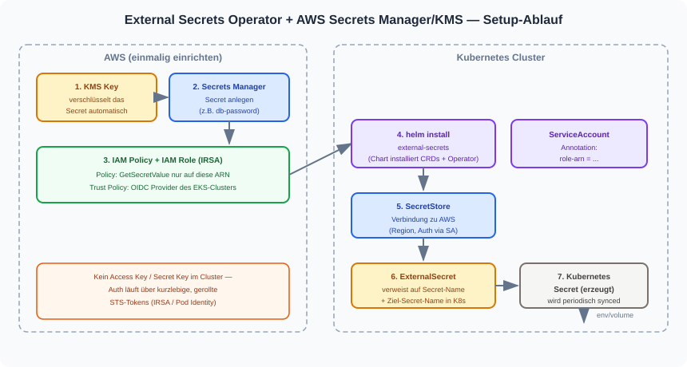
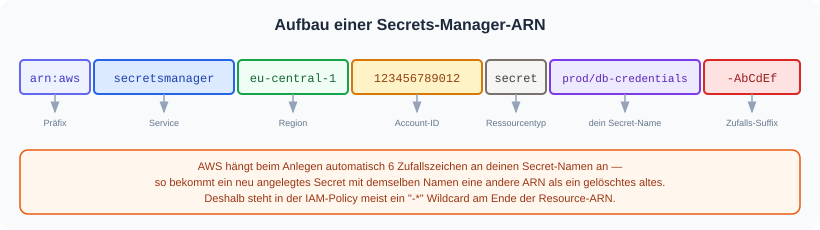
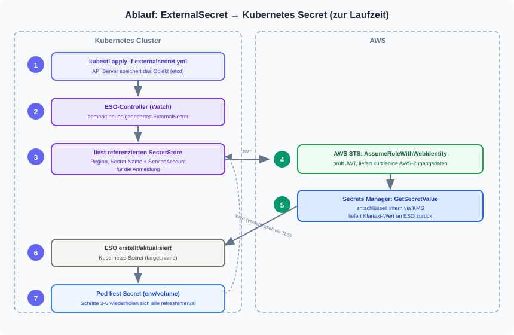

# External Secrets Operator (ESO) mit AWS Secrets Manager + KMS einrichten

## Hintergrund

Secrets liegen zentral in **AWS Secrets Manager** (dort automatisch durch **AWS KMS**
verschlüsselt). Der **External Secrets Operator (ESO)**
läuft als Controller im Cluster, holt sich die aktuellen Werte über eine eng begrenzte
IAM-Rolle und legt daraus ein ganz normales Kubernetes-`Secret` an.



Die im Git-Manifest sichtbaren Ressourcen (`SecretStore`, `ExternalSecret`) enthalten
**nie** den Secret-Wert selbst — nur den Namen/ARN des AWS-Secrets.

---

## 1. AWS-Seite (einmalig, i.d.R. vom Cluster-Admin)

### Abkürzungen kurz erklärt

| Kürzel | Bedeutung | Einfach gesagt |
|---|---|---|
| **IAM** | Identity and Access Management | AWS-Bereich, der regelt: wer darf was |
| **Policy** | — | Ein Zettel mit genau einer Erlaubnis ("darf X lesen") |
| **Role** (Rolle) | — | Ein "Ausweis", den man sich vorübergehend ausleihen kann |
| **ARN** | Amazon Resource Name | Die eindeutige "Adresse" einer AWS-Ressource (wie eine IBAN) |
| **OIDC** | OpenID Connect | Standard, mit dem sich der Kubernetes-Cluster bei AWS ausweisen kann |
| **IRSA** | IAM Roles for Service Accounts | Verfahren: ein Kubernetes-ServiceAccount bekommt eine IAM-Rolle geliehen |
| **STS** | Security Token Service | AWS-Dienst, der kurzlebige "Eintrittskarten" (Tokens) ausstellt |
| **JWT** | JSON Web Token | Ein digital signierter, fälschungssicherer "Ausweis" als Text |

Die kurze Version: **Policy = was darf man**, **Role = wer darf es sich ausleihen**,
**IRSA/OIDC/STS/JWT = wie das Ausleihen technisch funktioniert**, ohne dass irgendwo
ein Passwort oder Access-Key gespeichert werden muss.

### 1.1 Secret in Secrets Manager anlegen

```
aws secretsmanager create-secret \
  --name prod/db-credentials \
  --secret-string '{"username":"app","password":"s3cr3t"}'
```

### 1.2 IAM Policy — Zugriff nur auf genau dieses Secret

**Warum überhaupt eine Policy?** Ohne Erlaubnis darf niemand in AWS irgendetwas lesen —
auch ESO nicht. Die Policy ist die Erlaubnis, aber bewusst so eng wie möglich geschnitten:
Sie erlaubt **nur** `GetSecretValue` (lesen, nicht ändern) und **nur** für die ARN
(die "Adresse") von genau diesem einen Secret. Geht die Policy verloren oder wird sie
missbraucht, ist der Schaden auf dieses eine Secret begrenzt — nicht auf ganz AWS.

**Warum der Name `eso-prod-db-credentials`?** Reine Konvention, aber eine hilfreiche:
`eso-` zeigt, wer die Policy nutzt (der External Secrets Operator), `prod-db-credentials`
zeigt, für welches Secret sie gilt. Wer in der AWS-Konsole später 50 Policies sieht,
findet die richtige auf einen Blick — der Name selbst hat keine technische Funktion.

**Was ist die ARN in der `Resource`-Zeile?** Die eindeutige "Adresse" des Secrets in AWS —
siehe Aufbau unten. Wichtig: AWS hängt beim Anlegen automatisch 6 Zufallszeichen an den
Namen an, deshalb steht am Ende ein Wildcard (`-*`).



```
# vi 01-eso-iam-policy.json
{
  "Version": "2012-10-17",
  "Statement": [
    {
      "Effect": "Allow",
      "Action": ["secretsmanager:GetSecretValue"],
      "Resource": "arn:aws:secretsmanager:eu-central-1:123456789012:secret:prod/db-credentials-*"
    }
  ]
}
```

```
aws iam create-policy \
  --policy-name eso-prod-db-credentials \
  --policy-document file://01-eso-iam-policy.json
```

### 1.3 IAM-Rolle für IRSA (IAM Roles for Service Accounts)

**Warum reicht die Policy allein nicht?** Eine Policy ist nur der Erlaubnis-Zettel —
irgendjemand muss ihn sich aber "anziehen" können. Das ist die **Rolle**: Sie bekommt
die Policy angeheftet und kann dann von jemandem zeitweise übernommen ("assumed")
werden. Der ESO-Pod im Cluster bekommt so, ohne je ein Passwort zu besitzen, für kurze
Zeit genau diese eine Berechtigung geliehen.

**Warum eine eigene Rolle statt eines gespeicherten Access Keys?** Ein Access Key ist
ein dauerhaftes Geheimnis, das irgendwo liegt und gestohlen werden kann. Die Rolle
dagegen wird über **IRSA** genutzt: Der ServiceAccount im Cluster weist sich über den
**OIDC**-Provider des Clusters bei AWS aus, AWS fragt seinen **STS**-Dienst, der ein
kurzlebiges **JWT** ("digitaler Ausweis mit Ablaufdatum") ausstellt. Kein Passwort,
keine Datei, nichts, was dauerhaft irgendwo liegt und geklaut werden könnte.

**Warum genau dieser Name/Bedingung in der Trust Policy?** Die Trust Policy regelt
**wer** die Rolle überhaupt anziehen darf. Die `Condition` unten schränkt das auf
**genau einen** ServiceAccount ein (`system:serviceaccount:<namespace>:<name>`).
Ohne diese Einschränkung könnte theoretisch jeder Pod im Cluster versuchen, sich diese
Rolle zu leihen — die Bedingung ist also die eigentliche Absicherung, nicht nur Formsache.
Namespace und Name müssen dabei exakt zum ServiceAccount aus Schritt 2.2 passen, sonst
schlägt das Ausleihen fehl.

```
# vi 02-eso-trust-policy.json
{
  "Version": "2012-10-17",
  "Statement": [
    {
      "Effect": "Allow",
      "Principal": {
        "Federated": "arn:aws:iam::123456789012:oidc-provider/oidc.eks.eu-central-1.amazonaws.com/id/EXAMPLE1234"
      },
      "Action": "sts:AssumeRoleWithWebIdentity",
      "Condition": {
        "StringEquals": {
          "oidc.eks.eu-central-1.amazonaws.com/id/EXAMPLE1234:sub": "system:serviceaccount:external-secrets:eso-aws-sa"
        }
      }
    }
  ]
}
```

```
aws iam create-role \
  --role-name eso-prod-db-credentials \
  --assume-role-policy-document file://02-eso-trust-policy.json

aws iam attach-role-policy \
  --role-name eso-prod-db-credentials \
  --policy-arn arn:aws:iam::123456789012:policy/eso-prod-db-credentials
```

### FAQ: Brauche ich eine eigene Rolle pro Pod?

**Nein.** Die Rolle hängt am **ServiceAccount**, nicht am einzelnen Pod. Alle Replicas
eines Deployments teilen sich denselben ServiceAccount — 100 Pod-Replicas brauchen also
nicht 100 Rollen, sondern genau eine.

Wichtig: In diesem Setup hängt die Rolle sogar am ServiceAccount des **ESO-Controllers**
selbst — ESO ruft AWS auf, nicht die Anwendungs-Pods direkt.

Bei mehreren Anwendungen/Teams mit unterschiedlichen Secrets gibt es zwei Muster:

| Muster | Vorteil | Nachteil |
|---|---|---|
| Eine gemeinsame Rolle für ESO, Policy erlaubt mehrere Secret-ARNs | Einfach aufzusetzen | Weniger strenge Trennung zwischen Teams |
| Eine Rolle pro Team/Namespace, jeweils eigener `SecretStore` + eigener ServiceAccount | Team A kommt nicht an Secrets von Team B | Mehr Rollen/Policies zu pflegen |

Faustregel: Die Granularität richtet sich nach **wer darf was sehen**, nicht nach der
Anzahl der Pods.

---

## 2. Kubernetes-Seite

### 2.1 External Secrets Operator per Helm installieren

```
helm repo add external-secrets https://charts.external-secrets.io
helm repo update

helm install external-secrets external-secrets/external-secrets \
  --namespace external-secrets \
  --create-namespace \
  --wait
```

Das installiert den Operator **und** die CRDs `SecretStore`, `ClusterSecretStore` und
`ExternalSecret` (`apiVersion: external-secrets.io/v1`).

### 2.2 ServiceAccount mit IRSA-Annotation

```
# vi 03-eso-serviceaccount.yml
apiVersion: v1
kind: ServiceAccount
metadata:
  name: eso-aws-sa
  namespace: external-secrets
  annotations:
    eks.amazonaws.com/role-arn: arn:aws:iam::123456789012:role/eso-prod-db-credentials
```

```
kubectl apply -f 03-eso-serviceaccount.yml
```

### 2.3 SecretStore — Verbindung zu AWS Secrets Manager

```
# vi 04-eso-secretstore.yml
apiVersion: external-secrets.io/v1
kind: SecretStore
metadata:
  name: aws-secretsmanager
  namespace: external-secrets
spec:
  provider:
    aws:
      service: SecretsManager
      region: eu-central-1
      auth:
        jwt:
          serviceAccountRef:
            name: eso-aws-sa
```

```
kubectl apply -f 04-eso-secretstore.yml
kubectl get secretstore -n external-secrets
```

### 2.4 ExternalSecret — welches Secret, wie oft, wohin

```
# vi 05-eso-externalsecret.yml
apiVersion: external-secrets.io/v1
kind: ExternalSecret
metadata:
  name: db-credentials
  namespace: external-secrets
spec:
  refreshInterval: 1h
  secretStoreRef:
    name: aws-secretsmanager
    kind: SecretStore
  target:
    name: db-credentials
    creationPolicy: Owner
  data:
    - secretKey: DB_USERNAME
      remoteRef:
        key: prod/db-credentials
        property: username
    - secretKey: DB_PASSWORD
      remoteRef:
        key: prod/db-credentials
        property: password
```

```
kubectl apply -f 05-eso-externalsecret.yml
kubectl get externalsecret -n external-secrets
kubectl get secret db-credentials -n external-secrets -o yaml
```

### Was passiert dabei genau? (Laufzeit-Ablauf)

Der `kubectl apply` oben stößt im Hintergrund mehrere Schritte an, bis das
Kubernetes-`Secret` tatsächlich existiert:



Kurz gesagt: ESO merkt sich nichts dauerhaft selbst — bei jedem `refreshInterval`
holt es sich den Wert frisch aus AWS und gleicht das Kubernetes-`Secret` ab.

---

## 3. Im Pod nutzen (env / envFrom)

Ab hier ist es ein ganz normales Kubernetes-`Secret` — die Wege aus der
[Credentials-Übersicht](/kubernetes/secrets/credentials-overview.md) gelten unverändert:

```
# vi 06-eso-demo-pod.yml
apiVersion: v1
kind: Pod
metadata:
  name: eso-demo
  namespace: external-secrets
spec:
  containers:
  - name: demo
    image: nginx
    envFrom:
    - secretRef:
        name: db-credentials
```

```
kubectl apply -f 06-eso-demo-pod.yml
kubectl exec eso-demo -n external-secrets -- env | grep DB_
```

---

## Aufräumen

```
kubectl delete namespace external-secrets
aws iam detach-role-policy --role-name eso-prod-db-credentials --policy-arn arn:aws:iam::123456789012:policy/eso-prod-db-credentials
aws iam delete-role --role-name eso-prod-db-credentials
aws iam delete-policy --policy-arn arn:aws:iam::123456789012:policy/eso-prod-db-credentials
aws secretsmanager delete-secret --secret-id prod/db-credentials --force-delete-without-recovery
```

## Kurz zusammengefasst

| Ressource | apiVersion / Tool | Zweck |
|---|---|---|
| Helm Chart `external-secrets/external-secrets` | Helm Repo `https://charts.external-secrets.io` | Installiert Operator + CRDs |
| `ServiceAccount` mit `eks.amazonaws.com/role-arn` | Kubernetes | IRSA-Bindung an IAM-Rolle |
| `SecretStore` | `external-secrets.io/v1` | Verbindung zu AWS Secrets Manager |
| `ExternalSecret` | `external-secrets.io/v1` | Welches AWS-Secret → welches K8s-Secret |
