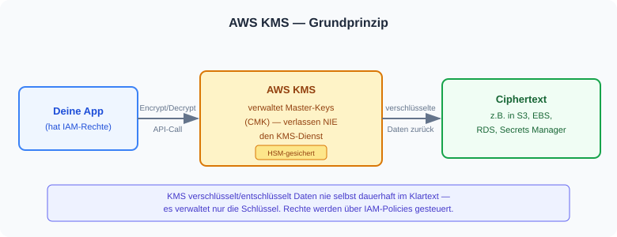
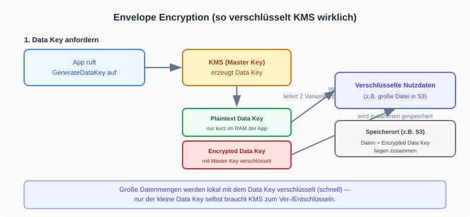
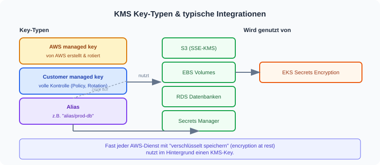

# AWS KMS — Überblick (vereinfacht)

KMS (Key Management Service) ist der zentrale AWS-Dienst zum Erstellen und Verwalten
von Verschlüsselungs-Schlüsseln. Er verschlüsselt/entschlüsselt nicht "alles selbst" —
er verwaltet vor allem die Schlüssel, mit denen andere Dienste (S3, EBS, RDS, Secrets
Manager, EKS, ...) Daten verschlüsseln.

## 1. Grundprinzip

Eine App ruft KMS über die API auf (Encrypt/Decrypt). Der Master-Key (CMK) selbst
verlässt dabei niemals KMS — er ist in Hardware-Sicherheitsmodulen (HSM) gesichert.

## 2. Envelope Encryption

Für große Datenmengen ruft KMS nicht ständig auf — stattdessen wird ein "Data Key"
erzeugt: einmal verschlüsselt (Master Key) und einmal im Klartext (kurzzeitig im
RAM). Die eigentlichen Nutzdaten werden lokal mit dem Data Key verschlüsselt, der
verschlüsselte Data Key wird zusammen mit den Daten gespeichert.

## 3. Key-Typen & typische Integrationen

- **AWS managed key** — von AWS selbst erstellt und automatisch rotiert (z.B. `aws/s3`)
- **Customer managed key (CMK)** — du erstellst und kontrollierst ihn (Key Policy, Rotation, Alias)
- **Alias** — sprechender Name (z.B. `alias/prod-db`), der auf einen Key zeigt

Fast jeder AWS-Dienst mit "encryption at rest" nutzt im Hintergrund einen KMS-Key.

## Kurz zusammengefasst

| Begriff | Bedeutung |
|---|---|
| CMK (Customer Master/Managed Key) | Der eigentliche Schlüssel, der in KMS verwaltet wird |
| Data Key | Kurzlebiger Schlüssel für die eigentliche Datenverschlüsselung |
| Alias | Sprechender Name für einen Key |
| Key Policy | Regelt, wer den Key nutzen/verwalten darf (ergänzt IAM) |
| Envelope Encryption | Muster: Daten lokal mit Data Key verschlüsseln, Data Key mit KMS schützen |

## Weiterführend

- [AWS KMS Dokumentation](https://docs.aws.amazon.com/kms/latest/developerguide/overview.html)
- [ECS vs. Kubernetes](ecs-vs-kubernetes.md)
