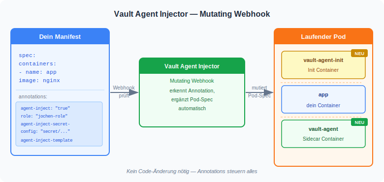
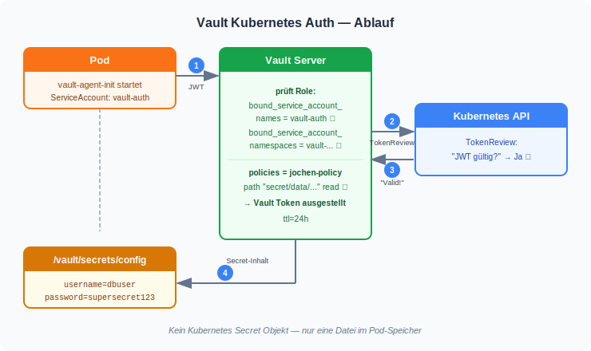
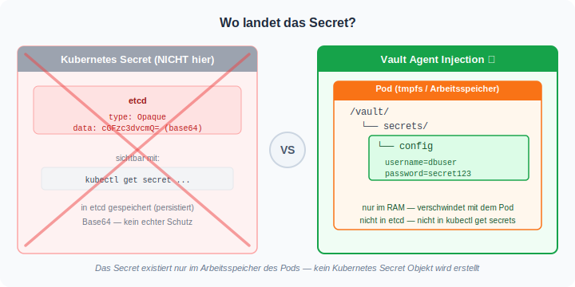
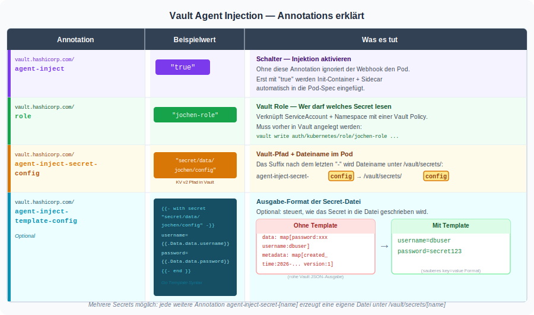
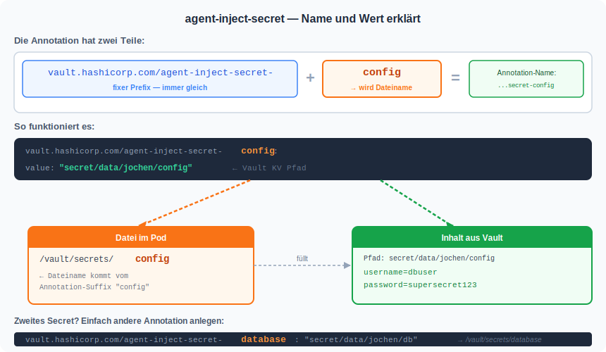

# Uebung: Vault Agent Injection in Kubernetes

## Hintergrund

### Was ist der Vault Agent Injector?

Der Vault Agent Injector ist ein **Mutating Webhook** in Kubernetes.
Das bedeutet: Jede neue Pod-Definition wird automatisch abgefangen und veraendert,
bevor der Pod wirklich startet — ohne dass du deinen Application-Code anfassen musst.



Die Annotation `vault.hashicorp.com/agent-inject: "true"` im Pod-Manifest reicht aus,
damit der Injector zwei neue Container in jeden Pod einschleust:

- **vault-agent-init** (Init Container): laeuft einmalig beim Start, holt das Secret aus Vault
- **vault-agent** (Sidecar Container): laeuft dauerhaft neben deiner App, erneuert Leases

### Wie laeuft die Authentifizierung ab?

Der Pod muss sich bei Vault beweisen, dass er berechtigt ist, das Secret zu lesen.
Das passiert ueber den **Kubernetes ServiceAccount Token** (JWT) — vollautomatisch.



Vault fragt Kubernetes per **TokenReview** ob der JWT-Token gueltig ist und prueft dann,
ob der ServiceAccount und der Namespace zur konfigurierten Role passen.

### Wo landet das Secret?



Das Besondere: Es wird **kein Kubernetes Secret Objekt** erstellt.
Das Secret existiert nur als Datei im Arbeitsspeicher des Pods (`/vault/secrets/config`)
und taucht weder in `kubectl get secrets` auf noch wird es in etcd gespeichert.

---

## Voraussetzung: Vault laeuft im Cluster (Trainer-Setup, einmalig)

```
helm repo add hashicorp https://helm.releases.hashicorp.com
helm repo update

helm install vault hashicorp/vault \
  --namespace vault \
  --create-namespace \
  --set "server.dev.enabled=true" \
  --set "server.dev.devRootToken=root" \
  --set "injector.enabled=true" \
  --wait
```

Kubernetes Auth aktivieren:

```
kubectl exec -n vault vault-0 -- vault auth enable kubernetes

kubectl exec -n vault vault-0 -- vault write auth/kubernetes/config \
  kubernetes_host="https://kubernetes.default.svc.cluster.local:443"
```

Vault laeuft im Dev-Modus: Root-Token `root`, kein TLS, In-Memory-Storage.

---

## Schritt 1: Verzeichnis anlegen und Namen setzen

```
cd
mkdir -p manifests
cd manifests
mkdir vault-injection
cd vault-injection
```

Namen einmalig setzen — alle folgenden Befehle nutzen automatisch `$NAME`:

```
NAME=jochen
```

## Schritt 2: Namespace und ServiceAccount erstellen

```
kubectl create namespace vault-$NAME
kubectl create serviceaccount vault-auth -n vault-$NAME
```

Pruefe:

```
kubectl get serviceaccount vault-auth -n vault-$NAME
```

## Schritt 3: Secret in Vault anlegen

Vault laeuft als Pod im Namespace `vault`. Alle Vault-Befehle werden per `kubectl exec` ausgefuehrt.

```
kubectl exec -n vault vault-0 -- vault kv put secret/$NAME/config \
  username="dbuser" \
  password="supersecret123"
```

Pruefen ob das Secret gespeichert wurde:

```
kubectl exec -n vault vault-0 -- vault kv get secret/$NAME/config
```

Erwartete Ausgabe:

```
====== Secret Path ======
secret/data/<dein-name>/config

====== Data ======
Key         Value
---         -----
password    supersecret123
username    dbuser
```

## Schritt 4: Vault Policy erstellen

Die Policy legt fest, auf welche Pfade zugegriffen werden darf.

```
kubectl exec -n vault vault-0 -- /bin/sh -c "
cat > /tmp/$NAME-policy.hcl << 'EOF'
path \"secret/data/$NAME/config\" {
  capabilities = [\"read\"]
}
EOF
vault policy write $NAME-policy /tmp/$NAME-policy.hcl
"
```

Policy pruefen:

```
kubectl exec -n vault vault-0 -- vault policy read $NAME-policy
```

Erwartete Ausgabe:

```
path "secret/data/<dein-name>/config" {
  capabilities = ["read"]
}
```

## Schritt 5: Vault Role erstellen

Die Role verbindet den Kubernetes ServiceAccount mit der Policy.

```
kubectl exec -n vault vault-0 -- vault write auth/kubernetes/role/$NAME-role \
  bound_service_account_names=vault-auth \
  bound_service_account_namespaces=vault-$NAME \
  policies=$NAME-policy \
  ttl=24h
```

Role pruefen:

```
kubectl exec -n vault vault-0 -- vault read auth/kubernetes/role/$NAME-role
```

## Schritt 6: Deployment anlegen

### Annotations im Ueberblick



### agent-inject-secret im Detail



Manifest erstellen — `$NAME` wird automatisch eingesetzt:

```
cat > 01-deployment.yml << EOF
apiVersion: apps/v1
kind: Deployment
metadata:
  name: myapp
spec:
  replicas: 1
  selector:
    matchLabels:
      app: myapp
  template:
    metadata:
      labels:
        app: myapp
      annotations:
        vault.hashicorp.com/agent-inject: "true"
        vault.hashicorp.com/role: "$NAME-role"
        vault.hashicorp.com/agent-inject-secret-config: "secret/data/$NAME/config"
        vault.hashicorp.com/agent-inject-template-config: |
          {{- with secret "secret/data/$NAME/config" -}}
          username={{ .Data.data.username }}
          password={{ .Data.data.password }}
          {{- end }}
    spec:
      serviceAccountName: vault-auth
      containers:
      - name: app
        image: nginx:alpine
EOF
```

```
kubectl apply -f . -n vault-$NAME
```

## Schritt 7: Ergebnis pruefen

Pod-Status pruefen — `2/2` bedeutet: `app` + `vault-agent` Sidecar laufen:

```
kubectl get pods -n vault-$NAME
```

Erwartete Ausgabe:

```
NAME                    READY   STATUS    RESTARTS   AGE
myapp-xxxxx             2/2     Running   0          10s
```

Injiziertes Secret lesen:

```
kubectl exec -n vault-$NAME deploy/myapp -c app -- cat /vault/secrets/config
```

Erwartete Ausgabe:

```
username=dbuser
password=supersecret123
```

Container-Struktur des Pods ansehen (Init Container + 2 regulaere Container):

```
kubectl describe pod -n vault-$NAME -l app=myapp | grep -A 2 "Init Containers:\|Containers:"
```

## Schritt 8: Secret aktualisieren (Bonus)

Das Passwort in Vault aendern:

```
kubectl exec -n vault vault-0 -- vault kv put secret/$NAME/config \
  username="dbuser" \
  password="neuespasswort456"
```

Nach kurzer Zeit aktualisiert der `vault-agent` Sidecar die Datei automatisch im Pod:

```
kubectl exec -n vault-$NAME deploy/myapp -c app -- cat /vault/secrets/config
```

## Aufraeumen

```
kubectl delete namespace vault-$NAME
```

Vault-Eintraege aufraeumen (optional):

```
kubectl exec -n vault vault-0 -- vault kv delete secret/$NAME/config
kubectl exec -n vault vault-0 -- vault policy delete $NAME-policy
kubectl exec -n vault vault-0 -- vault delete auth/kubernetes/role/$NAME-role
```

## Zusammenfassung

| Was | Wofuer |
|---|---|
| Mutating Webhook | Faengt jeden neuen Pod ab, fuegt Init-Container + Sidecar ein |
| `vault-agent-init` | Holt das Secret einmalig beim Pod-Start, legt Datei an |
| `vault-agent` | Laeuft als Sidecar, erneuert Token-Lease, schreibt Updates |
| ServiceAccount `vault-auth` | Beweist gegenueber Vault, wer der Pod ist (via JWT) |
| Vault Role | Verbindet SA + Namespace mit einer Policy |
| Vault Policy | Legt fest, welche Secrets gelesen werden duerfen |
| `/vault/secrets/config` | Datei im Pod — kein Kubernetes Secret Objekt |
