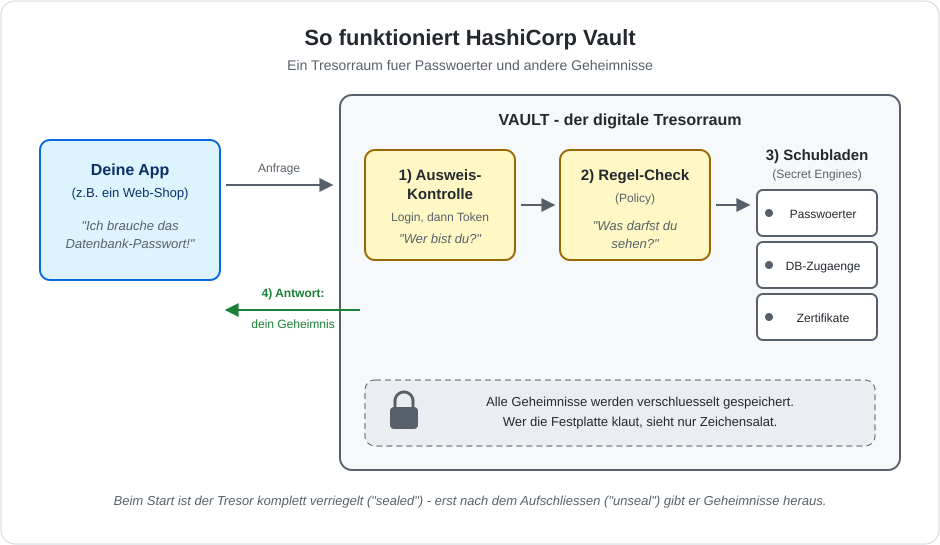

# HashiCorp Vault - Architektur einfach erklaert

## Die Idee: ein Tresorraum fuer Geheimnisse

Stell dir Vault wie den Tresorraum einer Bank vor. Statt Goldbarren liegen
darin Geheimnisse: Passwoerter, Datenbank-Zugaenge, Zertifikate. Niemand
schreibt diese Geheimnisse mehr in den Programmcode oder in Konfigurationsdateien -
wer eines braucht, geht zum Tresor und fragt danach.

## Die 4 Schritte

1. **Ausweis-Kontrolle (Authentifizierung):** Deine App meldet sich an und
   beweist, wer sie ist. Dafuer bekommt sie einen Ausweis - den **Token**.
2. **Regel-Check (Policy):** Vault schaut in seine Regelliste: Was darf
   dieser Ausweis sehen? Die App bekommt nur genau die Geheimnisse, die
   fuer sie erlaubt sind - nicht mehr.
3. **Schublade oeffnen (Secret Engine):** Jede Art von Geheimnis liegt in
   einer eigenen Schublade. Manche Schubladen geben gespeicherte Passwoerter
   heraus, andere erzeugen sogar frische Zugangsdaten, die nach kurzer Zeit
   automatisch wieder ungueltig werden.
4. **Antwort:** Die App bekommt ihr Geheimnis und kann damit z.B. auf die
   Datenbank zugreifen.

## Die wichtigsten Begriffe uebersetzt

| Fachbegriff | Einfach gesagt |
|-------------|----------------|
| Token | Ausweis, den man nach dem Anmelden bekommt |
| Policy | Regelliste: wer darf was sehen |
| Secret Engine | Schublade fuer eine bestimmte Art von Geheimnis |
| Sealed / Unseal | Tresor verriegelt / Tresor aufschliessen |
| Audit Log | Besucherbuch: wer hat wann welches Geheimnis geholt |

## Warum der Aufwand?

* Passwoerter stehen nicht mehr im Code oder in Git - dort werden sie
  am haeufigsten gestohlen.
* Alle Geheimnisse liegen an EINEM zentralen Ort und sind dort verschluesselt.
* Jeder Zugriff wird protokolliert - man sieht, wer wann was geholt hat.
* Geheimnisse lassen sich zentral austauschen oder sperren, ohne dass
  irgendwo Code angefasst werden muss.
