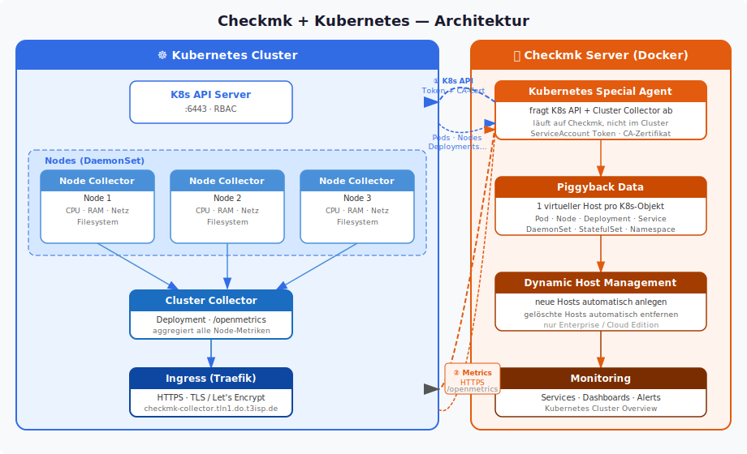
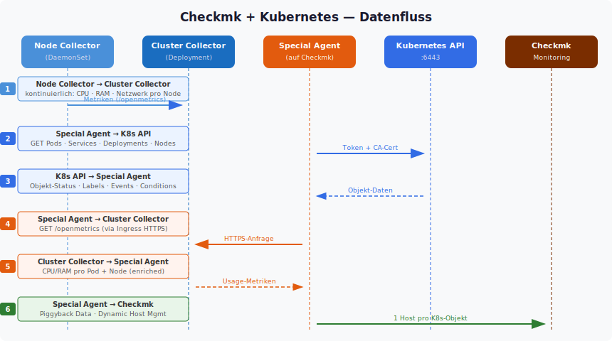
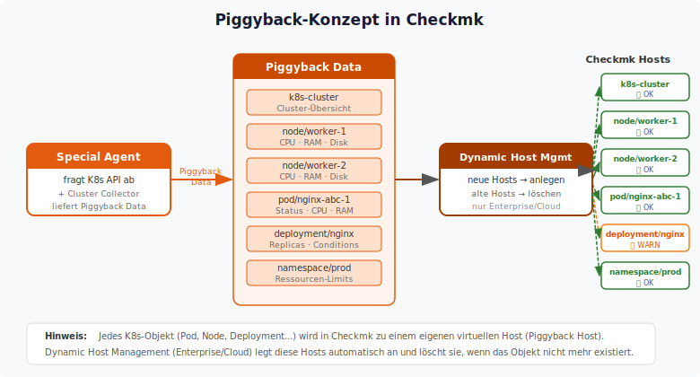

# Architektur: Checkmk + Kubernetes

## Komponenten-Übersicht

## Datenfluss

## Piggyback-Konzept

## Was liefert wer?

| Komponente | Typ | Daten | Deployment |
|------------|-----|-------|------------|
| **Node Collector** | DaemonSet (1× pro Node) | CPU, RAM, Netzwerk, Filesystem pro Node | Helm Chart im Cluster |
| **Cluster Collector** | Deployment (1×) | Aggregierte Metriken, `/openmetrics` Endpoint | Helm Chart im Cluster |
| **Special Agent** | Prozess auf Checkmk | K8s-Objekte (Pods, Services, Deployments…) + Usage-Daten | Läuft auf Checkmk-Server |
| **Piggyback Host** | Virtueller Host | Monitoring-Daten eines einzelnen K8s-Objekts | Wird von Dynamic Host Mgmt erstellt |
| **Dynamic Host Management** | Checkmk-Feature | Erstellt/löscht Hosts für K8s-Objekte automatisch | Nur Enterprise / Cloud Edition |

## Zwei Datenquellen des Special Agents

| Quelle | Protokoll | Inhalt |
|--------|-----------|--------|
| **Kubernetes API** (`:6443`) | HTTPS · ServiceAccount Token · CA-Zertifikat | Pods, Nodes, Services, Deployments, DaemonSets, StatefulSets, Namespaces — Status, Labels, Events |
| **Cluster Collector** (Ingress) | HTTPS · `/openmetrics` | CPU-Nutzung pro Pod, RAM-Nutzung pro Pod, Netzwerk-Throughput, Filesystem-Auslastung |

## Weiterführende Dokumente

- [Setup Enterprise/Cloud Edition](setup-kubernetes-checkmk-enterprise-cloud-edition.md)
- [Setup RAW Edition](setup-kubernetes-checkmk-raw.md)
- [Enterprise-Features (Dynamic Host Mgmt)](02-checkmk-kubernetes-wichtig-enterprise.md)
- [Kubernetes Dashboards](03-kubernetes-dashboards.md)
