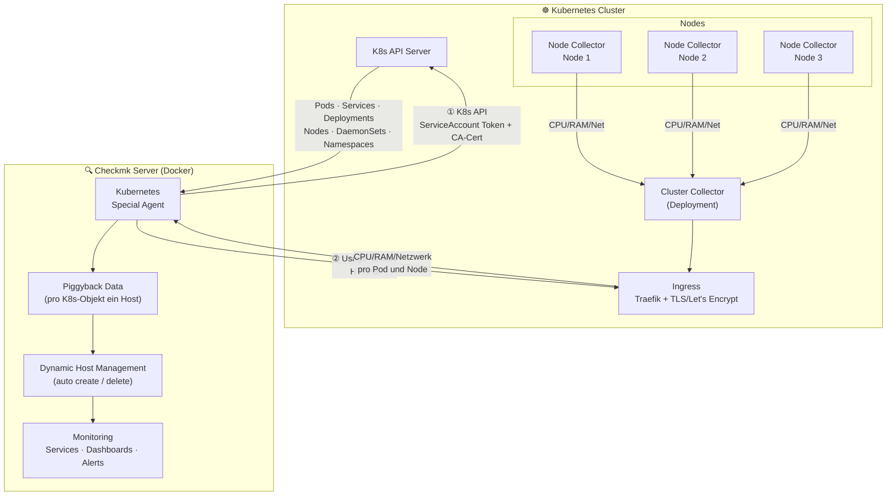
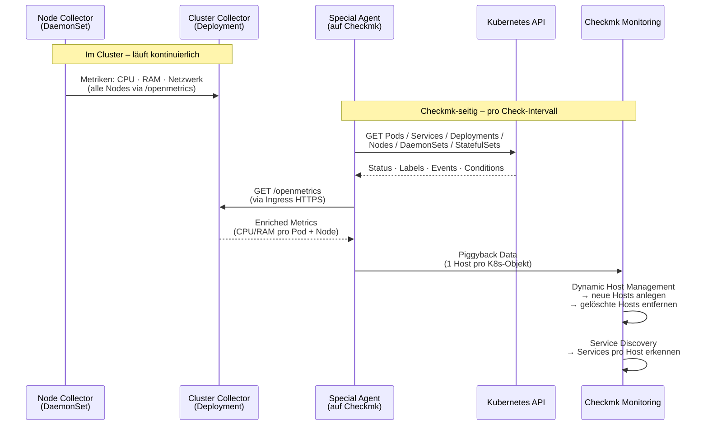
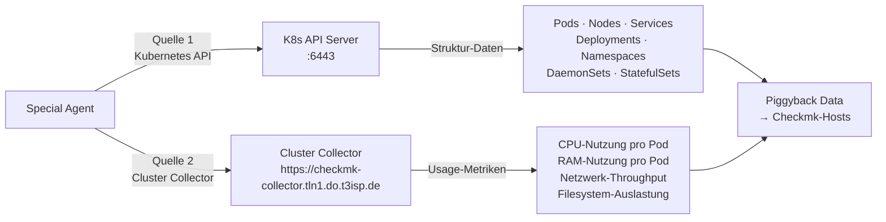
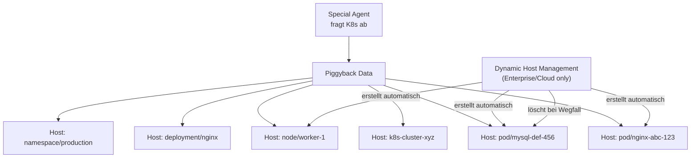
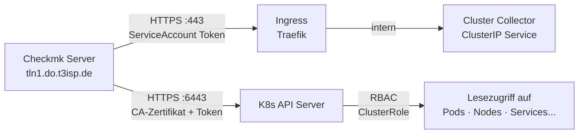

# Architektur: Checkmk + Kubernetes

## Überblick: Komponenten

## Datenfluss im Detail

## Was liefert wer?

| Komponente | Typ | Daten | Deployment |
|------------|-----|-------|------------|
| **Node Collector** | DaemonSet (1× pro Node) | CPU, RAM, Netzwerk, Filesystem pro Node | Helm Chart im Cluster |
| **Cluster Collector** | Deployment (1×) | Aggregierte Metriken, Endpoint für Special Agent | Helm Chart im Cluster |
| **Kubernetes Special Agent** | Prozess auf Checkmk | K8s-Objekte (Pods, Services, Deployments...) | Läuft auf Checkmk-Server |
| **Piggyback Host** | Virtueller Host in Checkmk | Monitoring-Daten eines K8s-Objekts | Wird von Dynamic Host Mgmt erstellt |
| **Dynamic Host Management** | Checkmk-Feature | Erstellt/löscht Hosts für K8s-Objekte automatisch | Nur in Enterprise/Cloud Edition |

## Zwei Datenquellen des Special Agents

## Piggyback-Konzept

Checkmk erstellt für jedes Kubernetes-Objekt einen **virtuellen Host** — den sogenannten **Piggyback Host**:

**Wichtig:** In der **RAW Edition** müssen Piggyback-Hosts manuell angelegt werden.  
In der **Enterprise/Cloud Edition** übernimmt das Dynamic Host Management dies automatisch.

## Netzwerk-Zugriffe (Checkmk → Cluster)

## Weiterführende Dokumente

- Setup (Enterprise/Cloud): `setup-kubernetes-checkmk-enterprise-cloud-edition.md`
- Setup (RAW Edition): `setup-kubernetes-checkmk-raw.md`
- Enterprise-Features: `02-checkmk-kubernetes-wichtig-enterprise.md`
- Dashboards: `03-kubernetes-dashboards.md`
