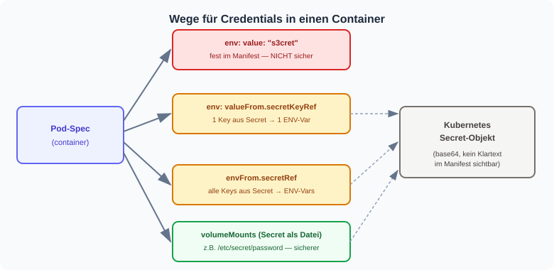
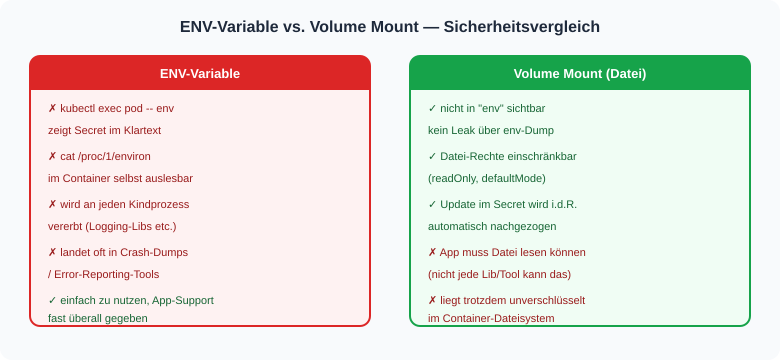
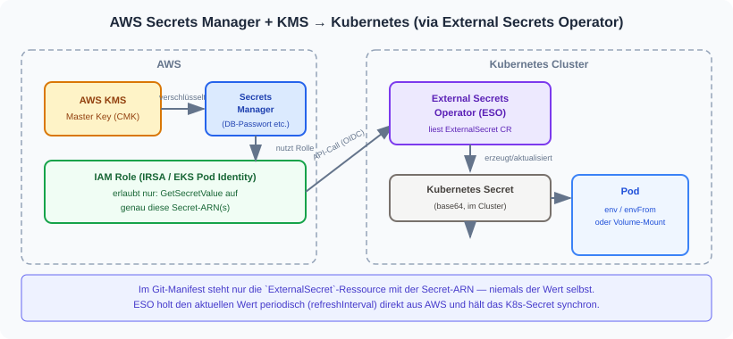

# Credentials in Kubernetes verwenden — welche Möglichkeiten gibt es?

Ein Passwort, API-Key oder Token muss irgendwie in den Container. Kubernetes bietet dafür
mehrere Wege — nicht alle sind gleich sicher. Diese Seite gibt den groben Überblick,
bevor es an die Details (Secret-Typen, Sealed Secrets, SOPS, Vault) geht.

## 1. Die vier Grundwege

| Weg | Beispiel | Wann sinnvoll |
|---|---|---|
| `env` mit festem `value` | `value: "s3cret"` | **Nie für echte Secrets** — landet im Manifest/Git |
| `env` mit `valueFrom.secretKeyRef` | einzelner Key aus einem Secret als eine ENV-Variable | Wenn nur 1-2 Variablen gebraucht werden |
| `envFrom.secretRef` | alle Keys eines Secrets werden zu ENV-Variablen | Viele Variablen auf einmal (siehe [Beispiel](/kubectl-examples/07-mariadb-secret.md)) |
| `volumeMounts` (Secret als Datei) | Secret wird unter `/etc/secret/...` gemountet | Sicherer, wenn die App auch Dateien lesen kann |

Praktisches Beispiel für `valueFrom.secretKeyRef` und `envFrom.secretRef`:
siehe [Übung: ENV-Variablen aus Secrets](uebung-secrets.md).

## 2. ENV-Variable vs. Datei (Volume Mount) — der Sicherheitsunterschied

ENV-Variablen sind bequem, aber sie "kleben" am Prozess: jeder Sub-Prozess erbt sie,
und sie sind leicht auslesbar. Ein Secret als Volume-Mount ist die etwas sicherere Wahl.

## 3. Und wo kommt das Secret-Objekt selbst her?

Beide Wege (ENV oder Volume) setzen voraus, dass es bereits ein Kubernetes-`Secret`-Objekt
gibt. Wie dieses sicher **erzeugt und verwaltet** wird, ist eine eigene Frage:

- [Kubernetes Secret-Typen](secrets.md) — was ein natives `Secret`-Objekt überhaupt ist (nur base64, nicht verschlüsselt!)
- [Sealed Secrets (Bitnami)](sealed-secrets.md) — Secret verschlüsselt in Git ablegen, Controller entschlüsselt im Cluster
- [SOPS + Age/KMS](/kubectl-examples/09-mariadb-secret-mit-sops.md) — Secret-Datei lokal/CI entschlüsseln, dann `kubectl apply`
- [HashiCorp Vault](/hashicorp-vault/overview.md) — zentrales Secret-Management, Injection direkt in den Pod (ganz ohne natives `Secret`-Objekt möglich)
- [Vergleich der Ansätze](secret-management-vergleich.md) — GitLab CI/CD vs. SOPS vs. Vault
- **AWS Secrets Manager + KMS** — siehe Schaubild unten

## 4. AWS Secrets Manager + KMS an Kubernetes anbinden

Wenn die Secrets bereits in AWS Secrets Manager liegen (dort per KMS verschlüsselt),
ist der gängige Weg der **External Secrets Operator (ESO)**: er läuft im Cluster, holt
sich über eine eng begrenzte IAM-Rolle (IRSA) periodisch den aktuellen Wert aus Secrets
Manager und legt daraus ein ganz normales Kubernetes-`Secret` an — das dann wie in
Abschnitt 1 per `env`/`envFrom`/Volume genutzt wird.

**Warum ESO die bevorzugte Wahl ist:**

| Kriterium | External Secrets Operator (ESO) | AWS Secrets Store CSI Driver |
|---|---|---|
| Verbreitung / Doku | Sehr weit verbreitet, viele Backends (nicht nur AWS) | AWS-spezifisch, weniger verbreitet |
| GitOps-fähig | Ja — Manifest referenziert nur die ARN | Ja — ähnliches Prinzip |
| Erzeugt natives `Secret`-Objekt | Ja → funktioniert mit `env`/`envFrom` | Optional (Sync-Feature), Standard ist reiner Volume-Mount |
| Ohne persistentes `Secret`-Objekt | Nein, per Design | Ja — etwas kleinere Angriffsfläche |

Für die meisten Fälle (v.a. wenn ENV-Variablen gebraucht werden) ist ESO der pragmatischste
Weg. Nur wenn bewusst **kein** Kubernetes-`Secret`-Objekt im Cluster persistiert werden soll,
lohnt sich der CSI Driver.

Konkretes Setup Schritt für Schritt (Helm-Installation, IAM-Rolle, `SecretStore`,
`ExternalSecret`): [External Secrets Operator mit AWS Secrets Manager + KMS einrichten](/aws/eso-secrets-manager-setup.md).

## Kurz zusammengefasst

| Frage | Antwort |
|---|---|
| Darf ein Secret-Wert im Manifest stehen (`value: "..."`)? | Nein — landet im Klartext in Git/kubectl-Historie |
| Ist ein Kubernetes-`Secret` an sich schon "sicher"? | Nein — nur base64-kodiert, nicht verschlüsselt |
| ENV-Variable oder Volume-Mount? | Volume-Mount ist sicherer (kein Leak via `env`/`/proc`) |
| Wie bekomme ich das Secret sicher ins Cluster? | Sealed Secrets, SOPS oder Vault — je nach Anforderung |
